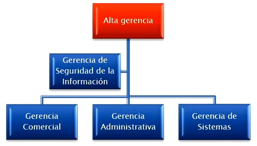
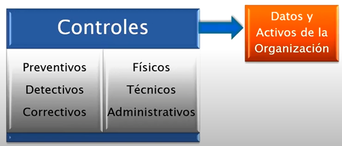

# **Ciberseguridad - Clase 1**
## **Introducción a la Ciberseguridad**
* **_Seguridad informática_** -> tiene que ver con la protección de la información que se encuentra almacenada en algún sistema informático, relaciona los riesgos de utilizar un determinado sistema informático, la forma de guardar la información, etc.
* **_Ciberseguridad_** -> habla de defender, mediante tecnologías o ejercicios ofensivos, los sistemas informáticos de posibles cibercriminales, APTS.
* **_Seguridad de la Información_** -> abarca las 2 anteriores, es el conjunto de medidas preventivas, detección y corrección destinados a proteger la integridad, confidencialidad y disponibilidad de la información.

### **Tipos de medidas**
* **_Preventivas_** -> se colocan antes de que suceda un evento, se utilizan para prevenir el evento.
  * Utilizar un Firewall para bloquear un puerto en específico.
* **_Detectivas_** -> herramientas que avisan cuando detectan eventos, se utilizan para frenar un evento.
  * Antivirus.
* **_Correctivas_** -> se aplican después de que sucede un evento, se utilizan para mitigar el evento.
  * Utilización de un BackUp para desalentar creadores de Ransomware
  * Parchear las partes del sistema por donde se encontró una brecha de seguridad.

---

## **Triada de la Ciberseguridad**
*La seguridad de la información se basa en los siguientes pilares.*

### **Confidencialidad**
*La información debe ser accedida únicamente por los sujetos autorizados.*

**Formas de protección** -> identificando los sujetos a través de controles de acceso, por medio de la autenticación y la autorización final por parte del comunicador de información.

**Amenazas contra la Confidencialidad**
* **_Ingeniería social_** -> engañar a alguien para que te brinde los datos o para ejecutar algo involuntariamente.
* **_OSINT_** -> open source intelligent, intentar adivinar contraseñas, el uso de la fuerza bruta para obtener contraseñas.
* **_Usuarios descuidados_** -> tener cuidado con lo que uno dice en un lugar público.
* **_Atacantes_** -> se dedican a hacer fraudes para obtener datos personales.
* **_Robo y divulgación de información._**
* **_Descargas peligrosas involuntarias._**
* **_Trashing_**: buscar datos sensibles en la papelera de reciclaje, basura, etc.

**Medidas de protección contra la perdida de confidencialidad**
* Clasificación de la información.
* Mecanismos de control de acceso informático.
* Encriptación de datos.
* Capacitación del personal.

### **Integridad**
*La información debe ser modificada únicamente por los sujetos autorizados.*

**Amenazas contra la Integridad**
* **_Ingeniería social_** -> engañar a alguien para que te brinde los datos o para ejecutar algo involuntariamente.
* **_Actividad de usuarios no autorizados_** -> actividades de modificación que hacen que peligre la integridad de la información.
* **_Malware_**
  * Virus: Alteran el comportamiento de los programas.
  * RATs: Controlan máquinas.
  * Falsas Alertas: popUps engañosos.
  * Sitios Peligrosos: explykit en sitios web.

**Medidas de protección contra las amenazas a la integridad**
* **_Menor privilegio_** -> relacionado con el uso del modo usuario Administrador.
* **_Segregación de funciones_** -> relacionado con la utilización de una única persona para realizar una serie de tareas en un cierto sector.
* **_Procedimientos de control de cambios_** -> procedimientos para aprobar modificaciones.
* **_Verificacion de integridad_** -> algoritmos de hashing para verificar integridad.
* **_Antivirus_**
* **_Firewall_**

### **Disponibilidad**
*La información se debe encontrar accesible en tiempo y forma según se requiera.*

**Amenazas contra la Disponibilidad**
* **_Denegación de Servicios_** -> DDOS, mandar paquetes a una única máquina para que se sature la conexión y pierda conectividad.
* **_Desastres Naturales_** -> lluvias torrenciales que produzcan interrupciones en los servicios.
* **_Acciones Humanas - intencionales o accidentales_** -> cortar un cable, desenchufar algo.
* **_Malware_**
  * Worms: se replican por la red.
  * Crypto-Ransomware: cifra archivos.

**Medidas de protección contra las amenazas a la disponibilidad**
* **_Seguridad Física_** -> contar con un suministro de luz, UPS.
* **_Mecanismos de tolerancia a fallos_** -> sistemas con la capacidad de seguir operando ante la aparición de fallos.
* **_Plan de contingencia_** -> documentos útiles que explican qué realizar frente a un fallo.
* **_Aplicar mecanismos de defensa_** -> firewall, segmentación de red, etc.
* **_Procedimientos operativos estándar (SOP)_**

---

## **Rol del responsable de Seguridad**
* **_CISO_** -> Chief Information Security Officer, responsable máximo de seguridad en una empresa.
* Cumplir con el programa integral de seguridad paragarantizar los 3 pilares de la información.
* Gestionar los recursos necesarios para cumplir el programa integral de seguridad.
* Determinar prioridades.
* Comunicarse con la alta dirección.

### **Organización**
*La seguridad de la información debe ser incumbencia de la alta gerencia de la organización, no debe circunscribirse al área de sistemas.*

### **Políticas, Normas y Procedimientos**
* **Nivel Estratégico**
  * Políticas: deben ser
    * Realizadas y aprobadas por el comité de seguridad de información.
      * Alineadas con la estrategia de negocio.
    * Comunicadas a todos los integrantes de la organización.
    * Escritas en lenguaje claro, idependiente de la tecnologia y sin ambigüedades.
    * Definidos los roles y responsabilidades para la implementación.
  * Contenido de las políticas:
    * Objetivos.
    * Alcance.
    * Importancia de la seguridad de la información.
    * Propósito de los responsables a nivel gerencial demostrando el apoyo.
    * Explicación de las políticas, principios, normas y requisitos de cumplimiento en materia de seguridad.
    * Definición de responsabilidades de la gestión de la Seguridad de la Información. 
* **Nivel Táctico**
  * Normas y Estándares:
    * Conjunto de reglas aplicadas a todas las actividades relacionadas al manejo de la información de una entidad, teniendo el propósito de proteger la información, los recursos y reputación de esta.
* **Nivel Operativo**
  * Procedimientos:
    * Conjunto de pasos para cumplir políticas y normas definidas por la organización.

---

## **Controles**
El principal objetivo del establecimiento de controles de seguridad de la información es reducir  los efectos producidos por las amenazas y vulnerabilidades a nivel tolerable por la empresa.

* **Controles Físicos**
  * Guardias de seguridad
  * Cerraduras
  * Protección del edificio
  * Cámaras de seguridad
  * Controles ambientales
* **Controles Técnicos**
  * Control de acceso lógico
  * Encriptación
  * Identificación
  * Autenticación
  * Monitoreo lógico
* **Controles Administrativos**
  * Políticas
  * Estándares
  * Procedimientos
  * Concientización
  * Control de cambios
  * Autorización

### **Clasificación y controles de activos**

* **Clasificación**
  * Activos de información: archivos, bases de datos, manuales.
  * Activos de software: aplicaciones, programas de desarrollo.
  * Activos físicos: máquinas, servidores.
  * Servicios: comunicaciones.

* Busca mantener una adecuada protección de los activos.
* Se designa un propietario para cada uno de los activos.
* Se debe realizar un inventario de activos.