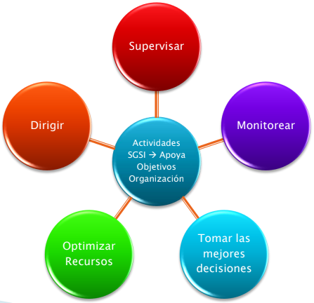
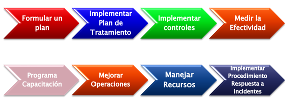
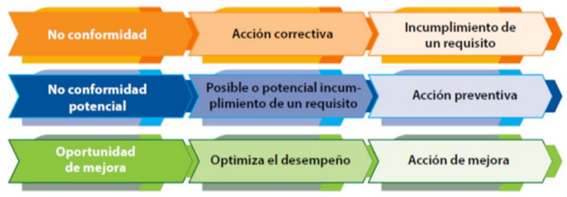

# **Ciberseguridad - Clase 2**
## **Control de Acceso y Sistemas de Gestión de Seguridad de Información**
### **Sistemas y metodologías de control de acceso**
* **Requisitos**
  * Evitar proveer información sensible a usuarios no autorizados. (Confidencialidad)
  * Proveer información sensible a usuarios autorizados. (Disponibilidad)
  * Confiable (Integridad)
  * Escalable (Duradero)
* Tipos:
  * Administrativos
  * Físicos
  * Técnicos

**Componentes**
* Sujeto: Es una entidad activa que solicita acceso a un objeto.
  * Usuarios, programas, procesos, computadoras, etc.
* Objeto: Es una entidad pasiva que contiene información o realiza una función.
  * Archivos, programas, documentos, impresoras, etc.

**Acceso** -> transferencia de información desde un objeto a un sujeto.

**Control de acceso**
* Es la habilidad de otorgar el acceso a un sistema u otro recurso que se desea controlar.
* Se implementa para asegurar la confidencialidad, integridad y disponibilidad.

*¿Cómo se logran?*
* Identificación: mecanismo para diferenciar los sujetos.
  * Nombre de usuario, numero de proceso, etc.
* Autenticación: Permite asegurar (con un determinado nivel de certeza) que el sujeto es quien dice ser.
* Autorización: mecanismo utilizado para definir si el sujeto tiene o no acceso a determinados objetos.
  * Listas de control de acceso, Control de acceso mandatorio, etc.

**Trazabilidad (Accountability)**: Habilidad para determinar las acciones individuales de un usuario dentro de un sistema. Esta soportado por logs de auditoría.

**No repudio**: El sujeto no puede negar que realizó cierta acción. Por ejemplo: En el envío de mensajes, el no repudio hace que el emisor no pueda negar el envío de un mensaje.

### **Tipos o factores de autenticación**
* Basada en secretos: “Algo que uno conoce”
  * Contraseñas, pin, etc.
* Basada en posesión de elementos: “Algo que uno tiene”
  * Tarjeta, token, llaves, etc.
* Basada en elementos biométricos: “Algo que uno es”
  * Huella, voz, retina, etc.

### **Autenticación fuerte**

Aquellos sistemas que requieren la autenticación de 2 factores diferentes de forma conjunta.
* Ejemplo: Contraseña + Tarjeta de coordenadas.

Se considera fuerte porque las debilidades de un factor son mitigadas por el segundo factor.

### **Autenticación basada en hashes**
1. El sujeto configura sus credenciales por primera vez y se calcula y guarda el hash (“H1”) de la contraseña en el servidor de autenticación.
2. El sujeto informa sus credenciales (ID + Contraseña).
3. El autenticador calcula el hash de la contraseña, obteniendo “H2”.
4. El autenticador busca el hash almacenado correspondiente al ID del usuario, obteniendo “H1”.
5. El autenticador compara “H1” con “H2”. Si son iguales, entonces la autenticación es correcta.

Si un atacante pudiera robarse el almacenamiento de credenciales, obtendría hashes y no las contraseñas en texto plano. No es necesario y no se sugiere almacenar la contraseña.

---

## **Autenticación basada en secretos**
### **Amenazas a la autenticación basada en secretos**
* **Ataques de diccionario / fuerza bruta**
  * Probar opciones de contraseñas hasta dar con la correcta.
* **Password spray**
  * Probar múltiples usuarios con la misma contraseña débil o default.
* **Análisis de trafico de red**
  * Buscar credenciales observando los protocolos
* **“Spoofing” del dispositivo autenticado**
  * Engañar al sujeto para que se autentique en un objeto falso.
* **Intentar obtener acceso a los mecanismos de autenticación basado en secretos**
  * Base de datos de usuarios (Directorio IDM)
  * Archivo “/etc/shadow” de Linux.

### **Contramedidas a las amenazas a la autenticación basada en secretos**
* No utilizar palabras de diccionario.
* No utilizar contraseñas triviales.
* Bloqueo de la cuenta tras ciertos intentos fallidos.
* Implementar retraso luego de ciertos intentos fallidos.
* Implementación de captchas.
* Forzar el uso de contraseñas con números, mayúsculas, minúsculas, establecer longitud mínima, etc.
* Forzar el cambio de contraseña periódico.
* No permitir el uso de credenciales anteriores.

---

## **Autenticación basada en posesión de elementos**
### **Token**
* Dispositivos generadores de contraseñas que un sujeto lleva con él.
* Existen 4 tipos:
  * Estáticos
  * Sincrónicos basados en tiempo
  * Sincrónicos basados en eventos
  * Asincrónicos basados en desafío respuesta
* Pueden ser dispositivos físicos o “software tokens”

**Token estáticos**
* Pueden requerir una contraseña
* Pueden almacenan una clave, credenciales de logon encriptadas, etc.
* Son utilizados principalmente como técnica de identificación en lugar de autenticación.
  * Dispositivos USB – Tarjetas inteligentes

**Token sincrónicos basados en el tiempo**
* Los dispositivos y el servidor tienen relojes que miden el tiempo transcurrido desde la inicialización.
* Cada cierto tiempo la clave generada se muestra en la pantalla del dispositivo. El usuario ingresa su clave en el sistema al cual se quiere autenticar.
* Como el servidor esta sincronizado con el dispositivo, la clave generada por el servidor debe coincidir con la clave generada por el dispositivo para que el usuario sea aceptado.

**Token sincrónicos basados en eventos**
* Las claves se generan en el dispositivo debido a la ocurrencia de un evento.
  * Botón presionado en el dispositivo.
  * El usuario debe ingresar la clave en el sistema al cual se quiere autenticar.
  * El servidor compara la clave con un listado de claves que tiene.
    * Si esta, el usuario se autentica y esa clave se elimina.
    * Si no está, el usuario no se autentica.

**Token asincrónicos Desafío – Respuesta**
* El servidor de tokens genera una cadena de dígitos aleatoria (desafío).
* El sujeto ingresa esa cadena en el dispositivo, la cual le aplica un algoritmo y genera la clave (respuesta).
* El resultado de esa función es enviado nuevamente al servidor de token, quien realiza la misma operación. Si el resultado es igual, el usuario es autenticado.

### **Amenazas de los Tokens físicos**
* Robo del token físico
* Clonado del token
* Ataques a la tarjeta de coordenadas mediante phishing:
  * Se le solicita al usuario que complete todos los casilleros de la tarjeta de coordenadas en un sistema que tiene el atacante.
  * Se solicita foto de la tarjeta.

### **Contramedidas a la amenaza a la autenticación basada en la posesión de elementos.**
* Capacitación
* Denuncia del token
* Autenticación fuerte

### **Software tokens**
Hay distintas implementaciones que permiten agregar un segundo factor de autenticación sin una alta inversión de hardware y aumenta la seguridad del sistema.
* Ejemplo: JWT (Json Web Token)

### **Amenazas en los software tokens**
* Mala implementación
* Falta de firma
* Manipulación de los campos que generan el token

### **Contramedidas a la amenaza a la autenticación basada en software tokens**
* Utilización de firma para los tokens
* Agregar en el JWT solo los datos necesarios
* Validar en backend los datos del JWT

---

## **Autenticación basada en elementos biométricos**

### **Sistema Biométrico – Proceso**
Los sistemas biométricos se basan en características físicas del sujeto a identificar (Huellas digitales, Reconocimiento retina/iris, geometría de mano) o en patrones de conducta/comportamiento (registro vocal, firma a mano alzada).
1. Extracción de ciertas características de la muestra.
2. Comparación de ciertas características con las almacenadas en la base de datos.
3. Finalmente la decisión de si el usuario es válido o no.

### **Elección de los sistemas biométricos**
* Además de los costos hay ciertos puntos críticos a determinar a la hora de elegir un sistema biométrico como método de control de acceso:
  * Aceptación del usuario.
  * Tiempo de registración (la toma de la muestra inicial).
  * Tiempo de ingreso.
  * Precisión.
  * Facilidad de implementación.
  * Tamaño y manejo de las muestras.

### **Amenazas a la autenticación basada en elementos biométricos**
* Dispositivos muy sensibles
  * Error tipo 1: tasa de falsos rechazos
* Dispositivos poco sensibles
  * Error tipo 2: tasa de falsas aceptaciones

### **Contramedidas a las amenazas a la autenticación basada en elementos biométricos**
* Contar con dispositivos bien configurados
  * El punto CER es usado como estándar para evaluar la performance de los dispositivos biométricos.

---

## **Gestión de Identidades**
* Tecnologías usadas para gestionar la información de un sujeto.
* Centralización de la administración de usuarios/contraseñas.

**Ventajas:**
* Sincronización y utilización de contraseñas fuertes.
* ABM de usuarios automatizada.
* Workflows de aprobación.
* Disminución de costos de administración.

**Desventajas:**
* Punto único de entrada.
* Tiempo de desarrollo para sincronizar las aplicaciones.

### **Acceso Unificado**
* Logueo único para diferentes sistemas.

**Ventajas:**
* Facilidad de administración.
* Uso de contraseñas fuertes.

**Desventajas:**
* Punto único de entrada.
* Difícil de implantar y operar.
* Al dejar la PC desbloqueada se puede acceder a cualquier sistema.
 
### **Modelos de control de acceso**
* Control de Acceso Discrecional (DAC)
  * Cada objeto tiene un dueño
  * Normalmente se implementa con Listas de Control de Acceso
* Control de Acceso Obligatorio (MAC)
  * El sistema impone sus reglas
  * Se implementa con el uso de etiquetas
* Control de Acceso Basado en Roles (RBAC)
  * Asignación indirecta de permisos
  * Se basa en una descripción de puesto que ocupa y no en la identidad del sujeto
  * Facilita la implementación de Segregación de Funciones

### **Técnicas de control de acceso**
* Dependiente del Contexto (CBAC)
  * El sistema toma su decisión de acceso basado en el estado de una determinada cantidad de variables que conforman un contexto.
    * Control de acceso de red – Firewall de Red
* Dependiente del contenido
  * Las decisiones de acceso se basan en la sensibilidad del dato y su contenido.
  * Los cambios en el contenido pueden provocar cambios en las decisiones de acceso. No obstante, las reglas de acceso definidas permanecen constantes.

---
---

## **Sistemas de Gestión de Seguridad de Información**

### **Objetivos:**
Gestionar en forma efectiva la Seguridad de la Información dentro de una organización, enfocarse en las tareas y el conocimiento con los que debe contar el gerente de seguridad de la información.

### **Normas para la gestión de la seguridad de la información**
* Serie ISO 27000
  * Establece una base común de buenas prácticas para desarrollar normas de seguridad.
  * Para certificar se usa la ISO 27001 que es menos detallada y define requisitos de auditoría (se basa en controles).
* Otros SGSI
  * ISO 22301 (Continuidad de negocio), COBIT 2019 (Control Objectives for Information and related Technology), MITRE, NIST 800-53, ITIL (Information Technology Infrastructure Library), COSO (Committee of Sponsoring Organizations), PCI, etc.

### **Serie ISO 27000**
* ISO/IEC 27001 es un estándar generado para establecer, implantar, mantener y mejorar un Sistema de Gestión de la Seguridad de la Información.
* Es consistente con las mejores prácticas descritas en IRAM/ISO/IEC 17799.
  * 27.001: Requisitos de los SGSI - Certificable
  * 27.002: Objetivos de control y controles recomendables
  * 27.003: Guía de implementación del SGSI
  * 27.005: Gestión de riesgos

### **Estructura de la ISO 27001:**
* Objeto y campo de aplicación
* Referencias normativas
* Términos y definiciones
* Contexto de la organización
* Liderazgo
* Planificación
* Soporte
* Operación
* Evaluación de desempeño
* Mejora

---

## **Objeto y campo de aplicación**

### **Enfoque del proceso**
* La adopción del SGSI debe ser una decisión estratégica dentro de la organización.
* Debe tener apoyo de la alta gerencia.
* Enfatizar la importancia en:
  * Entender los requerimientos de Seguridad de la Información.
  * Establecer políticas y objetivos de Seguridad de la Información.
  * Implementar y operar controles.
  * Manejar los riesgos de la Seguridad de la Información.
  * Monitorear y revisar el desempeño.
  * Mejoramiento continuo en base a la medición del objetivo.

### **Alcance**
Abarca todos los tipos de organizaciones

### **Establecer el SGSI**
* Definir alcance/limites del SGSI en términos de las características del negocio.
* Definir la política

 
### **Operación**
* Identificar los riesgos

* Identificar y evaluar opciones de tratamiento

* Definir la valuación de Riesgos

* Seleccionar los objetivos de control y controles para el tratamiento de riesgos.
* Obtener la aprobación de la gerencia respecto de los riesgos residuales
* Obtener la autorización de la gerencia para implementar y operar el SGSI.
* Preparar enunciado de aplicabilidad respecto del tratamiento de los riesgos.

### **Implementar y operar el SGSI**

 
### **Monitorear y revisar el SGSI**

* Realizar revisiones teniendo en cuenta la auditoría, incidentes y mediciones de seguridad.
* Realizar evaluaciones de riesgos a intervalos planeados tomando en cuenta los cambios.
* Realizar revisiones gerenciales periódicas del SGSI.
* Actualizar los planes de Seguridad.
* Registrar eventos y acciones que podrían tener impacto en el desempeño del SGI.

### **Mantener y mejorar el SGSI**

### **Documentación del SGSI**
* Política y objetivos del SGSI.
* Alcance del SGSI.
* Procedimientos y controles de soporte de SGSI.
* Descripción de la metodología de evaluación de riesgos.
* Informe de evaluación de riesgos.
* Plan de tratamiento del riesgo.
* Procedimientos documentados de planeación, operación y control.
* Enunciado de aplicabilidad.

### **Auditorías internas del SGSI**
* La organización debe realizar auditorías internas a intervalos planeados para determinar si los objetivos, controles, procesos y procedimientos:
  * Cumplen los requerimientos del estándar.
  *	Cumplen con los requerimientos de Seguridad.
  *	Se implementan y mantienen de manera efectiva.
  *	Se realizan conforme a lo esperado.

### **Mejoramiento continuo**
* La organización debe realizar acciones:
  * Correctiva: Para eliminar la causa de las no conformidades con los requerimientos de SGSI para evitar la recurrencia.
  * Preventiva: Para eliminar la causa de las potenciales no conformidades de los requerimientos SGSI para evitar la ocurrencia.

 
