# **Ciberseguridad - Clase 3**
## **Criptografía**
### **Criptología**
*Del griego krypto: 'oculto' y logos: 'estudio'.*

Disciplina o ciencia que estudia la manera de cifrar y descifrar los mensajes con una o más llaves para que resulte imposible conocer su contenido a los que no dispongan de las claves utilizadas.

*Su uso mas antiguo se puede encontrar en algunos jeroglíficos de hace 4500 años en Egipto.*

**_La criptología se divide en:_**
* **Criptografía** *(escritura oculta)* -> Arte de escribir en forma secreta o de modo enigmático.
* **Criptoanálisis** *(análisis de lo oculto)* -> Arte de descifrar criptogramas.
* **Esteganografía** *(escritura cubierta, oculta o protegida)* -> Arte de ocultar mensajes u objetos, dentro de otros.
* **Estegoanálisis** *(análisis de lo cubierto)* -> Estudio de la detección de mensajes ocultos usando esteganografía.

**Elementos**
* **Cifrado** -> Algoritmo
* **Texto plano / claro** -> Documento originial (M)
* **Criptograma** -> Documento / texto cifrado (C)
* **Claves** -> Llaves (criptovariables) que permiten cifrar / descifrar un criptograma
* **Espacio de llaves** -> Conjunto de todas las llaves posibles
* **Alfabeto** -> Conjunto de todos los caracteres posibles
* **Criptosistema** -> Conjunto completo de elementos que conforman un sistema criptográfico

**Propósito**
* Proteger información de forma tal que solo quien esta autorizado pueda leerla y comprenderla.
  * En el caso ideal, toda persona no autorizada a dicha información nunca podrá sacar provecho de dicha información.
* En la antigüedad se pretendía garantizar la confidencialidad, la integridad y la autenticidad. A finales del siglo XX se han añadido la disponibilidad y, últimamente, el no repudio.
* En el mundo real, el costo en tiempo y recursos de lectura de dicha información debe ser mayor que el valor que se obtiene de su lectura.

**Clasificación**
* **Criptografía Clásica** -> seguridad basada en el **secreto del algoritmo.**
  * Cifrado por transposición.
  * Cifrado por sustitución.
* **Criptografía Moderna** -> seguridad basada en el **secreto de la clave.**

---

### **Criptografía Clásica - Transposición**
* También conocido como **permutación**. Los caracteres se cambian de posición según ciertas reglas.
* El criptograma tendra los mismos caracteres del mensaje pero con una distribución diferente.
* Su criptoanálisis se realiza aplicando *'Técnicas de Anagramación'*.

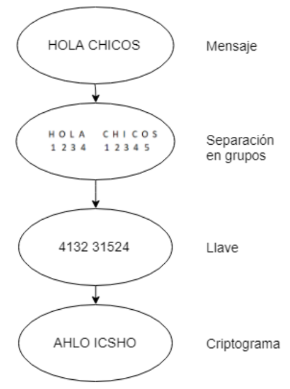

### **Criptografía Clásica - Sustitución**
* También conocido como **confusión**. El criptograma tendrá caracteres distintos a los que tenía el mensaje.
* Se sustituyen caracteres por otros del mismo u otros alfabetos.
* Se puede esconder la distribución característica del lenguaje en el criptograma.

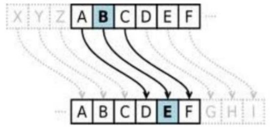

**Tipos**
* **Sustitución simple** -> un caracter del mensaje se remplaza por un caracter del alfabeto del criptograma (alfabeto de sustitución).
  * **Monoalfabéticos** -> un caracter del mensaje se remplaza por un caracter del alfabeto de sustitución.
    * **Ejemplos:** Atbash, Cesar, ROT13, afín, francmasón.
  * **Polialfabéticos** -> un caracter no siempre se sustituye por el mismo caracter. Se utilizan varios alfabetos.
    * **Ejemplos:** Alberti, Vigenere, Vernam.
  * **Homófonos** -> los caracteres más comunes del mensaje se pueden representar con más de un caracter del alfabeto de sustitución.
    * **Ejemplo:** Código navajo.
* **Poligráfico o por bloques** -> se sustituyen grupos de caracteres del mensaje por otros.
  * **Ejemplos:** Playfair, Hill.

### **Criptografía Clásica - Ejemplos**
* Escitala - 400 AC
* Polybios - 200 AC
* César - 100 AC
* Alberti - 1467
* Vigenére - 1586
* Enigma - 1923
* Hill - 1929

### **Criptografía Clásica - Escitala**
* Fue el primer cifrador por transposición.
* Consistía en un bastón en el que se enrollaba una cinta de cuero y luego se escribía en ella el mensaje de forma longitudinal. Al desenrollar la cinta, las letras aparecerán desordenadas.
* Para descifrar el criptograma y recuperar el mensaje en claro, hay que enrollar la cinta en un bastón con el mismo diámetro.

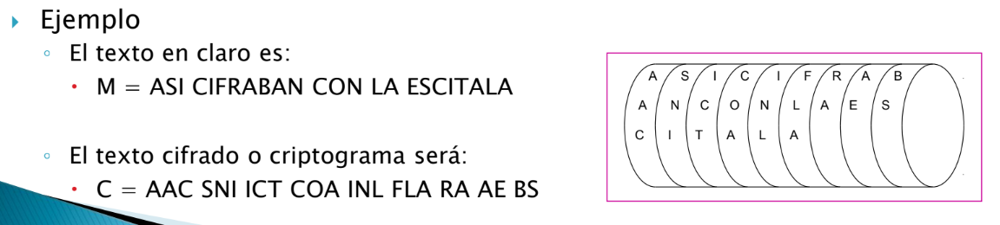

### **Criptografía Clásica - Polybios**
* Cifrador por sustitución.
* Duplica el tamaño del texto plano, por lo que no es tan eficiente.

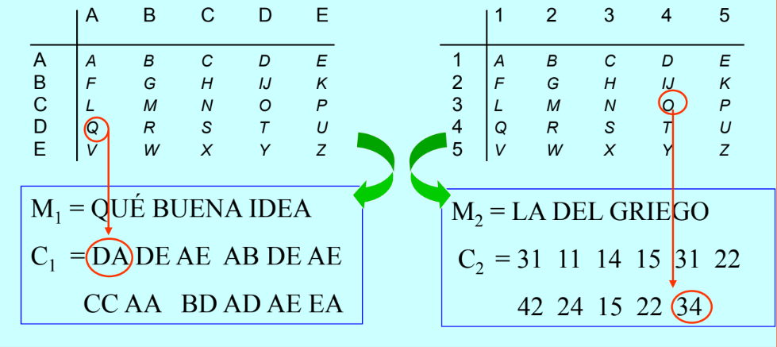

### **Criptografía Clásica - César**
* Usado por Julio César.
* El algoritmo consiste en el desplazamiento de tres espacios hacia la derecha de los caracteres del texto plano.
* Es un cifrador por sustitución monoalfabético en el que las operaciones se realizan módulo n, siendo n el número de elementos del alfabeto (en ese entonces el latín).

*Alfabeto de cifrado del César para castellano (mod 27)*

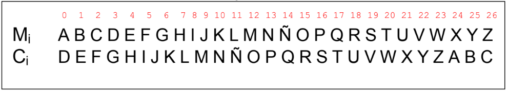

*Variante con clave* -> para aumentar la seguridad podemos incluir en el alfabeto de cifrado una clave de la siguiente forma:
* La clave K consiste en una palabra o frase que se escribe a partir de una posicion p0 del alfabeto en plano.
* Los caracteres repetidos de la clave no se escriben.
* Una vez escrita en la posición indicada se añaden las demas letras en orden.

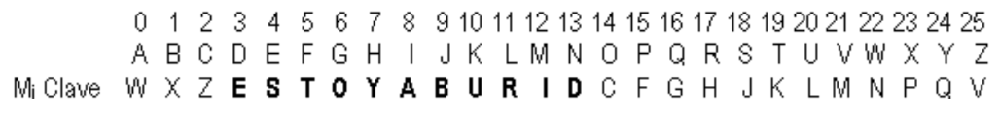

### **Criptografía Clásica - Alberti**
* Cifrado polialfabético por sustitución, desarolla un disco cifrador con el que es posible cifrar textos sin que exista una correspondencia única entre el alfabeto del mensaje y el de cifrado.
* Con este sistema, cada letra del texto en claro podía ser cifrada con un caracter distinto dependiendo esto de una clave secreta.

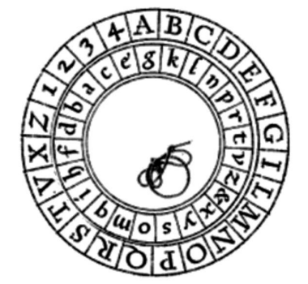

### **Criptografía Clásica - Vigenere**
* Este cifrador polialfabético soluciona la debilidad del cifrado del César, en el cual una letra se cifra siempre igual.
* Se usa una clave K de longitud L y se cifra caracter a caracter sumando “módulo n” al texto en claro con los elementos de esta clave: Ci = Mi + Ki (mod 27)

*Sea la llave K = CLAVE y el mensaje M = “HOLA AMIGOS”*

|M|=|H|O|L|A|A|M|I|G|O|S|
|-|-|-|-|-|-|-|-|-|-|-|-|
|K|=|C|L|A|V|E|C|L|A|V|E|
|C|=|J|Z|L|V|E|Ñ|S|G|K|W|

*Para codificar y decodificar se utiliza la tabla Vigenere*

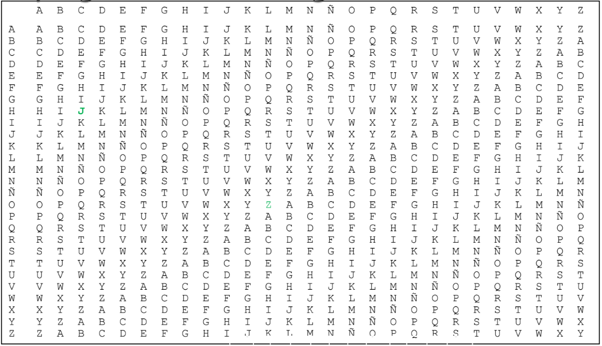

**Vigenere - Criptoanálisis, Método de Kasiski (1863)**
* Consiste en buscar repeticiones de “cadenas de caracteres” en el criptograma. Si estas cadenas son mayores o iguales a tres caracteres y se repiten más de una vez, es probable que se deba a cadenas de texto plano que se han cifrado con una misma porción de la clave.
* Si se detectan estas cadenas, la distancia entre las mismas será múltiplo de la longitud de la clave.
* Luego, el máximo común divisor entre esas cadenas es un candidato a ser la longitud de la clave (L).

**Vigenere - Criptoanálisis, Indice de Coincidencia (1920)**

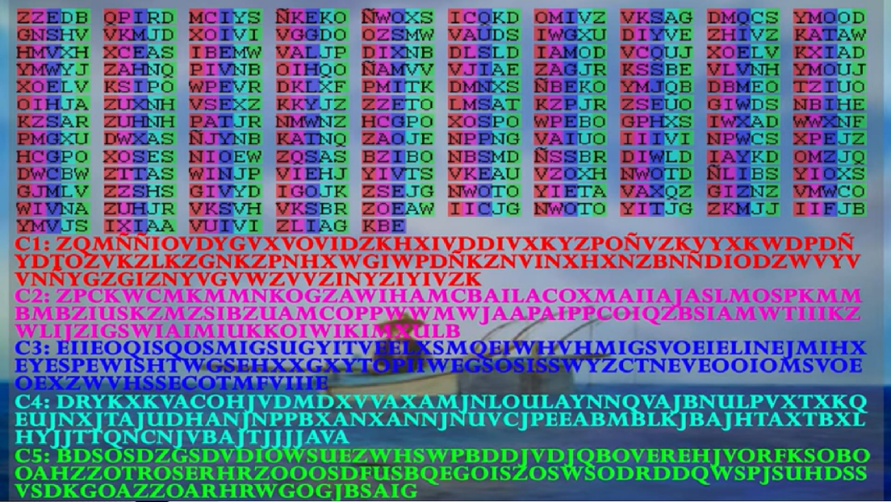

### **Criptografía Clásica - Enigma**
* Máquinas con rotores que permiten cifrado polialfabético.
* Inventada por el ingeniero aleman Arthur Scherbius.
* Tomaron un papel principal en la Segunda Guerra Mundial.
  * Fue de amplia utilización por parte del ejercito alemán.
* Enigma - Roto por *"el Bombe"* de Alan Turing.

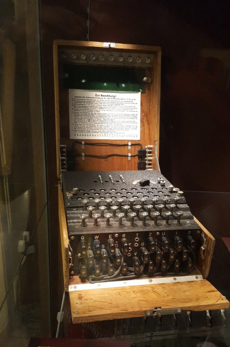

### **Criptografía Clásica - Hill**
* Sistema de sustitución poligráfica basada en algebra lineal.
* En 1929 el matemático Lester Hill propone un sistema de cifra usando una matriz como clave, cifrando N-gramas de forma que: 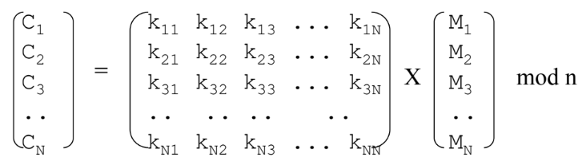
* La matriz clave K debe tener inversa K-1 en el cuerpo de cifrado “n”.
* Luego: K-1 = T Adj (K)/|K| mod n
  * Adj (K) es la matriz adjunta
  * T es la matriz traspuesta
  * |K| es el determinante, que no podrá ser cero ni tener factores en común con “n” puesto que está en el denominador
* Si el texto en claro no es múltiplo del bloque N, se rellena con caracteres predeterminados, por ejemplo la letra X o la Z.

*Vulnerable a un ataque usando Gauss-Jordan.*

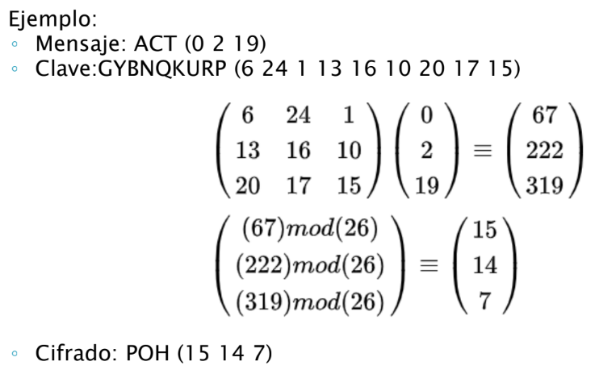

---

## **Dicotomía Ideológica - Clásica vs Moderna**

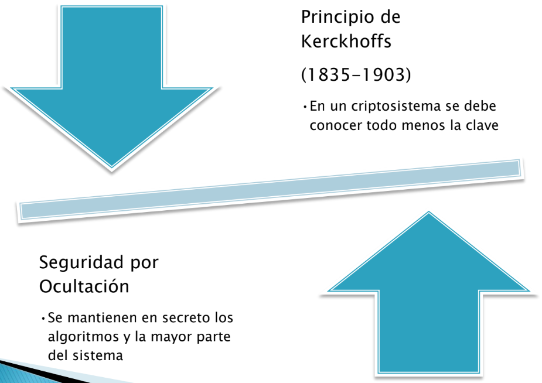

### **Requisitos de un Criptosistema**
* El algoritmo de cifrado y descifrado deberá ser rápido y fiable.
* Debe ser posible transmitir información por una línea de datos, almacenarlos o transferirlos.
* La seguridad del sistema deberá residir solamente en el secreto de una clave y no en las funciones de cifrado.
* La fortaleza del sistema se entenderá como la imposibilidad computacional de romper el cifrado o encontrar una clave secreta a partir de una pública.

---

## **Criptografía Moderna - Pilares**
|Teoría de la Infromación|Teoría de los Números|Teoría de la Complejidad Algorítmica|
|:-:|:-:|:-:|
|Estudio de la cantidad de información contenida en los mensajes y claves, así como su entropía|Estudio de las matemáticas discretas y cuerpos finitos que permiten las operaciones de cifrado y descifrado|Estudio de la clasificación de los problemas como computacionalmente tratables o intratables|

### **Criptografía Moderna - Teoría de la Información**
* Surgió en 1948
* Estudios hechos por Claude Shannon posteriores a la 2da Guerra Mundial permitieron:
  * Cuantificar la cantidad de información.
  * Medir la entropía de la información.
  * Definir un sistema con secreto perfecto.
  * Calcular la redundancia y el ratio del lenguaje.
  * Encontrar la distancia de unicidad.

*La teoría de la información mide la cantidad de información de un mensaje a través del número medio de bits necesario para codificar todos los posibles mensajes con un codificador óptimo*.

### **Criptografía Moderna - Teoría de los Números**
|Pertenecen a la teoría las cuestiones de:|Se investigan propiedades de funciones multiplicativas y otras|
|-|-|
|• Divisibilidad|• Función de Moebius|
|• Algoritmo de Euclides para calcular el MCD |• Función de Euler|
|• Factorización de los enteros como producto de números primos|• Sucesiones de números enteros|
|• Búsqueda de los números perfectos|• Factoriales|
|• Congruencias|• Números de Fibonacci|
|• Conjunto completo de restos||

### **Criptografía Moderna - Teoría de la Complejidad Algorítmica**
* Permite conocer la fortaleza de un algoritmo y tener así una idea de svulnerabilidad computacional.
* **Complejidad Computacional** ->
  * Los algoritmos pueden clasificarse según su tiempo de ejecución, en función del tamaño u orden de la entrada.
  * Hablamos así de complejidad:
    * **Polinominal** -> comportamiento similar al lineal
    * **Polinominal no Determinísta** -> comportamiento exponencial

*Da lugar a problemas "fáciles" y problemas "difíciles"*

---

## **Criptografía Moderna - Clasificación**

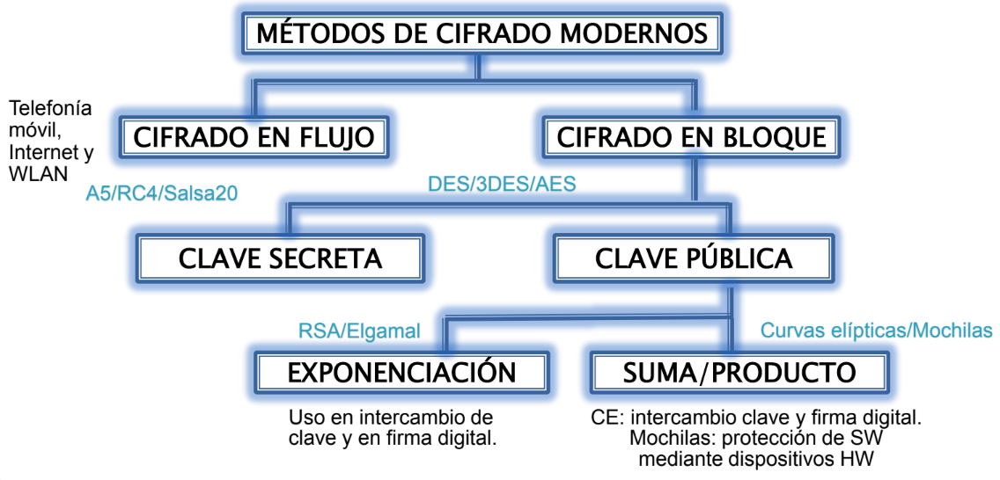

### **Criptografía Moderna - Cifrado de Flujo**
* Usa el concepto de Vernam ->
  * El espacio de las claves / llaves es igual o mayor que el espacio de los mensajes.
  * Las claves / llaves deben ser equiprobables.
  * El flujo de llaves se usa una sola vez y luego se destruye (one-time pad).
* El algoritmo de cifrado se aplica a un elemento de informacion mediante un generador de claves pseudoaleatorio y de mayor longitud que el mensaje.
* El cifrado se hace bit a bit.

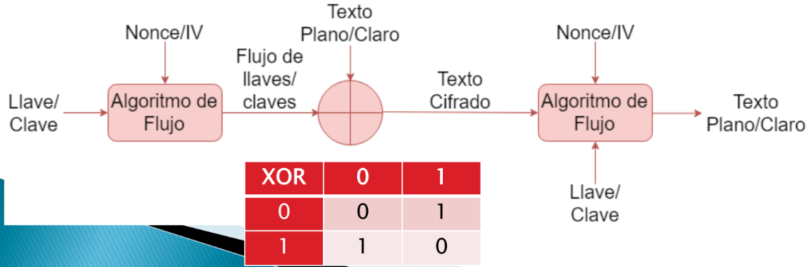

### **Criptografía Moderna - Cifrado en Bloque**
* El mensaje claro/plano se agrupa en bloques antes de aplicar un algoritmo a cada uno con la misma clave.
* El tamaño del boque no debe ser muy pequeño (facilita ataques de estadística del lenguaje) ni muy grande (lento, bajo rendimiento).
* Las operaciones sobre los bloques incluyen sustitución y permutación (AES) y redes feistel (DES).
* La forma en la que se cifran/decifran esos bloques, se lo llama “modo de cifrado” y son ECB, CBC, CTR, OFB, CFB.

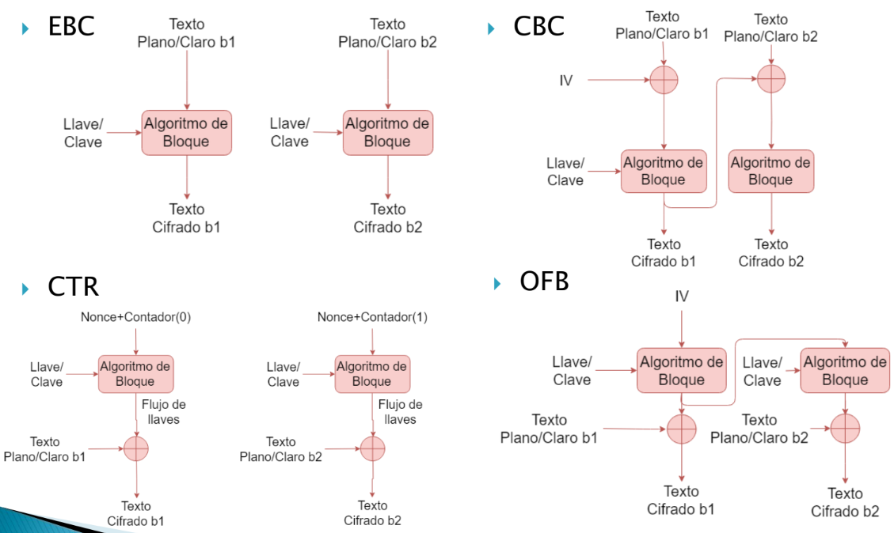

### **Criptografía Moderna - Sistema de llave secreta**
* Llamados criptosistemas simétricos.
* Con la misma clave se cifra y se descifra.
  * No es posible enviar la llave de forma segura a través de un medio inseguro.
* Es veloz.
* Con una llave pequeña, se obtiene alta seguridad.
* Ataque posible: Fuerza bruta.
* Ejemplos:
  * DES
  * AES / Rijnadel
  * Salsa 20
  * RC5
  * Blowfish

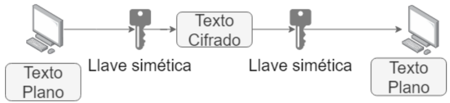

### **Criptografía Moderna - Sistema de llave pública**
* Llamados criptosistemas asimétricos.
* Cada usuario posee un par de claves, una privada y otra pública.
  * Lo que se cifra con una clave, se descifra con la otra.
* Se inventaron para evitar el problema de intercambio de llaves de los sistemas simétricos.
* La seguridad yace en la dificultar para saber la clave privada a partir de la pública.
* Usan las funciones unidireccionales con trampa.
* Usa llaves de tamaño mayor a las simétricas que son más lentas para procesar. 
* Ejemplos:
  * Curvas elípticas
  * Diffie-Hellman
  * RSA
  * El Gamal

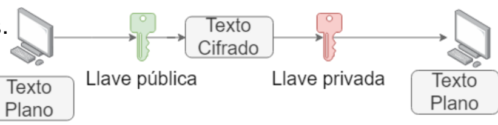

---

## **Criptografía Moderna - Usos**

### **Firma digital**
* El emisor envía un mensaje firmado y el receptor puede identificar que el emisor envió ese mensaje y que no fue alterado en el camino.

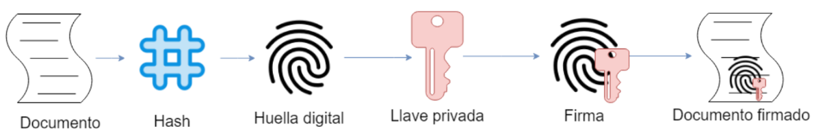

### **Certificado digital**
* Fichero electrónico emitido por una autoridad certificante pedido por alguna entidad.
* Los navegadores vienen con certificados raíz preinstalados.
* Contiene los datos del firmante (clave pública, identidad, etc), versión, validez, algoritmo de hash, etc.

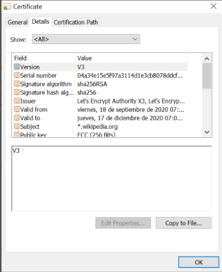

---

## **Criptografía Moderna - Cuántica**
* Usa la mecánica cuántica para garantizar la confidencialidad.
* Si un atacante espía durante la creación de la llave secreta, el proceso se altera (teorema de no clonado).
* Intercambio de llaves cuánticas: QKD (método de comunicación).
* Podría romper la criptografía actual.

### **Criptoanálisis - Tipos de Ataques**
* **Fuerza bruta** -> Intentan probar todas las llaves posibles.
* **Analíticos** -> Usan algoritmos y manipulación algebraica para reducir la complejidad del ataque.
* **Estadísticos** -> Utilizan debilidades estadísticas del diseño del sistema.
* **Implementación** -> No ataco al algoritmo sino como fue implantado.
* **Solo texto cifrado** -> El atacante intenta desencriptar el texto cifrado directamente.
* **Texto plano conocido** -> El atacante intenta desencriptar el texto cifrado conociendo parte del texto plano.
* **Texto plano elegido** -> El atacante obtiene texto cifrado correspondiente a un texto plano conocido.
* **Texto cifrado elegido** -> El atacante obtiene texto plano correspondiente a un texto cifrado predeterminado.

---

## **Algoritmos de Hash**
* Función criptográfica de una vía para generar salidas que representen de manera casi unívoca a la entrada.
  * "Hash" es el resultado de la función y el tipo de algoritmo.
  * La salida debe tener tamaño fijo independientemente del tamaño de la entrada.
* Ejemplos:
  * MD2 / MD4 / MD5
  * SHA-1
  * SHA-2

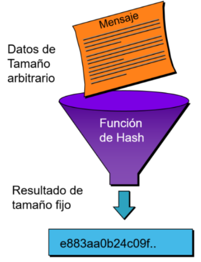

* **Propiedades**
  * Unidireccionalidad
  * Compresión
  * Facilidad de cálculo
  * Difusión

* **Aplicaciones**
  * Contraseñas
  * Firma Digital
  * Integridad
  * Autenticación

### **Sal, pimienta, semilla**
* Sal
  * Agregar un valor a lo que se quiere cifrar para que produzca otro resultado
  * Puede no ser secreto, pero debería ser único.
  * Se usa para guardar hashes de contraseñas.
    * Generalmente se guarda junto al hash.
* Pimienta
  * Similar a la sal, pero secreto.
  * Generalmente se usa 1 solo character al final de la contraseña.
  * Se puede combinar con la sal.
  * No se guarda con el hash.
* Semilla
  * Valor usado para iniciar un numero aleatorio.
  * Tiene que ser secreto.
  * Se usa para el vector inicial.

---

## **Esteganografía**
* Conjunto de técnicas para comunicar un mensaje ocultando la información dentro de un conjunto de datos para que pase desapercibida.
  * Fotografías, audio y video.
  * Puede ser muy difícil de detectar.
* Incluso si se considera que un archivo analizado no contiene información oculta, aun puede tenerla y no haber sido detectada.
* En el caso de encontrar la información, aun puede estar encriptada y resultar ilegible de manera directa.

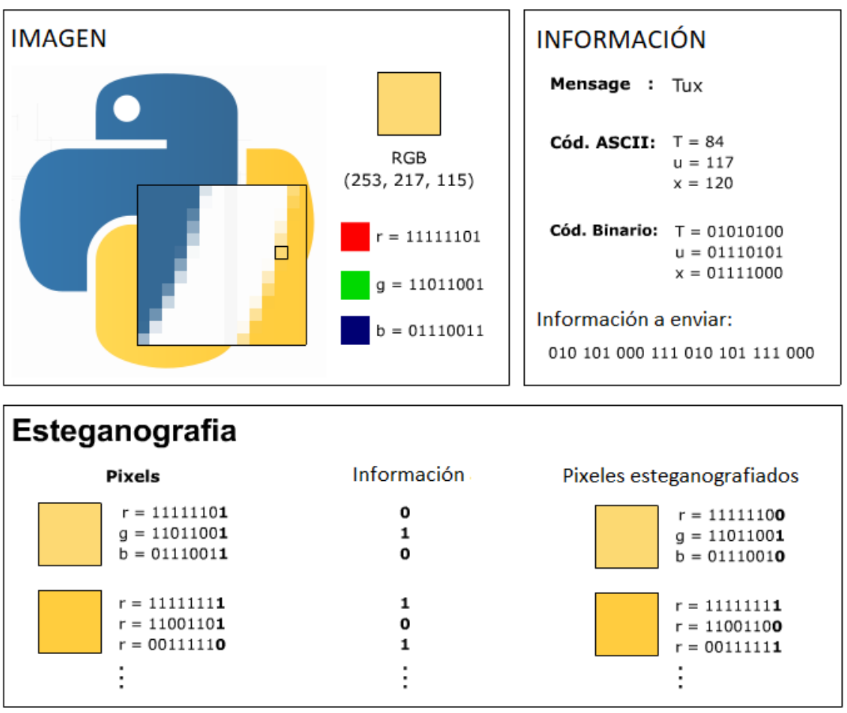

---

## **Estegoanálisis**
* Debido a que la esteganografía deja huellas en el medio de transporte utilizado, las técnicas de estegoanálisis intentan detectar estos cambios, usando incluso complejos mecanismos estadísticos.
* Tipos:
  * **Estegoanálisis manual** -> Buscar de forma manual diferencias entre el fichero original y el fichero con esteganografía, observando cambios en la estructura para localizar datos ocultos.
    * Se necesita tener un fichero original.
    * Es casi imposible descifrar el mensaje.
  * **Estegoanálisis estadístico** -> consiste en el cotejo de la frecuencia de distribución de colores en el caso de un fichero de imagen esteganografiado. Es una técnica lenta para la que se deben emplear software especializado. Aunque estos programas suelen buscar pautas para ocultar los mensajes que utilizan los programas más habituales de esteganografía, lo que los hace muy eficaces cuando se trata de mensajes ocultos con programas.
    * Los mensajes ocultados manualmente son casi imposibles de encontrar para estos programas.