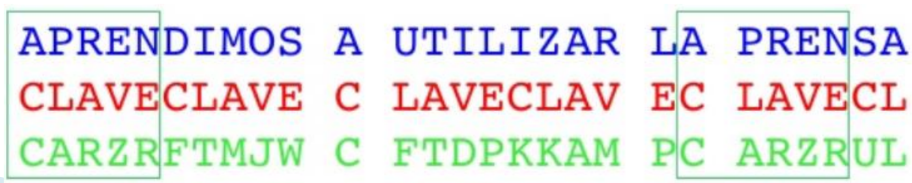

# **Ciberseguridad - Clase 3**
## **Criptografía**
### **Criptología**
*Del griego krypto: 'oculto' y logos: 'estudio'.*

Disciplina o ciencia que estudia la manera de cifrar y descifrar los mensajes con una o más llaves para que resulte imposible conocer su contenido a los que no dispongan de las claves utilizadas.

*Su uso mas antiguo se puede encontrar en algunos jeroglíficos de hace 4500 años en Egipto.*

**_La criptología se divide en:_**
* **Criptografía** *(escritura oculta)* -> Arte de escribir en forma secreta o de modo enigmático.
* **Criptoanálisis** *(análisis de lo oculto)* -> Arte de descifrar criptogramas.
* **Esteganografía** *(escritura cubierta, oculta o protegida)* -> Arte de ocultar mensajes u objetos, dentro de otros.
* **Estegoanálisis** *(análisis de lo cubierto)* -> Estudio de la detección de mensajes ocultos usando esteganografía.

**Elementos**
* **Cifrado** -> Algoritmo
* **Texto plano / claro** -> Documento originial (M)
* **Criptograma** -> Documento / texto cifrado (C)
* **Claves** -> Llaves (criptovariables) que permiten cifrar / descifrar un criptograma
* **Espacio de llaves** -> Conjunto de todas las llaves posibles
* **Alfabeto** -> Conjunto de todos los caracteres posibles
* **Criptosistema** -> Conjunto completo de elementos que conforman un sistema criptográfico

**Propósito**
* Proteger información de forma tal que solo quien esta autorizado pueda leerla y comprenderla.
  * En el caso ideal, toda persona no autorizada a dicha información nunca podrá sacar provecho de dicha información.
* En la antigüedad se pretendía garantizar la confidencialidad, la integridad y la autenticidad. A finales del siglo XX se han añadido la disponibilidad y, últimamente, el no repudio.
* En el mundo real, el costo en tiempo y recursos de lectura de dicha información debe ser mayor que el valor que se obtiene de su lectura.

**Clasificación**
* **Criptografía Clásica** -> seguridad basada en el **secreto del algoritmo.**
  * Cifrado por transposición.
  * Cifrado por sustitución.
* **Criptografía Moderna** -> seguridad basada en el **secreto de la clave.**

### **Criptografía Clásica - Transposición**
* También conocido como **permutación**. Los caracteres se cambian de posición según ciertas reglas.
* El criptograma tendra los mismos caracteres del mensaje pero con una distribución diferente.
* Su criptoanálisis se realiza aplicando *'Técnicas de Anagramación'*.

### **Criptografía Clásica - Sustitución**
* También conocido como **confusión**. El criptograma tendrá caracteres distintos a los que tenía el mensaje.
* Se sustituyen caracteres por otros del mismo u otros alfabetos.
* Se puede esconder la distribución característica del lenguaje en el criptograma.

**Tipos**
* **Sustitución simple** -> un caracter del mensaje se remplaza por un caracter del alfabeto del criptograma (alfabeto de sustitución).
  * **Monoalfabéticos** -> un caracter del mensaje se remplaza por un caracter del alfabeto de sustitución.
    * **Ejemplos:** Atbash, Cesar, ROT13, afín, francmasón.
  * **Polialfabéticos** -> un caracter no siempre se sustituye por el mismo caracter. Se utilizan varios alfabetos.
    * **Ejemplos:** Alberti, Vigenere, Vernam.
  * **Homófonos** -> los caracteres más comunes del mensaje se pueden representar con más de un caracter del alfabeto de sustitución.
    * **Ejemplo:** Código navajo.
* **Poligráfico o por bloques** -> se sustituyen grupos de caracteres del mensaje por otros.
  * **Ejemplos:** Playfair, Hill.

### **Criptografía Clásica - Ejemplos**
* Escitala - 400 AC
* Polybios - 200 AC
* César - 100 AC
* Alberti - 1467
* Vigenére - 1586
* Enigma - 1923
* Hill - 1929

### **Criptografía Clásica - Escitala**
* Fue el primer cifrador por transposición.
* Consistía en un bastón en el que se enrollaba una cinta de cuero y luego se escribía en ella el mensaje de forma longitudinal. Al desenrollar la cinta, las letras aparecerán desordenadas.
* Para descifrar el criptograma y recuperar el mensaje en claro, hay que enrollar la cinta en un bastón con el mismo diámetro.

### **Criptografía Clásica - Polybios**
* Cifrador por sustitución.
* Duplica el tamaño del texto plano, por lo que no es tan eficiente.

### **Criptografía Clásica - César**
* Usado por Julio César.
* El algoritmo consiste en el desplazamiento de tres espacios hacia la derecha de los caracteres del texto plano.
* Es un cifrador por sustitución monoalfabético en el que las operaciones se realizan módulo n, siendo n el número de elementos del alfabeto (en ese entonces el latín).

*Alfabeto de cifrado del César para castellano (mod 27)*

*Variante con clave* -> para aumentar la seguridad podemos incluir en el alfabeto de cifrado una clave de la siguiente forma:
* La clave K consiste en una palabra o frase que se escribe a partir de una posicion p0 del alfabeto en plano.
* Los caracteres repetidos de la clave no se escriben.
* Una vez escrita en la posición indicada se añaden las demas letras en orden.

### **Criptografía Clásica - Alberti**
* Cifrado polialfabético por sustitución, desarolla un disco cifrador con el que es posible cifrar textos sin que exista una correspondencia única entre el alfabeto del mensaje y el de cifrado.
* Con este sistema, cada letra del texto en claro podía ser cifrada con un caracter distinto dependiendo esto de una clave secreta.

### **Criptografía Clásica - Vigenere**
* Este cifrador polialfabético soluciona la debilidad del cifrado del César, en el cual una letra se cifra siempre igual.
* Se usa una clave K de longitud L y se cifra caracter a caracter sumando “módulo n” al texto en claro con los elementos de esta clave: Ci = Mi + Ki (mod 27)

*Sea la llave K = CLAVE y el mensaje M = “HOLA AMIGOS”*

|M|=|H|O|L|A|A|M|I|G|O|S|
|-|-|-|-|-|-|-|-|-|-|-|-|
|K|=|C|L|A|V|E|C|L|A|V|E|
|C|=|J|Z|L|V|E|Ñ|S|G|K|W|

*Para codificar y decodificar se utiliza la tabla Vigenere*

**Vigenere - Criptoanálisis, Método de Kasiski (1863)**
* Consiste en buscar repeticiones de “cadenas de caracteres” en el criptograma. Si estas cadenas son mayores o iguales a tres caracteres y se repiten más de una vez, es probable que se deba a cadenas de texto plano que se han cifrado con una misma porción de la clave.
* Si se detectan estas cadenas, la distancia entre las mismas será múltiplo de la longitud de la clave.
* Luego, el máximo común divisor entre esas cadenas es un candidato a ser la longitud de la clave (L).

**Vigenere - Criptoanálisis, Indice de Coincidencia (1920)**

### **Criptografía Clásica - Enigma**
* Máquinas con rotores que permiten cifrado polialfabético.
* Inventada por el ingeniero aleman Arthur Scherbius.
* Tomaron un papel principal en la Segunda Guerra Mundial.
  * Fue de amplia utilización por parte del ejercito alemán.
* Enigma - Roto por *"el Bombe"* de Alan Turing.

### **Criptografía Clásica - Hill**
* Sistema de sustitución poligráfica basada en algebra lineal.
* En 1929 el matemático Lester Hill propone un sistema de cifra usando una matriz como clave, cifrando N-gramas de forma que: 
* La matriz clave K debe tener inversa K-1 en el cuerpo de cifrado “n”.
* Luego: K-1 = T Adj (K)/|K| mod n
  * Adj (K) es la matriz adjunta
  * T es la matriz traspuesta
  * |K| es el determinante, que no podrá ser cero ni tener factores en común con “n” puesto que está en el denominador
* Si el texto en claro no es múltiplo del bloque N, se rellena con caracteres predeterminados, por ejemplo la letra X o la Z.

*Vulnerable a un ataque usando Gauss-Jordan.*

## **Dicotomía Ideológica - Clásica vs Moderna**

### **Requisitos de un Criptosistema**
* El algoritmo de cifrado y descifrado deberá ser rápido y fiable.
* Debe ser posible transmitir información por una línea de datos, almacenarlos o transferirlos.
* La seguridad del sistema deberá residir solamente en el secreto de una clave y no en las funciones de cifrado.
* La fortaleza del sistema se entenderá como la imposibilidad computacional de romper el cifrado o encontrar una clave secreta a partir de una pública.

### **Criptografía Moderna - Pilares**