# **Ciberseguridad - Clase 4**
## **Seguridad en Desarrollo de Sistemas**
### **Introducción a la Seguridad en Desarrollo**
* Las organizaciones suelen poner mucho esfuerzo en **resolver** los *problemas de seguridad* con la implementación de firewalls, IDS, antivirus, etc.
  * Controles que permiten crear un *perímetro* entre el exterior y el interior de la organización.

**La mayor cantidad de vulnerabilidades ocurre en los sistemas.**

---

### **¿Por qué los sistemas son inseguros?**
* En el pasado no se pensaba en seguridad y muchos sistemas fueron heredados.
  * Sistema Oracle JD Edwards creado en 1977
  * SAP fundada en 1972
* Los sistemas priorizan actualizaciones y mejoras en las interfaces.
* Mantienen su diseño y no modifican las estructuras de sus sistemas.
* Los conocimientos en programacion no van muy de la mano con los conocimientos en seguridad.
* Los proveedores de sistemas tratan de lanzar sus productos al mercado poniendo el foco en la funcionalidad y no en la seguridad.

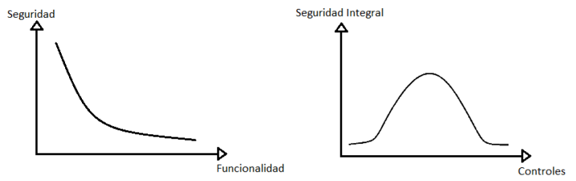

* La comunidad esta acostumbrada a recibir sistemas con vulnerabilidades y luego aplicar parches.

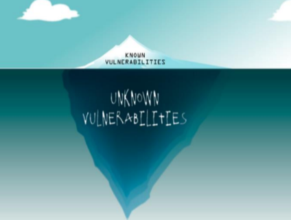

* Los clientes no pueden controlar las vulnerabilidades en los sistemas, por lo tanto tienen que confiar en ellos.

---

### **La tendencia de la Seguridad en los sistemas**
1. Se lanza al mercado un sistema con vulnerabilidades.
2. Se encuentran vulnerabilidades o debilidades en los sistemas.
3. Se informa a la organización que desarrolla el sistema de cierta vulnerabilidad.
4. La organización que desarrolló el sistema analiza la vulnerabilidad y desarrolla el parche o fix que resuelve la vulnerabilidad.
5. La organización que desarrolló el sistema, publica la vulnerabilidad y su respectivo parche.
6. Los clientes que tienen el sistema, deben instalar el parche o actualizar su sistema.

**Modelo cascada**
1. **Iniciativa** -> Temas legales, políticas, temas críticos, aprobación.
2. **Relevamiento** -> Entrevistas con el negocio para saber cómo implementar la seguridad.
3. **Análisis de Requerimientos** -> Evaluar requerimientos, vulnerabilidades, amenazas, requerimientos de seguridad, relación costo / beneficio.
4. **Diseño** -> Armado del modelo de seguirdad, definición de control de acceso y elección de cifrado.
5. **Programación** -> Configuración de los ambientes de prueba.
6. **Pruebas** -> Encontrar errores generales.
7. **Implementación** -> Armado del ambiente productivo, usuarios, roles, etc.
8. **Mantenimiento** -> Mesa de ayuda.

**Modelo espiral**
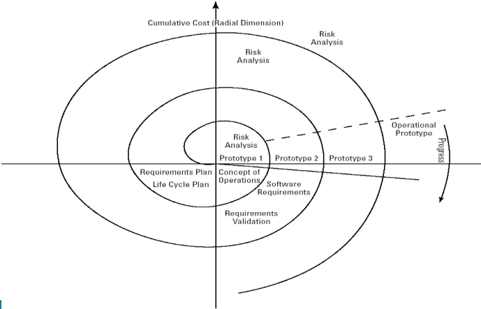
*Por cada prototipo que se genera, se realiza un análisis de riesgo nuevo.*

**DevSecOps**
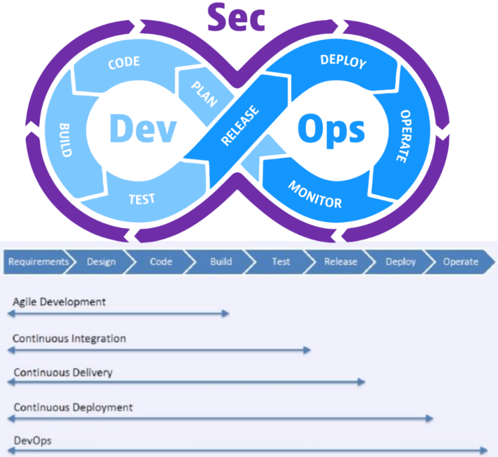
*Integración continua y entrega continua*
* Tecnicas para implementar DevSecOps
  * SAST -> Static Application Security Testing
    * Buscar errores en el código, en el diseño etc.
  * IAST -> Interactive Application Security Testing
    * Analiza el comportamiento de la aplicación.
  * DAST -> Dynamic Application Security Testing
    * Se coloca en la piel del atacante para verificar la respuesta de la aplicación.
  * RASP -> Runtime Application Self Protection (combinación de los 3 anteriores)
    * Se implementa seguridad durante todo el proceso y luego de finalizado, implementa una politica de seguridad para seguir actualizando eso.

---

### **Variedad de Entornos / Ambientes**
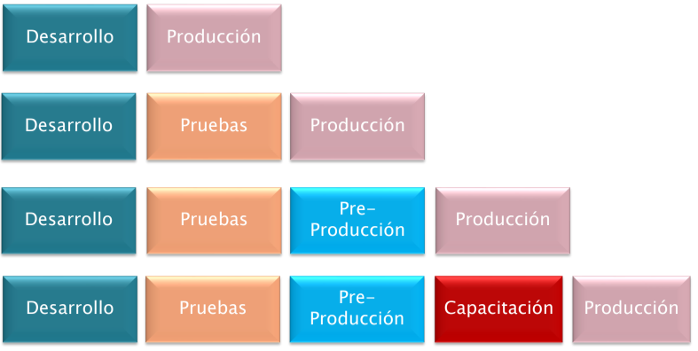

**Accesos a los entornos**

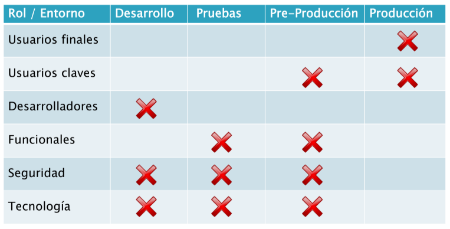

---

### **Control de cambios**
* ¿Quién lo debe hacer? -> **Comité de control de cambios**
  * El cambio debe estar analizado, aprobado, autorizado y documentado.
  * Los cambios no deben afectar negativamente a la seguridad.

---

### **Segregación de funciones**
**Fase I**

*Armado de la matriz de segregación de funciones incompatibles.*

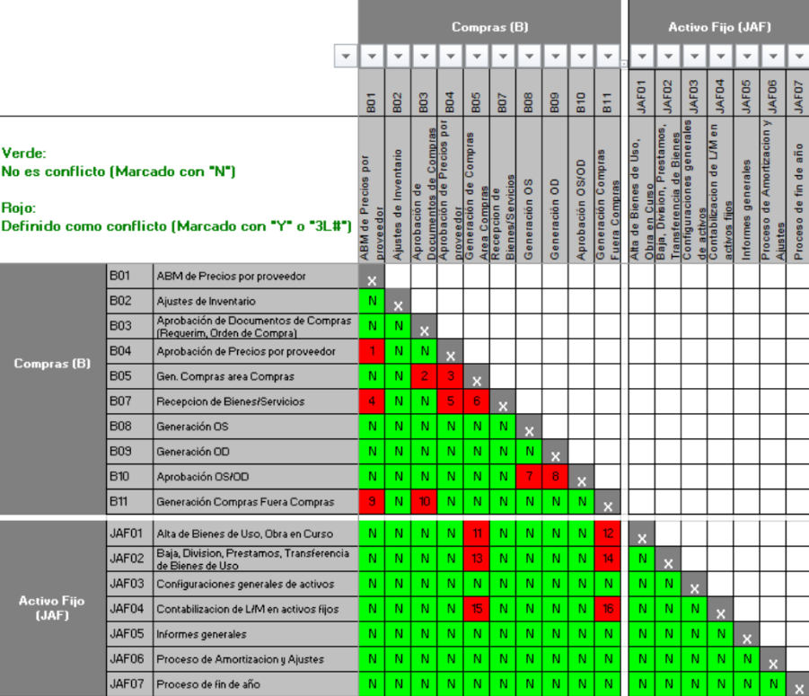

**Fase II**

*Carga y ejecución de las listas y reglas de incompatibilidad.*

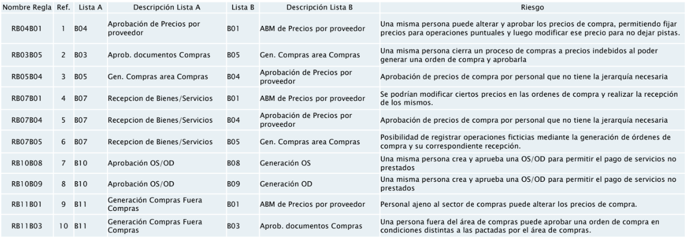

**Fase III**

*Identificar los usuarios con funciones incompatibles.*

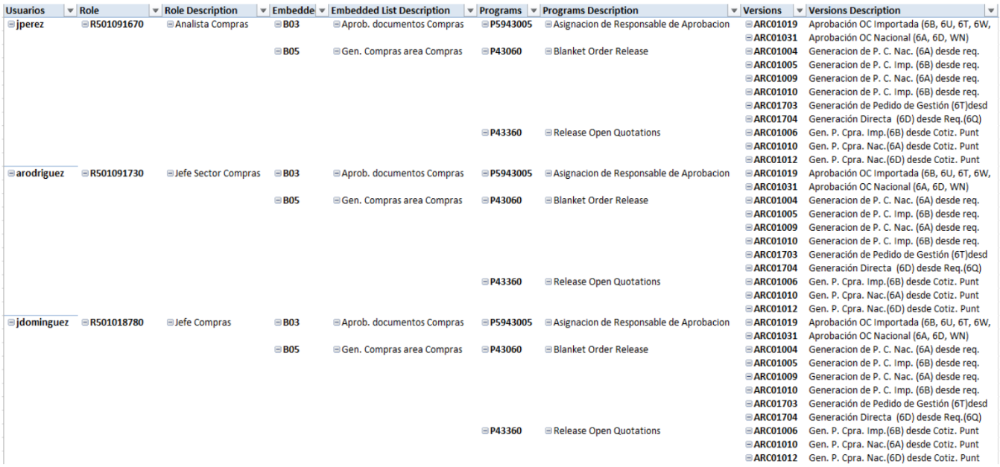

**Fase IV**

*Armado del plan de acción correctivo.*
* Modificacion de accesos.
* Justificación de los conflictos.

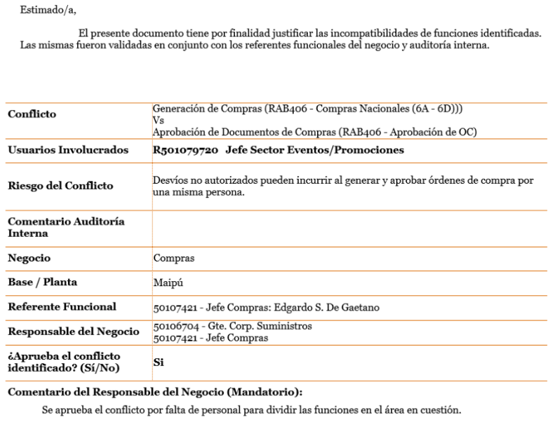

---

### **¿Qué loguear y dónde?**
* **¿Qué es necesario logear?**
  * Definir que eventos registrar.
    * Monitoreo usos indebidos, cambios de contraseña, ABM de usuarios.
  * Definir distintos niveles.
  * Contar con evidencia de los casos de incidentes de seguridad.
* **¿Dónde logear?**
  * Archivos propios de la aplicación
    * Ingresos
    * Cambios en el sistema
    * Transacciones criticas de negocio
  * Loggin Local
    * Windows - Visor de sucesos
    * Unix - Syslog
  * Consola de administración de log centralizada

**Arquitectura de sistemas**

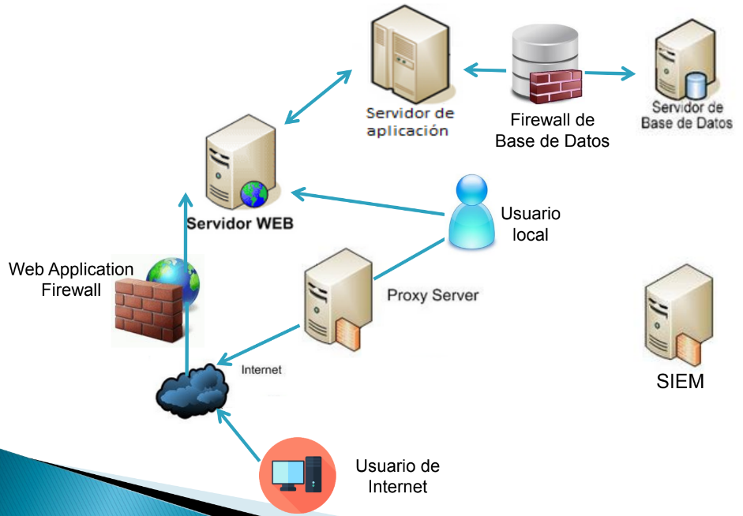

---

### **Técnicas de ataque**
* Búsqueda de revelación de información.
* Búsqueda de vulnerabilidades conocidas.
* Explotación de vulnerabilidades top 10 OWASP.
* Fuzzing.
* Ingeniería inversa/análisis de código.
* Análisis de protocolos.

---

## **OWASP (Open Web Application Security Project)**
**Top 10 2021**
* A1 – Pérdida de Control de Acceso.
* A2 – Fallas Criptográficas.
* A3 – Inyección.
* A4 – Diseño Inseguro.
* A5 – Configuración de Seguridad Incorrecta.
* A6 – Componentes Vulnerables y Desactualizados.
* A7 – Fallas de Identificación y Autenticación.
* A8 – Fallas en el Software y en la Integridad de los Datos.
* A9 – Fallas en el Registro y Monitoreo.
* A10– Falsificación de Solicitudes del Lado del Servidor (SSRF).

---

### **A1 - Pérdida de Control de Acceso**
* Exploit
  * La explotación del control de acceso es la habilidad principal de los atacantes. Puede darse por la falta del control o por una mala implementación.
* Vulnerabilidad
  * Las debilidades de control de acceso son comunes debido a la falta de detección automática y a la falta de pruebas funcionales efectivas por parte de los desarrolladores de aplicaciones.
* Impacto
  * Personas no autorizadas actúan como usuarios sin privilegios o administradores, o usuarios pueden utilizar funciones privilegiadas, o crear, acceder, actualizar o eliminar registros.
* ¿Cómo prevenirlo?
  * El control de acceso solo es efectivo si se aplica código confiable del lado del servidor.
    * Ejemplos: “denegación por defecto”, capturando las excepciones, implementando control de acceso, deshabilitando el listado de directorio, implementando logs, etc.

---

### **A2 - Fallas Criptográficas**
* Exploit
  * A través de fallas en la implementación de sistemas criptográficos, la información sensible queda expuesta. Permite robar credenciales, realizar ataques “man-in-the-middle”, robar datos en texto claro/plano del servidor (mientras se encuentran en tránsito o desde el navegador del usuario).
* Vulnerabilidades
  * La vulnerabilidad mas común es no cifrar datos sensibles.
* Impacto
  * Las fallas potencialmente comprometen todas las información que debería estar protegidas como tarjetas de créditos, registros médicos, datos personales, etc.
* ¿Cómo prevenirlo?
  * Aplicar algoritmos de cifrado para los datos sensibles.
  * No almacenar datos sensibles innecesariamente.
  * Asegurarse que las claves se almacenan con un algoritmo especialmente diseñado para protegerlas.

---

### **A3 - Inyección**
* Exploit
  * El atacante envía mensajes con cadenas de texto, las cuales explotan la sintaxis del interprete.
* Vulnerabilidad
  * Ocurre cuando una aplicación envía información no confiable a un interprete.
    * Ejemplos: SQL, NoSQL, LDAP, entre otros.
* Impacto
  * Puede causar denegación de servicio, perdida o modificación de datos. En ciertos casos puede causar el compromiso total.
* ¿Cómo prevenirlo?
  * Utilizar una API segura que provea una interfaz parametrizada.
  * Validar los valores de entrada usando listas de entrada o whitelist.
  * Realizar revisiones de código fuente.
  * Implementar SAST, DAST, IAST para detectar fallas antes de desplegar a producción.

**Ejemplo**

* Escenario
  * La aplicación usa datos no confiables en la construcción de la siguiente instrucción SQL vulnerable:
    * String query = "SELECT * FROM accounts WHERE custID='" + request.getParameter("id") + "'";
* Ataque
  * El atacante modificar el parámetro ‘id’ en su navegador para enviar:
    * 2' or '1'=‘1
  * Ejemplo:
    * http://example.com/app/accountView?id=2'or'1'='1
  * La consulta quedaría:
    * SELECT * FROM accounts WHERE custID=‘2' or '1'='1’;

---

### **A4 - Diseño Inseguro**
* Exploit 
  * Los atacantes podrían ingresar de forma no autorizada a los sistemas, adquirir productos o descuentos desmesurados, o usar bots sin ningún tipo de restricciones, entre otros.
* Vulnerabilidad
  * La falta, ineficiencia o inexistencia de controles en el diseño de los sistemas debido a la falta de consideración de los riesgos inherentes asociados al sistema no permite implementar controles claves.
* Impacto
  * Accesos no autorizados, perdida de dinero, imposibilidad de realizar transacciones.
* ¿Cómo prevenirlo?
  * Diseño seguro (threat modeling, historias de usuario).
  * Ciclo de desarrollo seguro (patrones de diseño, modelos de madurez).
  * Test unitarios e integrales.
  * Limitar consumo de recursos por un usuario o servicio.

---

### **A5 - Configuración de Seguridad Incorrecta**
* Exploit
  * Un atacante accede a cuentas por defecto, páginas sin uso, fallas sin parchear, archivos y directorios sin protección, etc., con el fin de obtener acceso no autorizado o conocimiento del sistema.
* Vulnerabilidades
  * Las configuraciones de seguridad incorrectas pueden ocurrir a cualquier nivel de la aplicación.
* Impacto
  * Estas vulnerabilidades frecuentemente dan a los atacantes acceso no autorizado a algunas funciones o datos del sistema. Ocasionalmente provocan que el sistema se pueda comprometer completamente.
* ¿Cómo prevenirlo?
  * Arquitectura fuerte de los sistemas y seguridad en capas.
  * Hardening.

---

### **A6 - Componentes Vulnerables y Desactualizados**
* Exploit
  * El atacante identifica un componente débil a través de escaneos automáticos o análisis manuales. Ajusta el exploit como lo necesita y ejecuta el ataque.
* Vulnerabilidades
  * En general, los equipos de desarrollo no se preocupan que sus componentes o bibliotecas estén actualizados, exponiéndose a vulnerabilidades.
* Impacto
  * El impacto varia en función de la vulnerabilidad que se encuentra en el componente o biblioteca desactualizada.
* ¿Cómo prevenirlo?
  * Identificar todos los componentes y versiones, revisar su seguridad, establecer políticas para el uso de componentes y agregar capas de Seguridad.

---

### **A7 - Fallas de Identificación y Autenticación**
* Exploit
  * El atacante utiliza filtraciones o vulnerabilidades en las funciones de autenticación o gestión de sesiones para suplantar otros usuarios.
* Vulnerabilidades
  * Los desarrolladores a menudo crean esquemas propios de autenticación o gestión de sesiones. Pueden contener vulnerabilidades de cierre de sesión, gestión de contraseñas, tiempo de desconexión, preguntas secretas, entre otros.
* Impacto
  * Las vulnerabilidades pueden permitir que una o todas las cuentas sean atacadas. El atacante podría hacer cualquier acción que la victima este autorizado a hacer.
* Como prevenirlo?
  * Autenticación fuerte o utilizar frameworks confiables.

**Ejemplo**

* Escenario
  * Aplicación de reserva de vuelos que soporta reescritura de URL poniendo los ID de sesión en la propia dirección:
  * http://example.com/sale/saleitems;jsessionid=2P0OC2JDPXM0OQSNDLPSKHCJUN2JV?dest=Hawaii
* Ataque
  * Un atacante podría utilizar cualquier técnica de man-in-the-middle para poder utilizar esa sesión y obtener los datos de tarjetas de crédito ingresadas.

---

### **A8 - Fallas en el Software y en la Integridad de los Datos**
* Exploit
  * Un atacante se aprovecha de la falta de controles que tiene el código y lo modifica según sus necesidades.
* Vulnerabilidad
  * El código no esta protegido contra alteraciones, afectando su integridad.
* Impacto
  * Acceso no autorizado, inclusión de código malicioso, compromiso del sistema.
* ¿Cómo prevenirlo?
  * Verificar la integridad de cada descarga antes de su instalación.
    * Usar firmas digitales.
  * Asegurarse de que las bibliotecas y dependencias (npm, Maven) son usadas desde repositorios confiables.
  * Usar herramientas de análisis.
  * Revisión de código.

---

### **A9 - Fallas en el Registro y Monitoreo**
* Exploit
  * Los atacantes dependen de la falta de monitoreo y de la respuesta oportuna para lograr sus objetivos sin ser detectados.
* Vulnerabilidad
  * La debilidad se encuentra en la falta de logs y monitoreo de los servidores críticos de la organización.
* Impacto
  * Este puede ser el inicio de las pruebas sobre otros ataques posibles haciendo investigación de las vulnerabilidades que tiene el o los servidores en cuestión.
* ¿Cómo prevenirlo? 
  * Asegúrese de que todos los inicios de sesión, las fallas de control de acceso y las fallas de validación de entrada del lado del servidor puedan registrarse con un contexto de usuario suficiente para identificar las cuentas sospechosas o maliciosas, y conservarlas durante el tiempo suficiente para permitir el análisis forense.

---

### **A10 - Falsificación de Solicitudes del Lado del Servidor (SSRF)**
* Exploit 
  * Envío de solicitudes falsificadas a un destino inesperado.
* Vulnerabilidades
  * El atacante tiene acceso parcial o total de las consultas enviadas por una aplicación.
* Impacto
  * Exposición de datos sensibles, acceso a almacenamiento de metadatos de los servicios en la nube, escaneo de servidores internos para generar un mapa de la red interna, entre otros.
* ¿Cómo prevenirlo?
  * Defensa en profundidad (Defensa por capas).
