# **Ciberseguridad - Clase 5**

## **Malware**

*Malicious Software*, es el término usado para referirnos a cualquier tipo de software cuya finalidad es causar algún daño, robar información, acceder a sistemas privados o mostrar publicidad no deseada.

Afectan todo tipo de sistema operativo y están escritos en distintos lenguajes.

### **Tipos de Malware**
* Existen muchas clasificaciones, las que vamos a enumerar nosotros son:

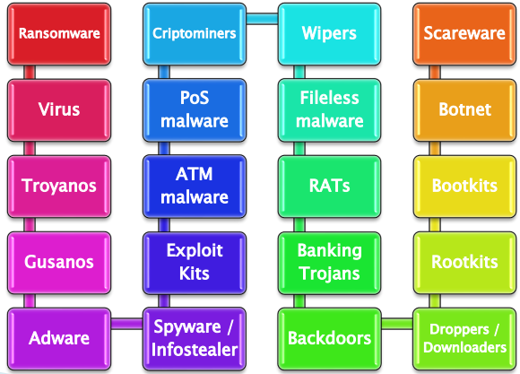

### **Virus**
* **Primer virus** -> Creeper (1971). Distribuido en ARPANET. Primer antivirus: Reaper.
* **Características** -> Se replican en los sistemas, reproduciéndose a si mismo o infectando otros programas y modificándolos.
* **Ejemplos**:
  * Elk Cloner (1982)
  * SCA virus (1987)
  * ILOVEYOU (2000)

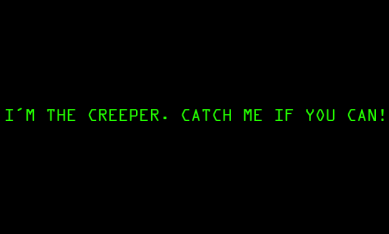

### **Gusanos**
* **Primer gusano** -> Morris (1988). Afecto el 10% de las computadoras conectadas a ARPANET.
* **Características** -> También se replican como los virus, pero no modifican otros programas. Pueden contener código malicioso para causar daños en el Sistema.
* **Ejemplos**:
  * Wank (1989)
  * Slammer (2003)

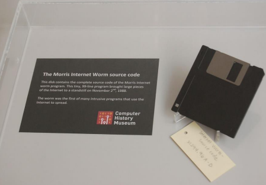

### **Adware**
* **Primer adware** -> Es difícil de precisar ya que al principio se lo consideraba spyware. También es conocido como PUP (Potentially Unwanted Program), Malvertising y click-fraud.
* **Características** -> Muestran o descargan publicidad no deseada al usuario para generar ganancias. Pueden recolectar información para saber los gustos del usuario y presentar publicidades acorde a esos gustos. También puede redireccionar las búsquedas del usuario a páginas publicitarias.
* **Propagación**:
  * Toolbars
  * Browser extensions

### **Spyware**
* **Primer spyware** -> El término surgió en 1995 en un post.
* **Características** -> El objetivo es robar información y enviarla a un servidor externo sin el consentimiento de la victima. Muchos consideran a los adware y ciertos tipos de troyanos como spyware.
* **Empresa conocida que genera Spyware** -> Hacking Team.
* **Subtipos**:
  * Keyloggers (iSpy) -> software que registra todas las teclas que se pulsan para operar una computadora.

### **Ransomware**
* **Primer ransomware** -> AIDS / PC Cyborg (1989). Biologo repartió 20K diskettes en una conferencia.
* **Características** -> Pide un monto de dinero a la víctima a modo de "rescate" para que pueda volver a disponer de su información. Funcionan de forma online y offline.
* **Subtipos**:
  * Crypto
  * Locker
  * Ransom-as-a-service
  * Doxware
  * Cryptworm

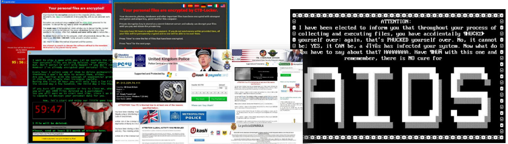

**Ransom-as-a-service**

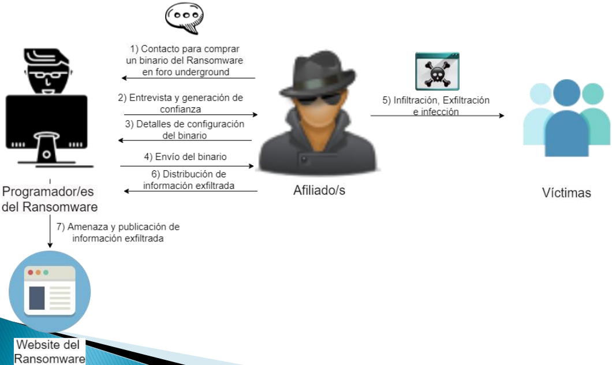

### **Troyanos**
* **Primer troyano** -> ANIMAL (1975).
* **Características** -> El término troyano se usa para todo malware que disfraza su verdadera intención.
* **Subtipos**:
  * **Downloaders / Droppers**: Fareit, Nemucod.
  * **Banking Trojans**: Zeus, Tiny, Trickbot, Shifu.
  * **Backdoor**: Carbon, BlackEnergy.
  * **Rootkits**: ZeroAcces.
  * **Bootkit**: BOOTRASH.
  * **RAT (Remote Access Trojan)**: Spyeye, DarkComet.

### **Exploit Kits**
* **Primer Exploy Kit** -> WebAttacker Kit (2006).
* **Características** -> Diseñados para correr en web servers con el propósito de identificar vulnerabilidades en clientes y poder explotarlas para descargar y ejecutar otro malware. Generalmente disponen de una interfaz.
* **Ejemplos**:
  * RIGECK
  * SundownEK
  * AnglerEK

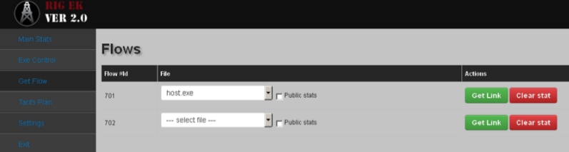

### **ATM (Automated Teller Machine)**
* **Primer ATM malware / ATM Skimmer** -> Se cree que los dispositivos aparecieron en 2008.
* **Características** -> Puede ser usado junto a dispositivos físicos, lo que se conoce como ATM Skimmers. Puede ser distribuido a través de CDs que se utilizan para instalar el malware en backoffice y luego una "mula" ingresa una clave especial en el cajero para acceder al panel del malware y obtener dinero.
* **Ejemplos**:
  * Alice
  * Ploutus
  * Tyupkin

### **PoS malware**
* **Primer PoS malware** -> Rdasrv (2011).
* **Características** -> El objetivo es obtener información de tarjetas de crédito y / o débito a través de terminales de puntos de venta, leyendo su memoria (RAM scraping). La información de las tarjetas que generalmente se cifra y se envía para ser autorizada, es interceptada y enviada al criminal. Los criminales deben clonar las tarjetas para poder usar esta información.
* **Ejemplos**:
  * BlackPoS
  * PunkeyPoS
  * CenterPoS

### **"Fileless" malware**
* **Primer Fileless malware** -> Poweliks (2014).
* **Características** -> No generan archivos, sino que directamente corren en memoria, lo cual les da cierta capacidad para ser indetectables. Pueden ganar persistencia en el sistema. Generalmente esconden su código en registros de Windows, en el espacio de memoria de un archivo legítimo o en APIs.
* **Ejemplos**:
  * Kovter
  * Phasebot
  * XswKit
  * DNSMessenger

### **Coinminers**
* **Historia** -> En 2009 se creó el dinero digital, el cual está soportado por la Blockchain (cadena de bloques que registran transacciones de forma permanente). Cada bloque es validado por la comunidad, y encontrarlo involucra un proceso aleatorio que se conoce como minado y consume mucho procesamiento de una computadora. Al encontrar un bloque, se recompensa con dinero digital.
* **Tipos**:
  * Cryptojacking
  * Miners

### **Scareware**
* **Características** -> Usa ingeniería social para causar un shock o ansiedad en la víctima para que ésta compre software no deseado. Incluye antivirus falso y ransomware falso.

### **Wipers**
* **Características** -> Es un tipo de malware cuyo objetivo es "limpiar" el disco rígido.
* **Ejemplos**:
  * Shamoon
  * RawDisk
  * KillDisk
  * Petya ransomware modificado

### **Formas de Propagación**
* **Campañas de email**:
  * Comprometidas, imitadoras o propias.
  * Masivas (phishing) o dirigidas (spearphishing).
  * URL.
  * Adjuntos.
    * Malware Payload
    * Downloader
    * Documentos de Office
    * PDF
* **Sitios comprometidos**:
  * Adware.
  * Campañas.
    * ElTest
    * Pseudo Darkleech
    * Afraidgate
* **Explotación de Vulnerabilidades**:
  * Wannacry.
* **Redes sociales y P2P**:
  * Koobface
  * Dorkbot
  * Turla

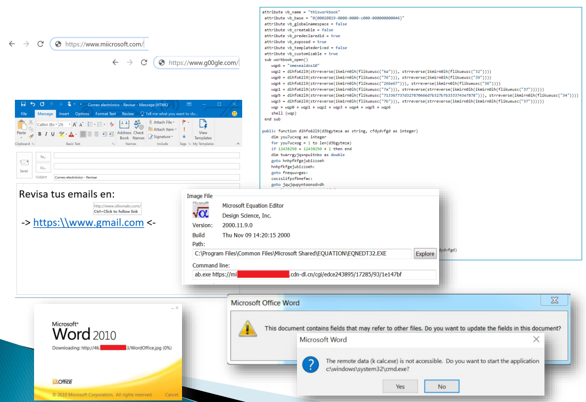

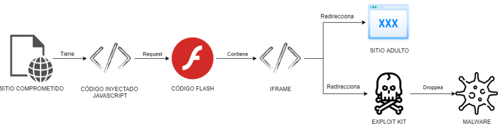

### **Análisis de Malware**
* **Automatizado**
  * Usar soluciones sandbox y observar los resultados.
    * Cuckoo, CAPE.
* **Estático**
  * Recabar información sobre la amenaza, sin ejecutarla (fecha de compilación, ofuscador, strings resources).
    * Pestudio, Dependency ?Walker, PEiD, Resource Hacker.
* **Dinámico**
  * Se ejecuta el malware y se realiza un seguimiento de las acciones que realiza. Relacionado con Debugging.
    * Process Monitor, Process Explorer, Fakenet, Wireshark, Regshot.
* **Ingeniería Inversa**
  * Obtener información de un archivo (generalmente cuyo código fuente no se dispone) para entender cómo funciona. Se lo cincula con el cracking.
    * IDA Pro, Ollydbg, ILSpy.

**Sugerencia de pasos de análisis manual**

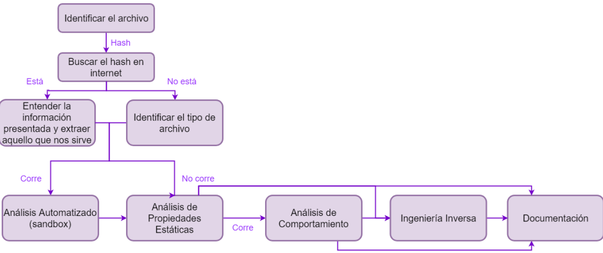

---

## **Threat Intelligence**

* Se basa en la recopilación de información utilizando inteligencia de código abierto (OSINT), inteligencia de medios sociales (SOCMINT), inteligencia humana (HUMINT), inteligencia local (producida por uno mismo), etc.
* Esta información debe ser **accedida a tiempo, debe ser precisa, de gran valor y accionable**.

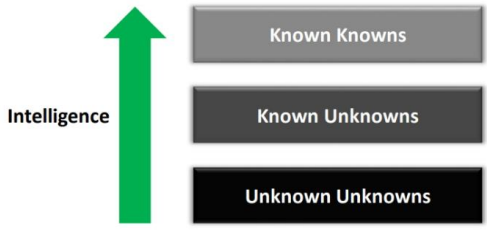

### **Fuentes del Threat Intelligence**

* **Confiabilidad de la fuente**:
  * Cuestionar la fuente
  * Buscar varias fuentes que avalen lo que otra fuente dice
  * Grado de subjetividad
  * Incompletas
  * Todos cometemos errores
  * Identificarlas y darles un grado de confianza adecuado

* Fuentes Públicas
  * Empresas de Seguridad (Paloalto Networks, Zscaler, Talos)
  * Empresas de Antivirus (ESET, McAfee, Kaspersky)
  * Twitter
  * Foros (Bleeping Computer, Ars Technica)
  * Feedly
  * Análisis de malware (hybrid-analysis, any.run)
  
* Fuentes Privadas
  * Honeypots
  * Sniffers
  * Análisis de Malware
  * VirusTotal
  * MISP

### **Jerarquia DIKW**

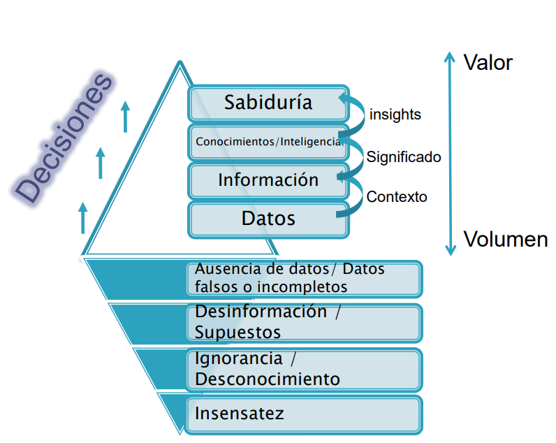

### **Ciclo de Threat Intelligence**

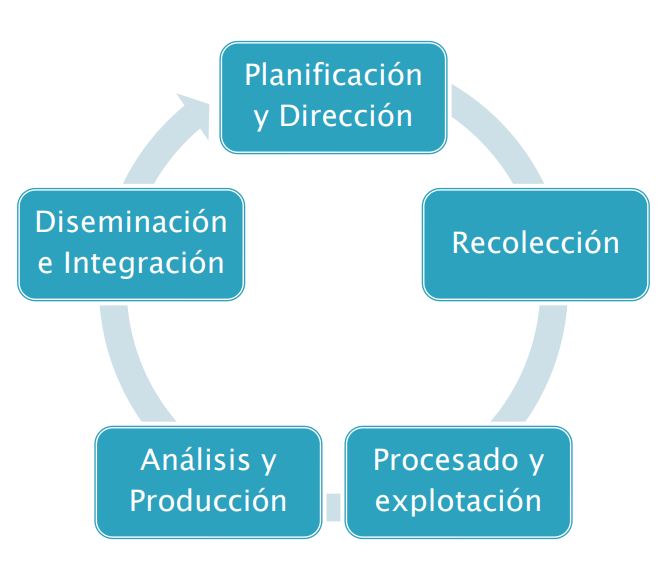

### **Desinformación / Misinformation**

Propagar información no verídica intencionalmente (o no) para engañar a la audiencia.

### **Inteligencia sobre personas**

* Evaluar la exposición de personas en internet.
  * Datos personales
  * Fotos
  * Redes sociales
  * Gustos
  * Hobbies
  * Contactos

### **Inteligencia sobre empresas**

* Evaluar la exposición de una empresa en internet.
  * Dominios
  * IPs
  * Regla de email
  * Ataques dirigidos
  * Metadata
  * Tratos con otras empresas
  * Clientes
  * Tecnologías

### **Incident Response and Digital Forensic**

* **Incident Response**
  * Forma organizada de afrontar un incidente.
    * Ser resiliente
    * Reducir del daño
    * Pasos: 
      * Preparación
      * Identificación
      * Contención
      * Erradicación
      * Recuperación
      * Lecciones aprendidas

* **Digital Forensic**
  * Recuperar información de dispositivos digitales
    * Relacionado con delitos informáticos
    * Pasos: 
      * Adquirir imágenes (Verificar)
      * Analizar el contenido (Buscar evidencia)
      * Reportar (Conclusiones)
