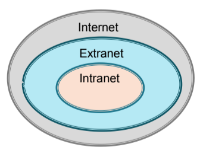
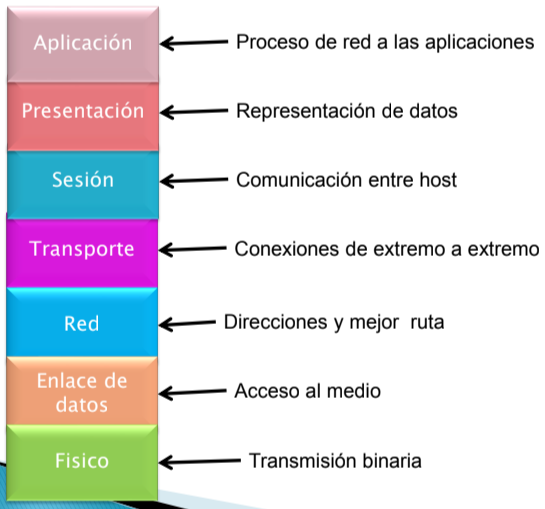
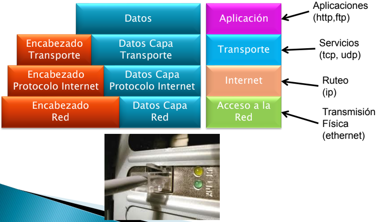
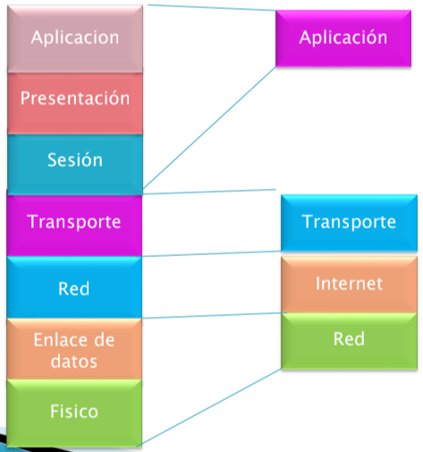
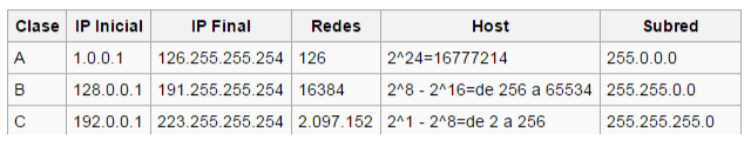
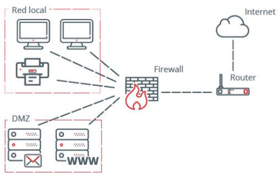
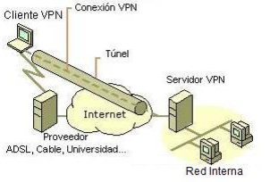

# **Ciberseguridad - Clase 6**

## **Seguridad en Redes de Información**

### **Introducción a Redes de Información**

Es un conjunto de equipos informáticos y software conectados entre sí por medio de dispositivos físicos con la finalidad de compartir información, recursos y ofrecer servicios.

### **Tipos de Redes**

* **Según la Ubicación:**
  * Red de Área Local - (LAN, Local Area Network)
  * Red de Área Metropolitana - (MAN, Metropolitan Area Network)
  * Red de Área Amplia - (WAN, Wide Area Network)

* **Según el uso:**
  * Internet
  * Extranet
  * Intranet

|LAN|MAN|WAN|
|:-:|:-:|:-:|
|Espacio geográfico limitado|Espacio geográfico extenso pero limitado|Conectan un espacio geográfico extenso|
|Velocidades de transmisión elevadas|Velocidad de transmisión alta en comparación a WAN|Velocidades de transmisión bajas en comparación a LAN|
|La organización es "dueña" del medio físico|La organización es "dueña" del medio físico|La organización alquila el medio a un proveedor del servicio|
|Utiliza su propio espacio para ubicar dispositivos|Interconecta edificios por medio de Fibra Óptica|Utilizan medios como satélites, Fibras, cables interoceánicos, etc.|

### **Medios de Transmisión**

* **Alámbricos**
  * **Coaxial**
    * 10 Base 2 (Fino - 10 Mbps - 185 Mts)
    * 10 Base 5 (Grueso - 100 Mbps - 500 Mts)
  * **Par trenzado**
    * 10 Mbps Ethernet
    * 100 Mbps Fast Ethernet
    * 1 Gbps Gigabit Ethernet
  * **Fibra óptica**
    * Mayor a 1 Gbps
* **Inalámbricos**
  * **Radiofrecuencia**
  * **Infrarrojo**
  * **Bluetooth**
  * **WIFI**

### **Modelo OSI (Open System Interconnection)**

### **Modelo TCP / IP**
**Transmission Control Protocol / Internet Protocol**

* Describe un conjunto de guías de diseño e implementación de protocolos de red para permitir que un equipo pueda comunicarse en una red.
* Provee conectividad extremo a extremo especificando como los datos deben ir:
  * Formateados
  * Direccionados
  * Transmitidos
  * Enrutados
  * Recibidos

### **Capas modelo TCP / IP**

### **Relación modelo OSI y TCP / IP**

### **Internet Protocol (IP)**

* No orientado a la conexión. Deja esta tarea para capas superiores.
* Maneja la fragmentación. 
* Contiene
  * Tiempo de Vida del Paquete (TTL)
  * Longitud del paquete
  * Dirección Origen
  * Dirección Destino
  * Verificación de cabecera

### **Direccionamiento IP**
* Dirección de Red: Parte del camino usado para rutear
* Dirección de Host: Dispositivo específico en la red
* Se usa el concepto de mascara para definir cuantos bits son para direcciones de red y de host
* La máscara se escribe indicando con 1 cuántos bits de la dirección le corresponden a la dirección de red. 255.255.255.0 es equivalente a escribir /24, mientras que 255.128.0.0 es equivalente a /9

* **Direcciones privadas:**
* Clase A: 10.0.0.0 a 10.255.255.255
  * 8 bits red y 24 bits hosts
* Clase B: 172.16.0.0 a 172.31.255.255
  * 16 bits red y 16 bits hosts
* Clase C: 192.168.0.0 a 192.168.255.255
  * 24 bits red y 8 bits hosts

### **Transmission Control Protocol (TCP)**
* Orientado a la conexión
* Existe un control de los paquetes que se envían:
  * Se retransmiten los paquetes perdidos
  * Se eliminan los paquetes duplicados
* Maneja el concepto de puerto para multiplexar varias conexiones entre dos equipos
* Contiene
  * Puerto Origen
  * Puerto Destino
  * Numero de secuencia
  * Longitud de la cabecera
  * Ventana
  * Verificación de la cabecera

### **Dispositivos de Red**
* **Hub** -> los dato que llegan a un puerto llegan a todo el resto.
* **Switch** -> divide la red en segmentos por cada puerto que tiene.
* **Router** -> tienen la capacidad de decidir cual es la mejor ruta para entregar los datos. Se usan para comunicar mas de una red.

### **Adress Resolution Protocol (ARP)**
* Cada computadora y dispositivo de red necesita contar con una IP y una MAC (Media Access Control)
* Se usan 6 valores hexadecimales para el fabricante y 6 para el dispositivo
  * Se envía un mensaje de Broadcast preguntando quien tiene la IP que se necesita 
  * El que tiene esa dirección IP contesta con la dirección MAC correspondiente
  * Cuando se obtiene la relación entre la dirección IP y la MAC se guarda durante un tiempo predefinido en la tabla de ARP para guardar esa relación y no tener que preguntar cada vez que se envía un mensaje

### **Adress Resolution Protocol (ARP) Poisoning**
* Algunos atacantes modifican la tabla ARP con información falsa 
* El ataque es llamado ARP Table Poisoning. El objetivo del atacante es recibir paquetes que tenían como destino otra computadora

### **Reverse Adress Resolution Protocol (RARP)**
* Se utiliza a la inversa de ARP. Es cuando se tiene una dirección MAC y se necesita conocer la dirección IP

### **DHCP (Dynamic Host Configuration Protocol)**
* Una computadora puede recibir su IP de diferentes maneras cuando inicia:
  * De manera estática en la configuración del adaptador de red
  * De manera dinámica donde el servidor de DHCP asigna la IP correcta en el inicio
* El beneficio de utilizar DHCP es facilitar la administración de las direcciones y no tener caídas de servicio solapamiento de direcciones IP

### **Ataques al DHCP**
* Tanto el cliente como el servidor son vulnerables a ataques los falsos DHCP 
* Del lado del cliente el atacante puede enmascarar su sistema para simular ser un cliente valido para ser parte de la organización e infiltrarse dentro de la red
* Un atacante puede crear un servidor DHCP falso y comenzar a responder a clientes que buscan el servidores de DHCP. Un atacante puede utilizar esta técnica para hacer un ataque de man in the middle, dirigiendo el trafico a una red no autorizada y como resultado final poner en peligro la red completa

### **Contramedidas a los ataques de DHCP**
* Una contramedida es utilizar DHCP snooping que asegura que los servidores DHCP asignen IP solo a los sistemas seleccionados, identificados por la dirección MAC 
* Proxy: El proxy intercepta los mensajes antes de enviarlos hacia los que intentan recibir el mensaje. Este proxy debe estar entre la red segura e insegura y realizar esta conexión
* Honeypot: Es una computadora que intenta ser un señuelo para los atacantes y no ataquen los sistemas productivos. Los administradores deben asegurarse de que esta computadora este correctamente aislada

### **DNS (Domain Name Service)**
* El DNS es un método que resuelve los nombres a las direcciones IP 
* Por ejemplo cuando un usuario ingresa una Uniform Resource Locator (URL) en  el navegador a través de una secuencia de caracteres como www.google.com. Esta dirección es traducida de texto a una dirección IP
* Muchas compañías utilizan sus propios DNS para resolver los nombres de sus equipos/servidores internos y los DNS de sus ISP para resolver los nombres de las direcciones de internet
* ICANN (Internet Corporation for Assigned Names and Numbers) toma la responsabilidad de asignaciones de IP y la administración de DNS

### **Ataques al DNS**
* DNS Spoofing
  * El ataque consiste en definir otro servidor DNS para la victima. Existen varias formas de realizar esta acción por ejemplo modificando las tablas donde están las traducciones de URL a IP, otra forma es utilizando algún exploit que se aprovecha de una vulnerabilidad

**Protección**

* Se puede utilizar DNS Sec para evitar cuya finalidad es firmar las repuestas de los servidores de nombres con el objetivo de que la pagina solicita por el usuario sea el correcto

### **Protocolo Seguro - HTTPS**
* Es la versión segura del protocolo http llamado https
* Utiliza el cifrado basado en algún algoritmo de encripción para crear un canal cifrado
* El nivel de cifrado depende del servidor remoto y del navegador del cliente
* Es utilizado por entidades bancarias, tiendas en línea y servicios que requieren envió de datos personales o contraseñas
* Su puerto estándar es el 443

### **Firewall**
* Cuando se implementa un firewall se encontrarán 2 perímetros definidos:
  * **Internos**: Se encuentran los recursos sensibles a un posible ataque
  * **Externos**: Se encuentran los recursos menos sensibles que necesitan ser accedidos desde la red externa por motivos funcionales
* La red interna y externa deben estar divididas por un firewall donde se implementarán reglas de control de acceso

**Principios de diseño de Firewall**
* Todo tráfico de adentro hacia afuera y viceversa debe pasar a través del firewall
* Solamente el tráfico autorizado, definido por la política del firewall debe pasar
* El firewall no protege contra
  * Ataques que no pasan por el firewall. Por ejemplo líneas dial up
  * Amenazas internas
  * Ataques de contenido malicioso
  * Robo de información

### **Tipos de Firewall**
* Firewall de filtrado de paquetes: Utiliza para filtrar numero de IP y puerto
* Firewall de capa de aplicación: Actúa como intermediario entre un equipo de la red externa y otro dentro de la red interna
* Firewall de Inspección de estado: distingue la legitimidad del paquete en función del tipo de conexión
* Firewall de filtrado dinámico de paquetes: Es capaz de manejar los cambios del Firewall sin la necesidad de reconstruirlo en su conjunto

### **IDS - Sistema de Detección de Intrusos**
* Funciona en conjunto con Routers y Firewalls
* Monitorea anomalías del tráfico de red
* Protege de abusos internos y externos
* Opera de manera continua registrando y notificando amenazas
  * Detección de Intrusos
  * Recolección de evidencias sobre la actividad del intruso
  * Respuesta automatizada
* Un modo de trabajo es detectar patrones de ataque

### **Tipos de IDS**
* Detección de Intrusos en el equipo (Host IDS - HIDS)
  * Se analiza el tráfico sobre un equipo específico, que puede ser un servidor
  * Utilizado para ambientes específicos

* Detección de Intrusos en la Red (Network IDS - NIDS)
  * Detecta los paquetes armados maliciosamente y diseñados para no ser detectados por el Firewall
  * Consta de uno o más sensores en la red y una consola
  * Es recomendable colocarlo entre Internet y el Firewall

### **Zona Desmilitarizada (DMZ)**
* Es la zona de red donde se establece el perímetro
* Añade un nivel de seguridad en las arquitecturas, el colocar un firewall situado en una subred entre las redes externas e internas, de forma de reducir los efectos de un ataque desde el exterior.

### **Seguridad en el acceso remoto**
* Asegurar conexiones externas
  * VPN
  * SSH
* Utilizar sistemas de autenticación de acceso remoto
* Restricción de dirección: Filtra las conexiones no autorizadas en función de la dirección de red

### **Red Privada Virtual (VPN)**
* Es una red privada de comunicaciones, implementada sobre una infraestructura pública
* Se utilizan diferentes tecnologías como ser servicios de encripción, encapsulamiento o se crea un túnel privado a través de la red pública
* Aquellas empresas que requieran conectar diferentes sucursales o diferentes sitios se recomienda utilizar enlaces dedicados

**Funcionamiento**

1. El usuario ingresa a Internet
2. El usuario inicia el túnel enviando una petición a un servidor de VPN de la red corporativa
3. El servidor VPN autentica el usuario y crea el otro extremo en el túnel
4. El usuario comienza a enviar datos a través de la VPN, los datos son encriptados antes de enviarlos a internet
5. En el destino el servidor de VPN recibe los datos y los descifra

### **Wireless LAN**
* Se utiliza como medio de comunicación la radiofrecuencia o luz infrarroja (de 2,4 Ghz a 5 Ghz)
* Se utiliza la norma de IEEE (Instituto de Ingenieros de Electricidad y Electrónica) 802.11
* Componentes Wireless LAN
  * Adaptadores para clientes Wireless (usb, pci, pcmcia, etc)
  * Access Point
  * Routers Inalámbricos
  * Antenas

### **Seguridad de la Wireless LAN**
* Autenticación: Sólo deberían estar permitidos los usuarios y dispositivos autorizados
* Cifrado: El tráfico debería estar protegido de accesos no autorizados
* Seguridad de la administración: Sólo los usuarios autorizados deberían poder acceder y configurar las distintas interfaces del AP
* Utilizar un SSID para la conexión distinto del que viene predeterminado

### **Seguridad WEP (Wired Equivalent Privacy)**
* Utiliza Claves (Clave Secreta + Vector de Inicialización)
  * 40 o 104 bits clave y 24 bits VI
* Codifica la comunicación entre el cliente y el AP
* El AP y el cliente deben usar las mismas claves WEP
* Basado en el algoritmo simétrico RC4
* WEP es atacado con facilidad
  * Clave secreta estática
  * Vector de Inicialización insuficiente 24 bits, en redes con alto trafico se pueden capturar 2 tramas con el mismo vector de inicialización

### **Seguridad WPA (Wireless Protected Access)**
* Utiliza claves (Clave Secreta + Vector de Inicialización)
  * 128 bits clave y 48 bits VI
* Clave generada en forma dinámica para cada usuario, para cada sesión y para cada paquete enviado
* Utiliza el protocolo TKIP (Temporal Key Integrity Protocol – Protocolo de Integridad de Clave Temporal)

*WPA2 (Clave 128 bits) y WPA3 (Clave 192 bits)*