# **Ciberseguridad - Clase 7**

## **Análisis Forense**

### **Introducción al Análisis Forense**
Es la ciencia de adquirir, preservar, analizar y presentar datos que han sido procesados electrónicamente y almacenados en medios informáticos.

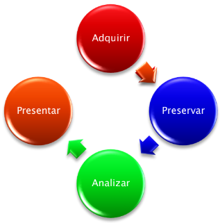

Esta relacionado con delitos informáticos o delitos donde se utiliza la tecnología como medio para llevar a cabo el delito.

### **Involucrados**
El análisis forense se puede realizar en el marco de la justicia o en el marco corporativo.
* Para el caso de la justicia los involucrados son:
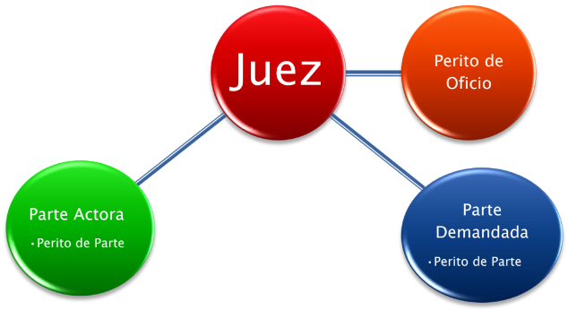

### **Puntos de pericia**
* El juez solicita al perito de oficio los puntos de pericia.
* El perito de oficio los revisa e informa si hay algún punto que no puede ser contestado porque puede **no ser de su competencia.**
* En caso que tenga algún punto que **no sea de su especialidad debe contestarlo de igual manera.**
* El perito puede **no aceptar el caso por ser pariente directo** de una de las partes o tener algún tipo de **interés directo** con la parte actora o demandada.
* El resto de los puntos debe generar un informe y contestar cada uno de ellos con las evidencias correspondientes.

### **Evidencia Digital**
* **Repetible** - Puede ser duplicado de manera exacta.
* **Integra** - Se puede verificar si ha sido modificada.
* **Recuperable** - En muchos casos es posible recuperarla aún borrada.
* **Metadatos** - Contiene datos relativos a la evidencia en cuestión.

### **Manejo de la evidencia**

### **Cadena de custodia**
* Nombre de la persona y fecha de contacto con la evidencia.
* Registro del pasaje de una persona a otra.
* Registro del pasaje de una ubicación física a otra.
* Tareas realizadas durante la posesión.
* Sellado de la evidencia al finalizar la posesión.
* Registro de testigos.

### **Ocultamiento de la evidencia**
* Renombrado del tipo de archivo.
* Alteración de la ubicación de archivos.
* Compactado.
* Encriptado/Cifrado.
* Esteganografía.

### **Regla de exclusión de la evidencia**
* La evidencia obtenida en violación de cualquier procedimiento técnico-legal, es Inadmisible.
* Todas las conclusiones que de obtengan a partir de esa evidencia serán anuladas.

### **Adquisición de evidencia - método directo**
Es el más rápido pero requiere de un bloqueador de escritura.

Pasos a seguir:
1. Extraer disco de la PC.
2. Montar disco en la PC del Investigador.
3. Adquirir imagen.
4. Reinstalar disco en PC del sospechoso.

### **Bloqueadores de escritura forense**
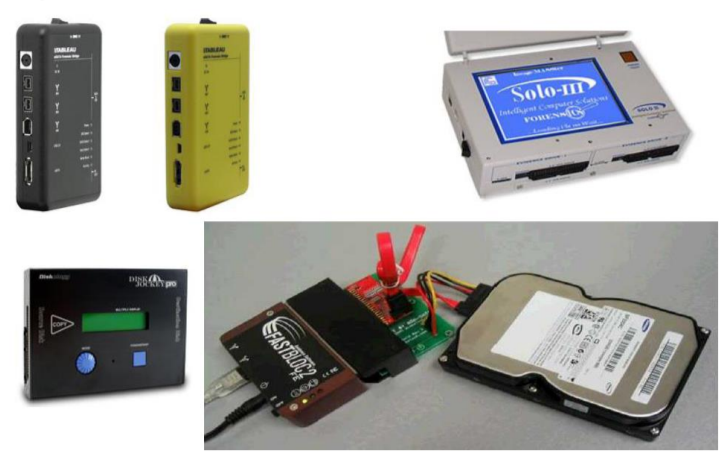

### **Plataforma para adquisición directa**
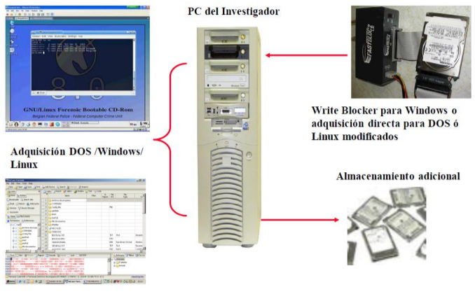

### **Adquisición de evidencia - método indirecto**
Permite adquirir sin apertura. Es un método más lento que el Directo.

Pasos a seguir:
1. Lograr conectividad equipo de adquisición.
2. Correr herramienta en modo Server en la PC sospechosa.
3. Adquirir imagen.

### **Plataforma para adquisición indirecta**
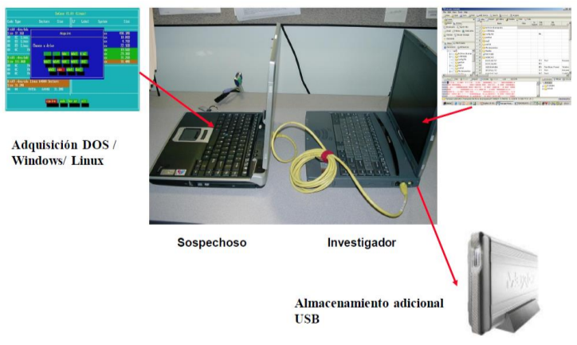

### **Procedimiento Forense en Windows**
1. Organizar el caso y crear una planilla para el informe final.
2. Examinar la documentación relacionada con la evidencia.
3. Controlar la cadena de custodia previa a tomar contacto con la evidencia.
4. Determinar la mejor alternativa de adquisición.
5. Verificar secuencia de boot - Verificar la fecha/hora.
6. Realizar la adquisición y mantener copias de resguardo.
7. Ingresar la evidencia en el software de análisis y verificar su integridad.
8. Ajustar la zona de tiempos del software de análisis para poder correlacionar eventos de tiempo.
9. Geometría de las unidades. Determinar la totalidad de sectores en el dispositivo y verificar que los mismos estén asignados a particiones de la unidad , de lo contrario realizar una recuperación y montar las eventuales particiones eliminadas.
10. Realizar una búsqueda de posibles carpetas eliminadas en todas las unidades del caso.
11. Ejecutar un análisis de firmas: Determinar la existencia de posibles archivos renombrados.
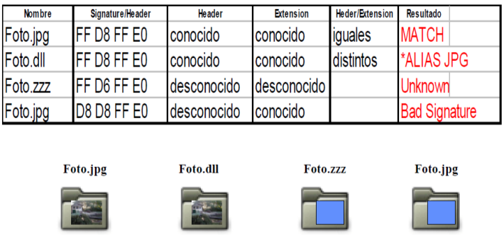
12. Ejecutar un análisis de índices: Identificar archivos “notables”.
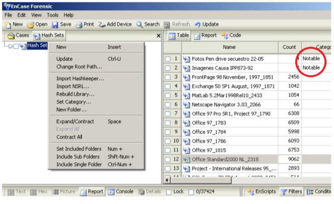
13. Determinar si la unidad tiene algún tipo de cifrado de datos.
14. Identificar los tipos de clientes de correo electrónico utilizados.
15. Realizar una búsqueda y posterior montaje de archivos compuestos (PST , DBX , ZIP , etc...):
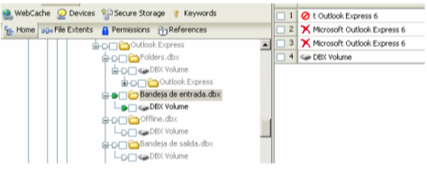
16. Examinar la estructura de programas instalados en busca de algo vinculado con el objetivo de la investigación.
17. Si lo amerita, conducir un análisis antivirus/antispyware sobre la evidencia.
18. Determinar la ubicación de los archivos temporarios, temporarios de internet, historial y caché de internet.
19. Procesar el registro de Windows para determinar los últimos programas ejecutados. En caso de encontrar alguno de interés, analizarlo.
20. Realizar búsquedas de palabras y frases. Refinar la búsqueda en función de resultados parciales.
21. Realizar un análisis de los archivos LNK.
22. Realizar una búsqueda genérica de imágenes.
23. Identificar unidades removibles o de red.
24. Procesar la papelera de reciclaje: Determinar fechas de borrado y usuarios.
25. Procesar la cola de impresión en búsqueda de impresiones realizadas.
26. Determinar la existencia de mensajeros instantáneos y procesar artefactos del mismo.
27. Determinar la utilización de software de intercambio P2P y procesar artefactos del mismo.
28. Analizar el caché de internet en búsqueda de patrones y páginas visitadas.
29. Realizar una verificación de la evidencia.
30. Completar el informe y guardar todo el material procesado para una eventual ampliación posterior.

---
---

## **Auditoría**
### **Introducción Auditoría**
* Es un control selectivo.
* Lo compone un grupo independiente del proceso a auditar.
* Busca lograr los objetivos propuestos.
* Debe evaluar la eficiencia y eficacia de los sectores.
* Se obtienen evidencias para para el respaldo de las afirmaciones.
* Proponen cursos de acción alternativos.

### **Auditoría Informática**
* Es la revisión y evaluación de los controles, sistemas y procedimientos de la informática.
* Participa del procesamiento de datos, con el fin de establecer cursos alternativos de acción que permitan obtener información en forma segura, confiable y eficiente para la toma de decisiones.
* Se basa sobre la integridad y la confidencialidad de la información.

### **Consideraciones para el auditor**
* El informe del auditor no es asegurador y no es garantía.
* El auditor debe tener en cuenta que pueden existir errores o irregularidades en el sistema de control. Es por eso que el auditor debe analizar, evaluar y considerar los riesgos de auditoría.
  * Los riesgos de auditoría representan la posibilidad de emitir un informe de auditoría incorrecto por no haber detectado errores o irregularidades. Los riesgos de auditoría disminuyen a medida que obtengo evidencias.

### **Clasificación de los riesgos de Auditoría**
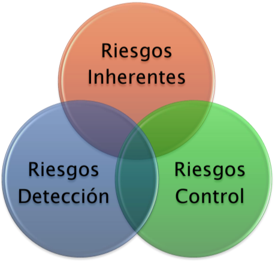

### **Riesgos Inherentes**
* Son errores o irregularidades significativos antes de considerar los sistemas de control.
* Son riesgos por fuera del control del por parte del auditor.

### **Riesgos de Control**
* Se refieren a la incapacidad de detectar errores o irregularidades significativos por parte de los sistemas de control.

### **Riesgos de Detección**
* Es el riesgo que los procesos de auditoría seleccionados no detecten errores o irregularidades. 

### **Procesos de Auditoría**
1. Identificar las afirmaciones a ser evaluadas.
2. Evaluar la importancia de las afirmaciones.
3. Reunir la información o evidencia necesaria.
4. Analizar y Evaluar la evidencia.
5. Formular un informe.

### **Tipos de Auditoría**
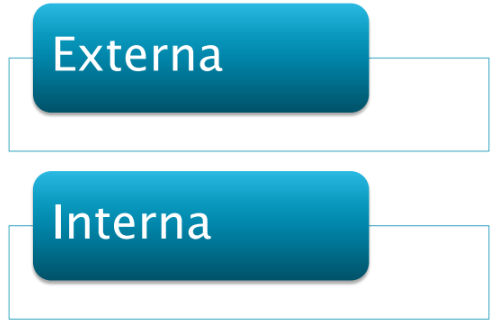

---
### **SOX - Sarbanes Oxley**
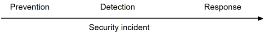
* Hay distintos tipos de fraudes que sucedieron en los años 2000 y que pueden ser prevenidos con SOX, por ejemplo modificación de informes financieros como:
  * Obtener aumentos de sueldos o bonos.
  * Obtener aprobaciones de bancos para financiamiento.
  * Cumplir las expectativas de accionistas.

### **Controles internos de la auditoría SOX**
* **Accesos**: Se refiere a los controles físicos y lógicos que previenen el acceso no autorizado a usuarios de información sensible.
* **Seguridad**: Significa estar seguro de aplicar los controles para prevenir ataques y contar con las herramientas para solucionar los incidentes que hayan ocurrido.
* **Administración del cambio**: Involucra el agregado de nuevos usuarios, equipos, sistemas y cualquier cambio en otros componentes donde esta almacenada la información.
* **Procedimientos de Backup**: Los sistemas de backup deben ser realizados y probados periódicamente.

---
### **GDPR - General Data Protection Regulation**
* **¿Quién?** - Union Europea.
* **¿Qué?** - Protege los datos de los ciudadanos y residentes Europeos.
* **¿Dónde?** - En cualquier lugar donde haya datos de personas pertenecientes a la Unión Europea.
* **¿Cuándo?** - Aplicable a partir del 25 de mayo del 2018.

### **Alcance**
Cualquier información que pueda ser usada para identificar un individuo de manera directa o indirecta. Esto puede ser datos de clientes, proveedores, empleados, stakeholders, etc.

|Personal|Identificadores|Financiera|Salud|
|:-:|:-:|:-:|:-:|
|Nombre, Edad, Email, Afiliación religiosa, Datos biométricos|Cuentas bancarias, Numero de tarjeta de crédito, Identificador del país (DNI, SSN, etc.), Número de licencia de conducir|Balances contables, Información de salario, Pago de impuestos|Información de salud, Características físicas, Resultados de exámenes médicos, Evaluaciones de salud mental, Pagos por cuidados de salud|

### **Requerimientos de GDPR**
* Evidencia y cumplimiento.
* Seguridad Integral.
* Pseudonimización y cifrado de datos personales.
* Protección de datos por diseño y por defecto.
* Control de acceso a usuarios.
* Registros de auditoría.

---
---
## **Legislación**
### **Leyes relacionadas**
* El marco legal relacionado con la informática se basa en las siguientes leyes:
  * Ley de Hábeas Data: 25.326
  * Ley de Delitos Informáticos: 26.388
  * Ley de Firma Digital: 25.506
  * Ley de Confidencialidad: 24.776
  * Ley de Propiedad Intelectual: 11.723
  * Ley de Protección de datos personales: 25.326

### **Ley Habeas Data (25.326)**
* Derecho de quien figura en la base de datos de conocer dicha información y solicitar corrección si le causara algún perjuicio
* Se exige una declaración de las bases de datos para generar transparencia sobre su existencia
* Busca la protección integral de los datos personales
* El responsable de la base de datos debe adoptar medidas para garantizar su seguridad y confidencialidad

**Tipos de datos**
* Datos personales
  * Información de cualquier tipo referida a personas físicas
* Datos sensibles
  * Datos que revelan opiniones políticas, convicciones religiosas, morales, afiliación sindical, información referente a la salud o vida sexual
* Nadie puede ser obligado a proporcionar datos sensibles
* Solo pueden ser recolectados y tratados por razones autorizadas por la ley

### **Ley de delitos Informáticos (26.388)**
* Se modificó el código penal argentino para incluir los delitos informáticos y sus respectivas penas

* Datos contemplados
  * Distribución y tenencia con fines de distribución de pornografía infantil
  * Violación de correo electrónico
  * Acceso ilegítimo a sistemas informáticos
  * Estafa y fraude informático
  * Daño informático y distribución de virus
  * Interrupción de comunicaciones

### **Ley de firma digital (25.506)**
* Proceso criptográfico que sirve para demostrar la autenticidad del documento digital
* Debe existir un tercero que verifique el firmante
* Asociado a la identidad de una persona
* Se considera como la firma hológrafa

### **Ley de Confidencialidad (24.766)**
* Ley de confidencialidad de la información y productos que estén legítimamente bajo el control de una persona y se divulgue indebidamente de manera contraria a los usos comerciales honestos

* Toda persona puede impedir que la información bajo su control sea utilizada sin su consentimiento siempre que:
  * Sea secreta
  * No sea generalmente conocida, ni fácilmente accesible
  * Tenga un valor comercial por ser secreta
  * Haya sido objeto de medidas razonables para mantenerla secreta

### **Ley de Propiedad Intelectual (11.723)**
* Los derechos quedan reservados a su autor salvo pacto en contrario
* Son titulares del derecho de propiedad intelectual:
  * El autor de la obra
  * Sus herederos
  * Los que con permiso del autor la traducen, refunden, adaptan, modifican o transportan sobre obra resultante

### **Ley de Protección de datos personales (25.326)**
* Protección integral de los datos personales asentados en archivos, registros, bancos de datos, u otros medios técnicos de tratamiento de datos, sean éstos públicos, o privados.
  * Datos personales: Información de cualquier tipo referida a personas físicas o de existencia ideal determinadas o determinables.
  * Datos sensibles: Datos personales que revelan origen racial y étnico, opiniones políticas, convicciones religiosas, filosóficas o morales, afiliación sindical e información referente a la salud o a la vida sexual.
* Los datos personales que se recojan a los efectos de su tratamiento deben ser ciertos, adecuados, pertinentes y no excesivos.