# **Ciberseguridad - Clase 8**
## **Seguridad Cloud**
### **Definición (Estándar NIST 800-145)**
Modelo para permitir el acceso de red, de forma práctica y bajo demanda, a un conjunto de recursos de computación configurables que pueden ser suministrados y desplegados rápidamente con una mínima gestión o interacción con el proveedor de servicio.

El modelo cloud se compone de:
* **5 características esenciales**: Amplio acceso a la red, Elasticidad rápida, Servicio medido, Autoservicio a demanda y Agrupación de recursos.
* **3 modelos de servicios**: SaaS, PaaS, IaaS.
* **4 modelos de despliegue**: Público, Privado, Híbrido y Comunidad.

### **Características Esenciales**
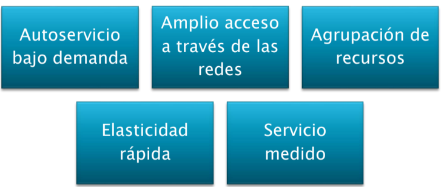

### **Modelos de servicio**
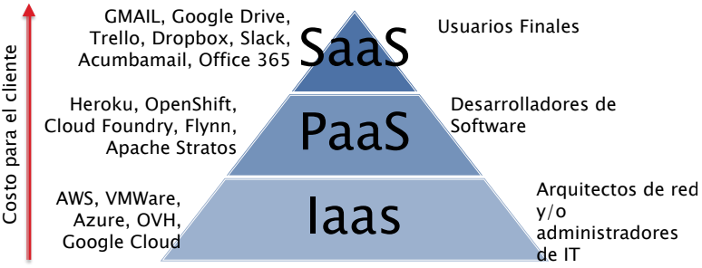

### **Responsabilidad Compartida**
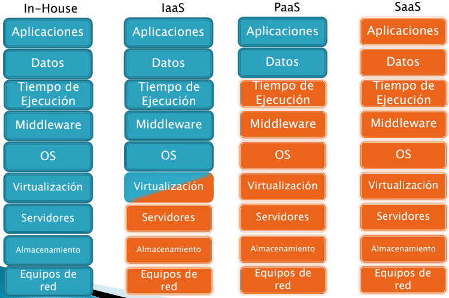

### **Modelos de despliegue**
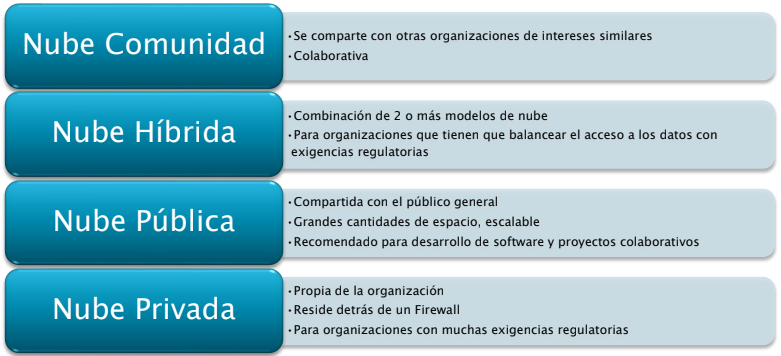

### **Conceptos**
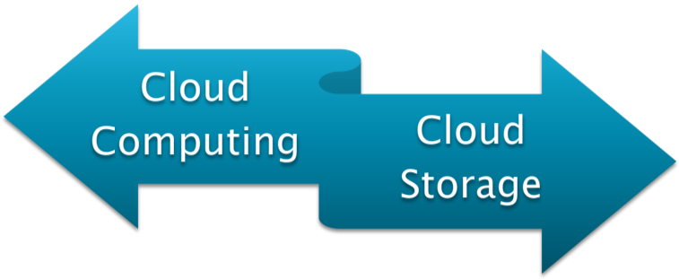

### **Evoluciones de Infraestructura IT**
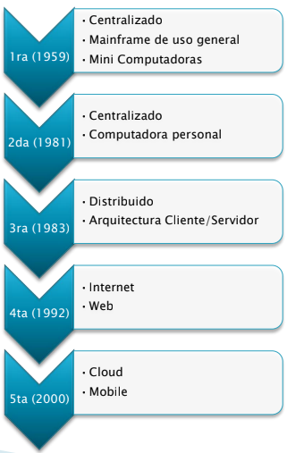

### **Actores Cloud según NIST**
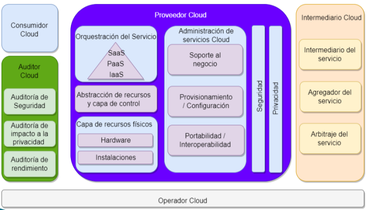

## **La nube democratiza el acceso a las TICs**

### **Ventajas y Desventajas**
* **Ventajas**
  * Pago por uso
  * Acceso desde cualquier lado
  * Recursos compartidos
  * Escalabilidad
  * Eficiencia de costos
  * Barrera de entrada baja
  * Facilidad de mantenimiento
  * Fiabilidad
  * Calidad del servicio
  * Facilidad de uso

* **Desventajas**
  * Rendimiento compartido
  * Control
  * Seguridad y Privacidad
  * Costo
  * Dependencia de conectividad
  * Fallas del proveedor

### **Top 11 de Amenazas a Cloud Computing según CSA**
* Gestión insuficiente de identidad, credenciales y acceso.
* Interfaces inseguras e interfaces de programación de aplicaciones (API).
* Mala configuración y controles de cambio inadecuados.
* Falta de estrategia y arquitectura de seguridad Cloud.
* Desarrollo inseguro.
* Recursos de 3ros inseguros.
* Vulnerabilidades del sistema.
* Violaciones de datos accidental (accidental disclosure)
* Mala configuración y explotación de cargas de trabajo serverless y de containers.
* Crimen organizado/Hackers/ Amenazas persistentes avanzadas (APTs)
* Exfiltración de datos.

### **Seguridad Cloud**

**Categorías**
* Seguridad de los datos.
* Gestión de identidades y accesos (IAM).
* Gobernanza (políticas de prevención, detección y mitigación de amenazas).
* Planificación de la retención de datos (DR) y la continuidad del negocio (BC).
* Cumplimiento legal.

**Objetivos**
* Permitir la recuperación de datos en caso de pérdida de datos.
* Proteger el almacenamiento y las redes contra el robo de datos malicioso.
* Evitar los errores humanos o negligencias que causan la fuga de datos.
* Reducir el impacto de cualquier compromiso de datos o sistemas.

**Riesgos**
* Acceso no autorizado.
* Perdida o robo de datos.
* Plataformas informáticas heredadas incompatibles.
* Interrupciones de los servicios de almacenamiento de datos de terceros.
* Amenazas internas.
* Amenazas externas.
* Incumplimientos contractuales.
* APIs inseguras.
* Desconfiguración de servicios/Pérdida de visibilidad.

**Preocupaciones**
* Privacidad.

**Recomendaciones**
* Cifrado de las comunicaciones con la nube en su totalidad.
* Cifrado de datos especialmente confidenciales, como las credenciales de las cuentas.
* Cifrado de extremo a extremo de todos los datos que se suben a la nube.
* Modificar configuración predeterminada.
* No exponer almacenamiento en la nube.
* Activar controles de seguridad proporcionados por el proveedor de servicios.
* Usar contraseñas “seguras” y activar MFA.
* Revisar políticas de retención de datos de usuarios y clientes.

---
---

## **Gestión de Riesgos**
### **Introducción**
* Brinda administración consistente con la identificación y evaluación de los riesgos como también las recomendaciones para reducirlo:
  * Es un proceso continuo.
  * Requiere la correcta identificación y valuación de los activos.

* Requerimientos:
  * Dimensionar el proyecto (proyección).
  * Establecer políticas de Gestión de Riesgos.
  * Armar un equipo de Gestión de Riesgos.
  * Definir metodologías y herramientas.
  * Identificar y medir el riesgo.

### **Objetivos**
* Es el proceso de identificación, análisis y determinación de riesgos asociados a eventos determinado, para poder tomar acciones que lo reduzcan.
* Reducir el riesgo hasta niveles tolerables por la organización.

### **Etapas de administración del riesgo**
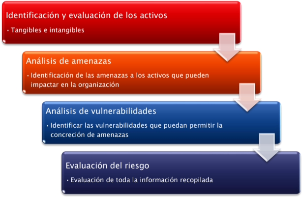

### **Evaluación de Riesgo**
* Determinación del impacto de potenciales amenazas al negocio.
* Como resultado obtenemos:
  * Identificación de los riesgos.
  * Justificación económica de controles (costo/beneficio).
* Métodos:
  * Cuantitativo.
  * Cualitativo.

### **Indicadores cuantitativos**
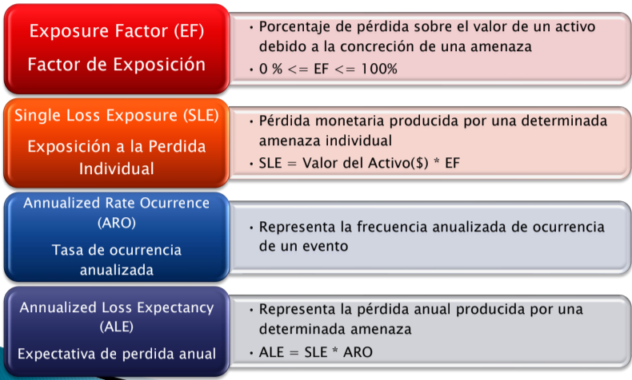

**Ejemplo de cálculo**
* **Escenario**
  * Activo: Servidor de aplicación ERP
  * Valor: U$D 800.000
  * Amenaza: Ransomware
  * Afecta 1/5 de la aplicación
  * Probabilidad de ocurrencia: cada 2 años
* **Cálculos**
  * EF= 20%
  * SLE = Valor * EF = U$D 160.000
  * ARO= 0,5
  * ALE= SLE *ARO = U$D 80.000

### **Pasos del Análisis Cualitativo**
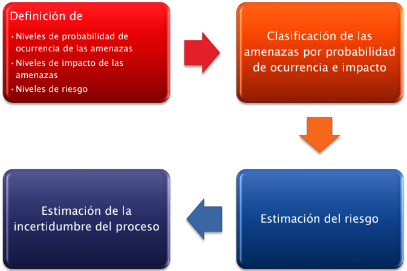

### **Acciones sobre los riesgos**
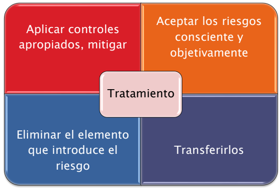