# **Diseño de Sistemas**

*¿Como se relaciona la Ley de Conway y el Diseño de Sistemas?*

**Ley de Conway** -> Habla de considerar no solo los aspectos técnicos del diseño sino también los aspectos sociales y organizacionales.

---

## **Diseño de Sistemas**
* Forma de pensar, modelar y diagramar una solución conceptual al problema.
* Es el plano general para un Sistema. Es como un plano de un edificio/casa: tiene todas las especificaciones que le dan forma y estructura al Sistema.
* Incluye la evaluación de las distintas soluciones alternativas y la especificación de una de ellas de forma detallada.

**Diseño** -> es la estrategia de alto nivel para resolver problemas y construir una solución.

**Diseño de Software** -> es una descripción de la estructura del software que se va a implementar, modelos y estructuras de datos utilizados por el sistema, interfaces entre componentes del sistema y, a veces, algoritmos utilizados.

*¿Por qué es importante el análisis y el diseño?*
* Las soluciones que piensan los ingenieros deben ser las más adecuadas para la resolucion de la problematica, entendiendo el contexto (economico, social, cultural, tecnológico)
* Se debe entender profundamente el problema (o necesidad) y el contexto para poder generar un "Buen producto"

---

## **Requerimientos - Requisitos**
Son todas las necesidades y deseos pedidos por el cliente y las personas involucradas en el Sistema.

**_Requerimiento_** es un sinonimo de necesidad, es un concepto orientado hacia la carencia o falta de algo.

**_Requisito_** es una circunstancia o condición necesaria para algo

| No ambiguo | Conciso | Consistente | Completo | Alcanzable | Verificable |
|:-:|:-:|:-:|:-:|:-:|:-:|
|El texto debe ser claro, preciso y tener una única interpretación posible.|Debe ser preciso y compresible por personas no técnicas ni especializadas.|Ningún requisito debe entrar en conflicto con otro requisito diferente, ni con parte de otro. Además, el lenguaje empleado entre los distintos requisitos debe ser consistente.|Los requisitos deben contener en sí mismos toda la información necesaria y no redirigir a otras fuentes externas que los expliquen con más detalle.|Un requisito debe ser un objetivo realista, posible de ser alcanzado con el dinero, el tiempo y los recursos disponibles.|Se debe poder verificar con absoluta certeza si el requisito fue satisfecho o no. Esta verificación puede lograrse mediante inspección, análisis, demostración o testeo.|

### **_Requerimientos_**
* **Funcionales** -> especifican **lo que debe hacer** un sistema, **describen acciones especificas** que el ingeniero debe ser capaz de realizar durante el desarrollo de software.
* **No Funcionales** -> especifican **como debe comportarse** un sistema, **describen caracteristicas especificas** que el software debe poseer durante el desarrollo de la aplicacion.

---

## **Paradigma Orientado a Objetos**
* Nos hace pensar en la realidad, estudiarla, entenderla, conceptualizarla y luego modelarla.
* Este paradigma nos hace replantear varias cuestiones sobre cómo diseñar y desarrollar un sistema.
* Nos hace pensar en la mantenibilidad, flexibilidad, cohesión, y muchos otras tantas cualidades y atributos de calidad que se buscan maximizar constantemente.
* Está a favor de la reutilización de código y cree en que las cosas deben hacerse una sola vez.

### **POO - Objeto**
*¿Que es un objeto?*
* Es toda *"cosa"* " del mundo real, o no, que puede representarse computacionalmente.
* Se puede decir tambien que un objeto es una abstracción que tiene una razón de ser porque tiene una o varias responsabilidades asociadas.
* Cada objeto tiene características que le pertenecen y que lo diferencian del resto.

*Todo objeto cuenta con 3 caracteristicas que lo diferencia del resto:*

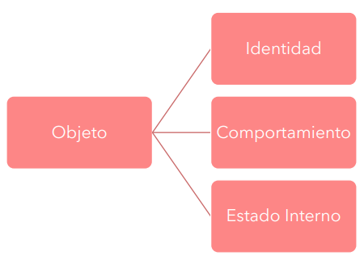

**Identidad**
* Propiedad que permite diferenciar a un objeto y distinguirse de otros.
* Se considera de que objetos son idénticos solamente si son el mismo, es decir, si las referencias están apuntando a la misma dirección de memoria.

**Comportamiento**
* Conjunto de mensajes que entiende un objeto
* El comportamiento que tiene un objeto está ligado con la responsabilidad que le dá sentido de existencia.

**Estado Interno**
* Conjunto de atributos que tiene un objeto
* Como los atributos son variables, también podríamos afirmar que el estado interno es el conjunto de variables que contiene un objeto.

### **POO - Mensajes y Métodos**
**_Los objetos se comunican enviándose mensajes entre sí_**
* Cuando un objeto recibe un mensaje, ejecuta el método asociado.
* En el método se especifica lo que el objeto debe hacer frente a esa petición.

### **POO - Atributos**
*Un objeto tiene características que le pertenecen y que lo diferencian del resto*
* Un objeto puede tener una o más variables, desde ahora y para siempre *"atributos"*, que conforman su estado interno.
* Estos atributos sobreviven mientras el objeto sobreviva, es decir, mientras el mismo esté presente en la memoria.

### **POO - Responsabilidad**
* Cada objeto debería tener una responsabilidad asociada, una razón de ser, algo que resolver.
* Un objeto no debería tener muchas responsabilidades asociadas porque ello llevaría a que se vuelva *inmantenible*.

### **POO - Encapsulamiento**
* Este término hace referencia a que un objeto no debería saber cómo está implementado otro objeto que conoce.
* Las formas posibles interactuar con un objeto deberían ser acotadas y explícitas y es por eso que el objeto debe definir qué mensajes se deberían utilizar para interactuar con él.

### **POO - Declaratividad**
*"Debemos pensar en el qué y no en el cómo"*
* Para aplicar este concepto en el paradigma orientado a objetos deberíamos pensar qué objetos necesitamos para resolver el dominio presentado, qué mensajes deberían entender, qué responsabilidades deberían tener.

### **POO - Delegación**
*"Patear la pelota"*

**- Hacer las cosas cuando realmente las necesitamos.**

### **POO - Clase**
* Las clases nos permiten definir moldes para nuestros objetos, para que todos ellos se comporten de la misma manera.
* Una clase es una forma de clasificar a los objetos que "se parecen".

### **POO - Instancias**
*¿Cómo obtengo un objeto a partir de una clase?*
* Al proceso de crear un objeto a partir de una clase se lo conoce como instanciación y decimos que el objeto obtenido como resultado de este proceso es una instancia de esa clase.

**Un objeto es una instancia de una clase**

*¿Cómo se hace?*
```java
Gato gary = new Gato();
```

### **POO - Clase Abstracta**
*Una clase que no puede ser instanciada*
* Tienen clases hijas, algunas clases heredan de ella.
* Estas clases, las hijas, sí pueden ser instanciadas siempre y cuando sean *"concretas"*.
* Una clase es concreta -> No es abstracta

*¿Para qué sirven?*
* Se puede evitar repetir código y lógica entre clases haciéndolas heredar de una clase abstracta en común.
* En las clases abstractas podemos escribir el código en común que tengan muchas clases, ya sea métodos o atributos.

### **POO - Polimorfismo**
* Característica que nos permite trabajar con objetos distintos en forma transparente.
* Decimos que dos o más objetos son polimórficos para un tercero si éste puede trabajar indistintamente con cualquiera de ellos.

*Dos o mas objetos son polimórficos si entienden los mismos mensajes.*

### **POO - Interface**
* Es un contrato en el cual se establecen los métodos que debe implementar un objeto.
* En la interface solo se escriben las firmas de los métodos, es decir, sin cuerpo ni desarrollo de los mismos.

*Cuando objeto implementa una interface se dice que cumple con esa interface.*

### **POO - Colecciones**
* Una colección es un objeto que dentro suyo contiene referencias a otros objetos.
* Su responsabilidad es contener y manejar un grupo de objetos.
* Las colecciones, por lo general, pueden contener objetos de distintas clases siempre y cuando compartan al menos una interface.

## **Diagrama de Clases *(UML)***
Es un diagrama estático que muestra y describe cierta porción de la estructura de un sistema mostrando las clases con sus atributos, sus métodos y sus relaciones con otras clases.

*No necesariamente existe un único diagrama de clases para representar un sistema*

### **Clases**
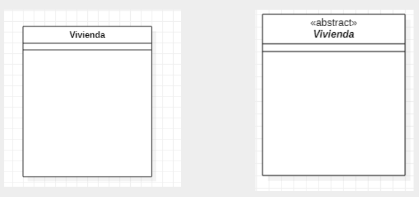
### **Atributos**
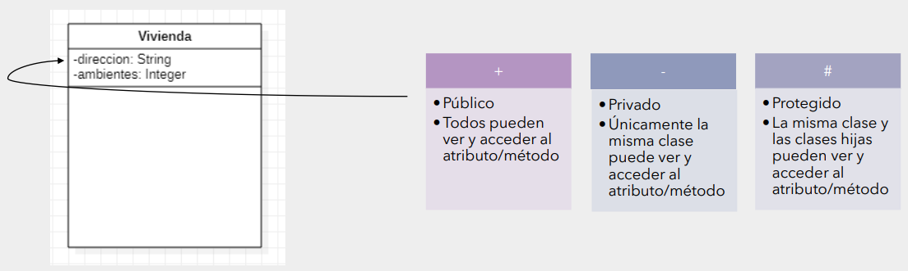
### **Mensajes/Métodos**
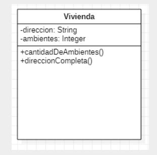
### **Interfaces**
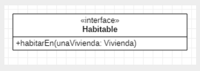

### **Relaciones - Asociación Simple Dirigida**
* Una clase A tiene como atributo (de objeto) a un objeto de la clase B.
* Se suele leer “A tiene un B”.
* En el ejemplo, “Una vivienda tiene una constructora”.

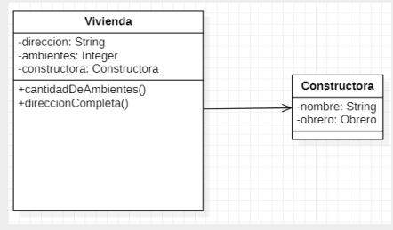

### **Relaciones - Asociación Múltiple Dirigida**
* Se puede especificar la multiplicidad de las relaciones ya sea dejando explícito el número o utilizando un “*” en caso de que sea una colección.
* En el ejemplo, “Una vivienda tiene (o puede tener) muchos habitantes, y un habitante solamente vive (o puede vivir) en una única casa”.
* “Una vivienda tiene una colección de habitantes”.

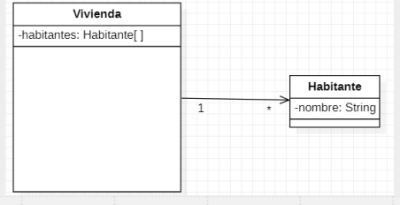

### **Relaciones - Agregación**
* Es una representación jerárquica que indica a un objeto y las partes que componen ese objeto. Es decir, representa relaciones en las que un objeto es parte de otro, pero aun así debe tener existencia en sí mismo.

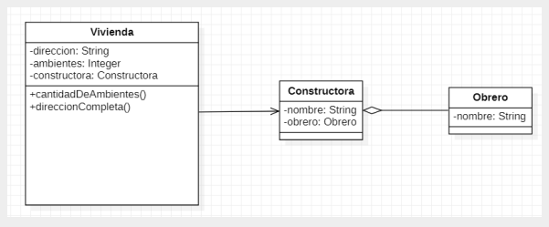

### **Relaciones - Composición**
* La composición es similar a la agregación, representa una relación jerárquica entre un objeto y las partes que lo componen, pero de una forma más fuerte. En este caso, los elementos que forman parte no tienen sentido de existencia cuando el primero no existe.

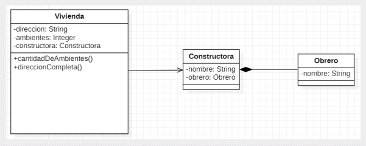

### **Relaciones - Generalización ("Herencia")**
* Se utiliza cuando una clase hereda de otra.
* Se suele leer “A hereda de B”.

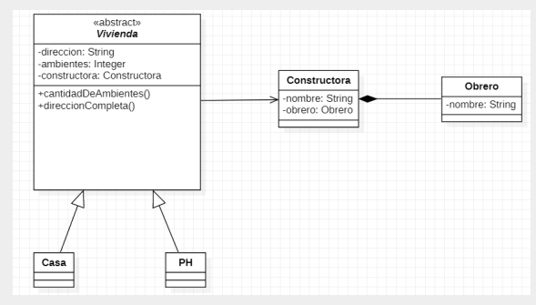

### **Relaciones - Dependencia ("Uso")**
* Se utiliza para representar que una clase requiere de otra para ofrecer cierta funcionalidad.
* Se suele leer “A usa o conoce a B”.

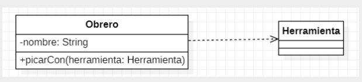

### **Relaciones - Realización ("Implementación")**
* Se utiliza para representar que una clase Implementa una Interface
* Se suele leer “A implementa a B, siendo B una interface”

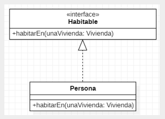
