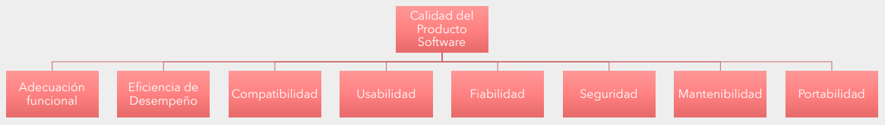
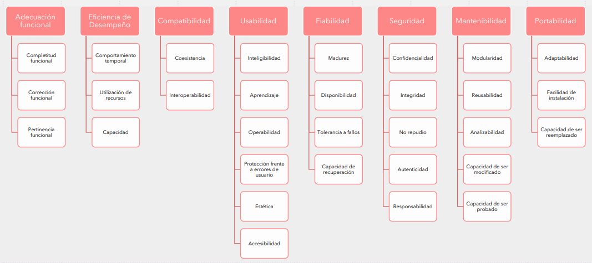
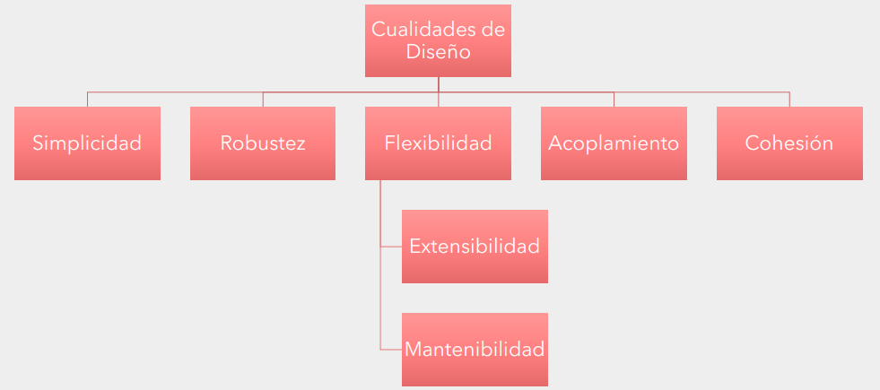

# **Diseño de Sistemas - Clase 2**
## **Calidad de Software**
*Para la norma ISO 25000:*

*"La **calidad** del producto software se puede interpretar como el grado en que dicho producto **satisface los requisitos de sus usuarios aportando** de esta manera un **valor**. Son precisamente estos requisitos (funcionalidad, rendimiento, seguridad, mantenibilidad, etc.) los que **se encuentran representados en el modelo de calidad**, el cual categoriza la calidad del producto en características y subcaracterísticas."*

El modelo de calidad del producto definido por la ISO 25010 se encuentra compuesto por las siguientes 8 características:

A su vez, estas grandes características se subdividen en varias subcaracterísticas:

### **Adecuación funcional (Funcionalidad)**
***Capacidad** del producto de software para **proveer las funcionalidades que satisfacen las necesidades explícitas e implícitas** cuando el software se utiliza bajo condiciones específicas.*

* Completitud funcional
  * Grado en el cual el conjunto de funcionalidades cubre todas las tareas y los objetivos del usuario especificados.
* Correción funcional
  * Capacidad del producto o sistema para proveer resultados correctos con el nivel de precisión requerido.
* Pertinencia funcional
  * Capacidad del producto software para proporcionar un conjunto apropiado de funciones para tareas y objetivos de usuario especificados.

### **Eficiencia de desempeño**
*Esta característica representa el **desempeño relativo a la cantidad de recursos utilizados** bajo determinadas condiciones.*

* Comportamiento temporal
  * Los tiempos de respuesta y procesamiento y los ratios de *throughput* de un sistema cuando lleva a cabo sus funciones bajo condiciones determinadas en relación con un banco de pruebas (benchmark) establecido.
* Utilización de recursos
  * Las cantidades y tipos de recursos utilizados cuando el software lleva a cabo su función bajo condiciones determinadas.
* Capacidad
  * Grado en que los límites máximos de un parámetro de un producto o sistema software cumplen con los requisitos.

### **Compatibilidad**
*Capacidad de 2 o más sistemas o componentes para intercambiar información y/o llevar a cabo sus funciones requeridas cuando comparten el mismo entorno hardware o software.*

* Coexistencia
  * Capacidad del producto para coexistir con otro software independiente, en un entorno común, compartiendo recursos comunes sin detrimento.
* Interoperabilidad
  * Capacidad de dos o más sistemas o componentes para intercambiar información y utilizar la información intercambiada.

### **Usabilidad**
*La capacidad del producto software de ser entendido, aprendido, usado y atractivo al usuario, cuando es usado bajo las condiciones especificadas.*

* Adecuación
  * Capacidad del producto que permite al usuario entender si el software es adecuado para sus necesidades.
* Capacidad de aprendizaje
  * Capacidad del producto que permite al usuario aprender su aplicación.
* Capacidad para ser usado
  * Capacidad del producto que permite al usuario operarlo y controlarlo con facilidad.
* Protección contra errores de usuario
  * Capacidad del sistema para proteger a los usuarios de hacer errores.
* Estética de la interfaz
  * Capacidad de la interfaz de usuario de agradar y satisfacer la interacción con el usuario.
* Accesibilidad
  * Capacidad del producto que permite que sea utilizado por usuarios con determinadas características y discapacidades.

### **Fiabilidad**
*Capacidad de un sistema o componente para desempeñar las funciones especificadas, cuando se usa bajo unas condiciones y periodo de tiempo determinados.*

* Madurez
  * Es la capacidad del producto software para evitar fallas como resultado de errores en el software.
* Disponibilidad
  * Capacidad del sistema o componente de estar operativo y accesible para su uso cuando se requiere.
* Tolerancia a fallos
  * Es la capacidad del producto software para mantener un nivel especificado de funcionamiento en caso de errores del software o de incumplimiento de su interfaz especificada.
* Recuperabilidad
  * Es la capacidad del producto software para reestablecer un nivel especificado de funcionamiento y recuperar los datos afectados directamente en el caso de una falla.

### **Seguridad**
*Capacidad de protección de la información y los datos de manera que personas o sistemas no autorizados no puedan leerlos o modificarlos.*

* Confidencialidad
  * Capacidad de protección contra el acceso de datos e información no autorizados, ya sea accidental o deliberadamente.
* Integridad
  * Capacidad del sistema o componente para prevenir accesos o modificaciones no autorizados a datos o programas de ordenador.
* No repudio
  * Capacidad de demostrar las acciones o eventos que han tenido lugar, de manera que dichas acciones o eventos no puedan ser repudiados posteriormente.
* Responsabilidad
  * Capacidad de rastrear de forma inequívoca las acciones de una entidad.
* Autenticidad
  * Capacidad de demostrar la identidad de un sujeto o un recurso.

### **Mantenibilidad**
*Esta característica representa la capacidad del producto software para ser modificado efectiva y eficientemente, debido a necesidades evolutivas, correctivas o perfectivas.*

* Modularidad
  * Capacidad de un que permite que un cambio en un componente tenga un impacto mínimo en los demás.
* Reusabilidad
  * Capacidad de un activo que permite que sea utilizado en más de un sistema software o en la construcción de otros activos.
* Analizabilidad
  * Facilidad con la que se puede evaluar el impacto de un determinado cambio sobre el resto del software, diagnosticar las deficiencias o causas de fallos en el software, o identificar las partes a modificar.
* Capacidad para ser modificado
  * Capacidad del producto que permite que sea modificado de forma efectiva y eficiente sin introducir defectos o degradar el desempeño.
* Capacidad para ser probado (*"Testeabilidad"*)
  * Facilidad con la que se pueden establecer criterios de prueba para un sistema o componente y con la que se pueden llevar a cabo las pruebas para determinar si se cumplen dichos criterios.

### **Porabilidad**
*Capacidad de un producto o componente de ser trasferido de forma efectiva y eficiente de un entorno de hardware, software, operacional o de utilización, a otro.*

* Adaptabilidad
  * La capacidad del producto software para ser adaptado a diferentes entornos definidos sin aplicar acciones o medios diferentes de los previstos para el propósito del software considerado.
* Capacidad para ser instalado
  * Facilidad con la que el producto se puede instalar y/o desinstalar de forma exitosa en un determinado entorno.
* Capacidad para ser reemplazado
  * Capacidad del producto para ser utilizado en lugar de otro producto software determinado con el mismo propósito y en el mismo entorno.

---

## **Cualidades de Diseño**
*Sirven como criterios para analizar distintas propuestas/alternativas y tomar decisiones más formadas respecto a ellas.*

### **Acomplamiento**
*Grado de dependencia entre 2 componentes, es decir, el grado de conocimiento que un componente tiene sobre el otro.*

*Cuanto mayor sea el acoplamiento entre 2 componentes, los cambios o errores de uno de ellos impactarán en mayor medida sobre el otro componente.*

*Si se minimiza el acoplamiento:*
* Mejora la mantenibilidad
* Aumenta la reutilización
* Evita que un defecto en un componente se propague a otros
* Evita tener que inspeccionar y/o modificar múltiples componentes ante una modificación en uno solo de ellos

### **Cohesión**
*Un componente cohesivo tiende a tener todos sus elementos abocados a resolver el mismo problema*

*Se define como la cantidad de responsabilidades que están asignadas a un componente*

*Mientras más responsabilidades tenga un componente, menos cohesivo será*

---

> ### **Alta cohesión, bajo acoplamiento** BuenoTM

---

### **Simplicidad**
**_KISS - Keep it simple, stupid_** -> propone evitar cualquier complejidad innecesaria.

**_YAGNI - You aren't gonna need it_** -> propone no agrgar funcionalidad nueva que no apunte a la problemática actual.

### **Robustez**
*Dice que, ante un uso inadecuado por parte del usuario, sistemas externos o fallas internas:*
* El sistema no debe generar información o comportamiento inconsistente/errático
* El sistema debe reportar los errores y volver a un estado consistente
* El sistema debe facilitar tanto como sea posible la detección de la causa del problema

### **Flexibilidad**
*Capacidad de reflejar cambios en el dominio de manera simple y sencilla*
* **Extensibilidad** -> capacidad de agregar nuevas características con *"poco"* impacto.
* **Mantenibilidad** -> capacidad de modificar las características existentes con *"el menor"* esfuerzo posible.

---

## **Patrones de Diseño**
> **_"Son descripciones  de clases y objetos relacionados que están adaptados para resolver un problema de diseño general en un contexto determinado"_** Erich Gamma, Richard Helm, John Vlissides y Ralph Johnson

> **_"Consiste en un diagrama de objetos que forma una solución a un problema conocido y frecuente"_** Laurent Debrauwer - Patrones de diseño en Java

*"Soluciones conocidas a problemas conocidos y reiterados en el mundo del Desarrollo de Software"*

### **Patrones de Diseño - Estructura**
* Propósito
* Motivación
* Participantes
* Colaboraciones
* Consecuencias
* Implementación Código de Ejemplo
* Usos conocidos
* Patrones relacionados

### **Patrones de Diseño - Partes esenciales**
* **Nombre** -> comunica el objetivo del patrón en una o dos palabras. Aumenta el vocabulario sobre el diseño.
* **Problema** -> describe el problema que el patrón soluciona y su contexto. Indica cuándo se aplica el patrón.
* **Solución** -> indica cómo resolver el problema en términos de elementos, relaciones, responsabilidades y colaboraciones. La solución debe ser lo suficientemente abstracta para poder ser aplicada en diferentes situaciones.
* **Consecuencias** -> indica los efectos de aplicar la solución. Son críticas al momento de evaluar distintas alternativas de diseño.

### **Patrones de Diseño - Clasificación**
|Creacionales|Comportamiento|Estructurales|
|:-:|:-:|:-:|
|Abstraen el proceso de creación/instanciación de los objetos. Se los suele utilizar cuando debemos crear objetos, complejos o no, tomando decisiones dinámicas en momento de ejecución|Resuelven cuestiones, complejas o no, de interacción entre objetos en momento de ejecución|Resuelven cuestiones, generalmente complejas, de generación y/o utilización de estructuras complejas o que no están acopladas al dominio|

### **Ejemplos**

| Creacionales       | Comportamiento            | Estructurales    |
| :----------------- | :------------------------ | :--------------- |
| • Factory Method   | • State                   | • Adapter        |
| • Simple Factory   | • Strategy                | • Composite      |
| • Singleton        | • Observer                | • Facade         |
| • Abstract Factory | • Command                 | • Decorator      |
| • Builder          | • Template method         | • Proxy          |
| • Prototype        | • Iterator                | • Flyweight      |
|                    | • Memento                 | • Bridge         |
|                    | • Visitor                 |                  |
|                    | • Interpreter             |                  |
|                    | • Chain of Responsability |                  |
|                    | • Mediator                |                  |

