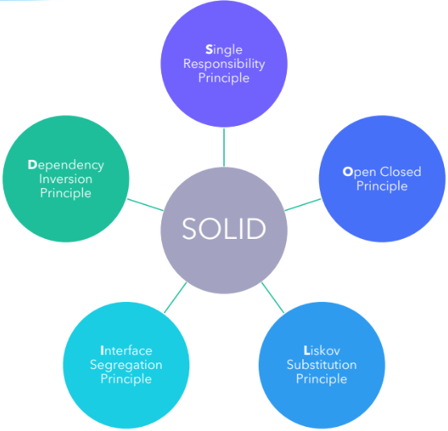

# **Diseño de Sistemas - Clase 4**
## **Principios SOLID**

Principios básicos de POO y DDS que nos ayudan a obtener mejores diseños implementando una serie de reglas o principios.

*Ayudan a evitar la generación de **"Código Sucio"***

### **S**OLID **- Single Responsibility Principle**

* Cada clase debe tener responsabilidad sobre una sola parte de la funcionalidad del software -> **Clases Cohesivas**
* Esta responsabilidad debe estar encapsulada por la clase, y todos sus servicios deben estar estrechamente alineados con esa responsabilidad.

**_Evitar la clase "Dios" propiciando la alta Cohesión_**

### S**O**LID **- Open Closed Principle**

* Las entidades deben estar abiertas para la expansión, pero cerradas para su modificación.
* Se basa en la implementación de herencias y el uso de interfaces para resolver el problema.

**_Se sugiere evitar la utilización excesiva de los **"switchs"** y propiciar el polimorfismo entre objetos._**

### SO**L**ID **- Liskov Substitution Principle**

*“Cada clase que hereda de otra puede usarse como su superclase sin necesidad de conocer las diferencias entre las clases derivadas. Lo mismo vale para las realizaciones de Interfaces”*

**_Se debería utilizar correctamente la herencia y las realizaciones de Interfaces._**

### SOL**I**D **- Interface Segregation Principle**

* Los clientes de un componente sólo deberían conocer de éste aquellos métodos que realmente usan y no aquellos que no necestian usar.
* Muchas interfaces cliente específicas son mejores que una interfaz de propósito general.

**_Se debería propiciar un diseño orientado a interfaces, para mantener el acoplamiento entre clases al mínimo posible, y también evitar generar interfaces extensas (con muchos métodos)._**

### SOLI**D** **- Dependency Inversion Principle**

*“Los módulos de alto nivel no deben depender de módulos de bajo nivel. Ambos deben depender de abstracciones. Es una forma de desacoplar módulos.”*

**_Se sugiere utilizar inyectores de dependencias_**

---

## **Refactoring**

*¿Qué **No** es refactorizar?*

* **NO** es incorporar funcionalidades nuevas
* **NO** es optimizar

**_"Es <u>cambiar la estructura de código</u> para hacerlo más <u>simple</u> y <u>extensible</u>. Esto involucra muchas acciones posibles, algunas simples como cambiar el nombre de una clase o un método, o cosas más complejas como reemplazar condicionales por objetos polimórficos o bien separar una clase en varias."_**

El refactor busca:
* **Métodos cortos** y con **nombres bien definidos** -> que revelen exactamente el propósito para el que fueron creados.
* **Métodos** y **clases** con **responsabilidades claras** y bien definidas (mayor cohesión).
* Respecto a las variables de instancia -> hay que evaluar el costo-beneficio de tener en **variables valores que puedan calcularse**, como el total de deuda de un cliente, o la cantidad de hijos de un empleado.
* **No** tener **god objects** ni **managers**, objetos que roban responsabilidades que les corresponden a otros objetos.
* Es preferible tener **objetos chicos** antes que un objeto grande con muchas responsabilidades (sobre todo si los objetos chicos pueden intercambiarse).
* **Evitar ciclos de dependencia** entre objetos si no los necesito, esto es relaciones bidireccionales innecesarias.

---

## **Code Smells**