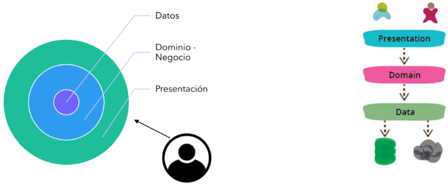

# **Diseño de Sistemas - Clase 4**
## **Principios SOLID**

Principios básicos de POO y DDS que nos ayudan a obtener mejores diseños implementando una serie de reglas o principios.

*Ayudan a evitar la generación de **"Código Sucio"***


### **S**OLID **- Single Responsibility Principle**

* Cada clase debe tener responsabilidad sobre una sola parte de la funcionalidad del software -> **Clases Cohesivas**
* Esta responsabilidad debe estar encapsulada por la clase, y todos sus servicios deben estar estrechamente alineados con esa responsabilidad.

**_Evitar la clase "Dios" propiciando la alta Cohesión_**

### S**O**LID **- Open Closed Principle**

* Las entidades deben estar abiertas para la expansión, pero cerradas para su modificación.
* Se basa en la implementación de herencias y el uso de interfaces para resolver el problema.

**_Se sugiere evitar la utilización excesiva de los **"switchs"** y propiciar el polimorfismo entre objetos._**

### SO**L**ID **- Liskov Substitution Principle**

*“Cada clase que hereda de otra puede usarse como su superclase sin necesidad de conocer las diferencias entre las clases derivadas. Lo mismo vale para las realizaciones de Interfaces”*

**_Se debería utilizar correctamente la herencia y las realizaciones de Interfaces._**

### SOL**I**D **- Interface Segregation Principle**

* Los clientes de un componente sólo deberían conocer de éste aquellos métodos que realmente usan y no aquellos que no necestian usar.
* Muchas interfaces cliente específicas son mejores que una interfaz de propósito general.

**_Se debería propiciar un diseño orientado a interfaces, para mantener el acoplamiento entre clases al mínimo posible, y también evitar generar interfaces extensas (con muchos métodos)._**

### SOLI**D** **- Dependency Inversion Principle**

*“Los módulos de alto nivel no deben depender de módulos de bajo nivel. Ambos deben depender de abstracciones. Es una forma de desacoplar módulos.”*

**_Se sugiere utilizar inyectores de dependencias_**

---

## **Refactoring**

*¿Qué **No** es refactorizar?*

* **NO** es incorporar funcionalidades nuevas
* **NO** es optimizar

**_"Es <u>cambiar la estructura de código</u> para hacerlo más <u>simple</u> y <u>extensible</u>. Esto involucra muchas acciones posibles, algunas simples como cambiar el nombre de una clase o un método, o cosas más complejas como reemplazar condicionales por objetos polimórficos o bien separar una clase en varias."_**

El refactor busca:
* **Métodos cortos** y con **nombres bien definidos** -> que revelen exactamente el propósito para el que fueron creados.
* **Métodos** y **clases** con **responsabilidades claras** y bien definidas (mayor cohesión).
* Respecto a las variables de instancia -> hay que evaluar el costo-beneficio de tener en **variables valores que puedan calcularse**, como el total de deuda de un cliente, o la cantidad de hijos de un empleado.
* **No** tener **god objects** ni **managers**, objetos que roban responsabilidades que les corresponden a otros objetos.
* Es preferible tener **objetos chicos** antes que un objeto grande con muchas responsabilidades (sobre todo si los objetos chicos pueden intercambiarse).
* **Evitar ciclos de dependencia** entre objetos si no los necesito, esto es relaciones bidireccionales innecesarias.

---

## **Code Smells**

*Olores de Código*
* No necesariamente significan que esté mal lo que diseñé / implementé, sino que son señales de que algo se puede mejorar (no hay que ser terminante, muchos code smells se entrecruzan al tratar de solucionarlos)
* Nosotros debemos ser capaces de sentir estos "malos olores" en nuestro código para que, de esta forma, se puede mejorar nuestro diseño.

### **Código duplicado**

* No queremos duplicar la misma idea en el código
  * **Once and only once**: hacer las cosas una sola vez
  * **Don't repeat yourself (DRY)**
* No solo vale para el código sino para el diseño en general. Dos de las formas más conocidas para evitar este smell en diseño es la composición y la herencia.

### **Métodos largos**

* Un método largo podemos descomponerlo en varias partes.
* De cada parte del método debemos:
  * Identificar el objetivo que cumple.
  * Implementar esa abstracción: ponerle un nombre representativo y encontrar qué objeto es responsable de ese objetivo.
* Los métodos generados pueden ser utilizados en otro contexto.
* Delegar el método original en varios submétodos nos permite entender mejor qué es lo que hace.

### **God Class**

* Clases que poseen demasiadas responsabilidades, que están fuertemente acopladas a muchos otros objetos y que ante cualquier cambio se ven afectadas.

Para solucionar este Smell se puede:
* **Generar nuevas clases**: si el comportamiento de la clase es grande, y cumple con varias funciones al mismo tiempo, se deve dividir a la God Class en más clases que cumplan con un solo propósito -> Alta cohesión.
* **Generar subclases**: si parte del comportamiento de la God Class se puede implementar de diferentes maneras, entonces una solución es convertir a nuestra vieja God Class en una clase Abstracta y luego generar subclases que definan el comportamiento específico necesario.
* **Generar interfaces**: si lo que queremos es brindar una lista de operaciones con diferentes comportamientos que el cliente puede utilizar, podemos generar una / varias interface(s) y luego crear clases concretas que cumplan con dicha interfaz e implementen las diferentes funcionalidades.

*Si la God Class es responsable de una interfaz gráfica, se debe comenzar a pensar en el patrón MVC, e ir descomponiendo las responsabilidades entre las diferentes capas involucradas.*

### **Parámetros largos**
* Puede darse cuando varios algoritmos se combinan en un solo método. O también cuando nos estamos olvidando de alguna abstracción del dominio.
* Si un objeto va a brindar un servicio a otro, lo mejor sería que la cantidad de parámetros del método en cuestión no varíe.

Por ejemplo...

```java
public void getPelicula(String nombrePeli, String autor, int anio, int version, int estrellas) {...}
```

Está totalmente sujeto a esos parámetros, y cualquier cambio en alguno de ellos afectaría a todo nuestro código. Del mismo modo, al querer agregar un parámetro más, estaríamos "rompiendo" con el cliente que está utilizando este servicio.

Una posible solución:

```java
public void getPelicula(BusquedaPelicula peliBuscada) {...}
```

### **Cadena de mensajes**

Si un objeto envía un mensaje de la forma:

```
a.b().c().d();
```

Va en contra del consejo **Tell, don't ask** y de la **Ley de Demeter** *("don't talk to strangers", "only talk to friends")*, donde un objeto sólo debería enviar mensajes:
* a sí mismo
* a objetos que conoce (como variables de instancia)
* a objetos que recibe como parámetro
* a objetos de instancia

### **Herencia Rechazada**

Se puededar cuando una clase sobrescribe completamente un método base definido por su padre sin importarle lo que éste le haya dicho que tenía que hacer, o cuando una clase hereda métodos que en realidad no debería tener.

*¿Por qué utilizar herencia cuando se puede obtener lo mismo con composición?*

La herencia es rígida:
* Obliga a definir más métodos que los necesarios (en ciertos casos)
* En la mayoría de los lenguajes la herencia es simple, lo que se transforma en un limitante.

**_Utilizar composición por sobre herencia._**

### **Lazy Class** (Clase perezosa)

*La clase no hace nada o hace muy poco.*

* Suele darse en el caso de la extrema delegación o porque el componente fue diseñado "por las dudas".
* Para evitar estas clases:
  * Pensar en YAGNI para no agregar funcionalidad hasta que no sea necesario.
  * Eliminar de nuestro diseño las clases "Por las dudas"

### **Nombres de variables cortos**

El nombre de las variables debe representar su funcionalidad.

### **Nombre de método muy largo**

Si nos está costando escoger un nombre bien representativo para el método, yu nos queda muy largo, seguramente hay más de una lógica comprendida dentro del mismo.

### **Código muerto**

El típico código "por las dudas" que nos marea a la hora de ver la responsabilidad que tiene asignada una clase.

**Solución** -> borrar todo el código muerto y, otra vez, diseñar de modo extensible pero cerrado al cambio.

### **Primitive Obssesion**

Suele darse al representar con ints, booleans, Strings o enumeraciones cosas que podrían ser objetos con comportamientos. Las enumeraciones nos llevan a tener sentencias condicionales en lugar de trabajar con objetos polimórficos.

Algo del estilo:

```java
Public enum Estacion { VERANO, OTONIO, INVIERNO, PRIMAVERA }
Public void actuar(){
  switch(estacion) {
  Case(VERANO) ...... break;
  Case(OTONIO)... break;
}}
```

**Solución** -> buscar abstracciones que nos permitan trabajar polimórficamente.

### **Datga Class - Only Accessors**

* Una clase que sólo representa una estructura de datos es fácil verla porque tiene sólo getters y setters.
* Es mala práctica pensar que es bueno separar un objeto en atributos y comporamiento, ya que rompe con nuestro paradigma de objetos; donde un objeto agrupa comporamiento y atributos.

**Existen excepciones y son los Value Objects** y los objetos que modelan los parámetros que enviamos a un objeto.

### **Métodos fuera de lugar e Itermediario**

```java
>> MiembroDeComunidad

public void unirseAComunidad(Comunidad comunidad){
comunidad.agregarMiembro(this);
}
```

Si no accedemos a ningún atributo ni tampoco utilizamos comportamiento interno, posiblemente estamos ubicando mal el método: ¿por qué no enviar directamente el mensaje a "Comunidad"?

Este Smell nos da lugar a hablar de la asignación de posibles "Casos de Uso" en métodos de objetos de negocio.

---

## **Entities vs Value Objects**

Tanto las entidades como los value objects representan abstracciones para el dominio.

Diferencias: 
* **Entidades** -> abstracciones principales y / o relevantes para el dominio, tienen sentido de existencia propio.
* **Value objects** -> generalmente representan abstracciones "accesorias" que guardan datos. Datos que no tienen sentido de existencia propio y que solo tienen sentido si se los contextualiza en alguna entidad.

### **Tipos de igualdad**

|Igualdad de referencia (identidad)|Igualdad estructural (equivalencia)|Igualdad de identificadores|
|:-:|:-:|:-:|
|• Dos objetos son iguales si son exactamente el mismo, esto es, si están referenciando a la misma porción de memoria.|Dos objetos son iguales si todos los valores que tienen sus atributos, en un momento determinado, coinciden.|• Implica que una clase tiene un atributo de identificación, natural o ficticio. 
|||• Dos objetos son iguales si tienen exactamente el mismo valor para su identificador.|

### **Vida Útil**

|Entidades|Value Objects|
|:-:|:-:|
|• Viven **"a largo plazo"**|• Son **desechables**, su vida útil es "muy corta".|
|• Pueden tener un historial|• No tiene sentido de existencia propio, están atados a entidades.|
|• Tienen sentido de existencia propio||

### **Inmutabilidad**
|Entidades|Value Objects|
|:-:|:-:|
|• Generalmente son **mutables**, los valores de sus atributos pueden cambiar a lo largo del tiempo.|• Son **inmutables**, sus atributos no pueden cambiar de valor.|
||• Si se necesita cambiar el valor de algún atributo, se desecha la instancia y se crea un value object nuevo.|

### **¿Entidad o Value Object?**

Lo importante es entender que:
* Una entidad puede que no tenga comportamiento y eso no la convierte en un value object pues tiene sentido de existencia propio y es algo "muy relevante" para nuestro dominio.
* Un value object es un objeto inmutable, desechable, accesorio de algo principalm que no tiene sentido de existencia propio sino que debe ser contextualizado.
* Obviamente una entidad puede tener comportamiento, es decir, lógica propia del negocio; y eso no le quita su condición de "entidad".

---

## **Modelado de Usuarios, roles & permisos** <sub>-Parte I</sub>

### **Responsabilidades de Capas de un Sistema**
Muchas veces el POO puede llevar a confundir la asignación de responsabilidades entre las distintas capas que puede tener un Sistema.

Este diseño es incorrecto porque no debemos mezclar la lógica de negocio con los hipotéticos permisos que tiene un actor / rol en particular sobre nuestro Sistema.

Un sistema puede dividirse, *mínimamente*, en 3 capas.



### **Capa de Presentación**
* Capa encargada de presentar los datos al usuario, con la cual éste interactuará.
* La presentación de datos no necesariamente es visual, es decir mediante interfaz gráfica, sino que puede ser de distintas formas.
* La forma de presentación de datos la podemos dividir al menos en 2 formas:
  * Presentación de datos mediante interfaz gráfica (interfaz desktop, iterfaz Web, aplicación móvil, etc.).
  * Presentación de datos mediante APIs.

### **Capa de Dominio / Negocio**
* Capa encargada de modelar las reglas de negocio, las entidades del dominio.
* Contiene la parte estructural y de comportamiento que brinda sostén a todos los posibles Casos de Uso del Sistema.

### **Capa de Datos**
* Capa encargada de la manipulación de la Persistencia de datos del Sistema.
* Si existe persistencia en una base de datos, esta es la encargada de comunicarse con ella.

### **Capa de Controladores**
* Capa que se encuentra más "arriba" de la capa de Dominio / Negocio, más precisamente entre ésta y la capa de Presentación.
* En esta, se suelen agregar métodos que "orquestan" las funcionalidades; además de verificar si el usuario que está intentando realizar dicha accion posee los permisos necesarios.
* En algunos Sistemas se toma la decisión de delegar en otra capa la verificación de Permisos (capa llamada "Middleware")

---

## **Biblioteca vs Framework**

### **Bibliotecas**
*“Las bibliotecas definen funcionalidades y estructuras concretas que pueden ser utilizadas o no por el desarrollador en un proyecto que las incluye, de la forma que el desarrollador considere oportuna.“*

**_Las bibliotecas las llamamos nosotros, cuando nosotros las necesitamos, no ellas a nosotros._**

### **Frameworks**
*“Los frameworks definen código que representa las abstracciones y la lógica surgidas de una estructura de
trabajo. Los frameworks obligan al desarrollador a trabajar de una forma específica, siguiendo los lineamientos
que definen.“*

### **Frameworks - Tipos**
Según la rigidez de un framework se lo puede clasificar como Dogmático o No dogmático.

|Dogmático|No dogmático|
|:-:|:-:|
|“Los frameworks dogmáticos son aquellos que opinan acerca de la "manera correcta" de gestionar cualquier tarea en particular. Ofrecen soporte para el desarrollo rápido en un dominio en particular (resolver problemas de un tipo en particular) porque la manera correcta de hacer cualquier cosa está generalmente bien comprendida y bien documentada.”|“Los framewoks no dogmáticos, en contraposición, tienen muchas menos restricciones sobre el modo mejor de unir componentes para alcanzar un objetivo, o incluso qué componentes deberían usarse. Hacen más fácil para los desarrolladores usar las herramientas más adecuadas para completar una tarea en particular, si bien al coste de que se necesita encontrar esos componentes por uno mismo.”|

### **Comparación**
|Biblioteca|Framework|
|:-:|:-:|
|• Es responsabilidad del desarrollador decidir cómo y cuándo utilizar los componentes.|• Este define la forma en la que se estructurará el código y el desarrollador se ve obligado a seguir esa forma.|
|• Las decisiones de diseño que se toman suelen tener bajo impacto en el diseño del código que la utiliza.|• Las decisiones de diseño que se toman pueden condicionar fuertemente el diseño del código cliente.|
|• Utilizan **control directo**: El usuario llama funciones de la biblioteca e instancia las estructuras que la biblioteca pueda definir.|• Utilizan **control inverso**: Es el framework el que llama funciones abstractas que el usuario define en concreto.|

---

## **Inyección de Dependencias**

Partiendo del siguiente ejemplo:

```java
>> Incidente

public void enviarAvisos(){
this.interesados.forEach(i -> whatsAppSender.enviar(i, “Ha ocurrido un incidente”));
}
```
Suponiendo que existe un objeto “whatsAppSender”, ¿cómo llegamos a conocerlo? Algunas opciones:
* Tener una única instancia de su clase accesible globalmente.
* Obtener ese objeto a través de otro que lo provea.
* Que a la clase Incidente le llegue por parámetro whatsAppSender

### **Inyecció de Dependencias - Singleton**
```java
>> Incidente

public void enviarAvisos() {
  this.interesados.forEach(i -> WhatsAppSender.getInstance().enviar(i, “Ha ocurrido un incidente”));
}
```
```java
>> WhatsAppSender

private static WhatsAppSender instance = null;

public static WhatsAppSender getInstance() {
  if(instance == null)
    instance = new WhatsAppSender(); // más toda la configuración
  return instance;
}
```
### **Inyecció de Dependencias - Service Locator**
```java
>> Incidente

public void enviarAvisos() {
  this.interesados.forEach(i -> ServiceLocator.get(“whatsAppSender”).enviar(i, “Ha ocurrido un incidente”));
}
```
### **Inyecció de Dependencias - Inyectando la dependencia**
```java
>> Incidente

public Incidente(WhatsAppSender whatsAppSender){...}

public void enviarAvisos() {
  this.interesados.forEach(i -> this.whatsAppSender.enviar(i, “Ha ocurrido un incidente”));
}
```

Suponiendo que **A**, instancia de la clase 1, necesita a **B**, instancia de la clase 2, para poder realizar la tarea **X**...

* Singleton
  * **A solicita a clase 2 una instancia, la cual devuelve siempre la instancia B.**
  * "B" es un objeto global, única instancia para toda la ejecución.
  * Fuerte acoplamiento entre Clase 1 y Clase 2.
  * Difícil de testear pues es complicado mockear a B.
* Service Locator
  * **A solicita al Service Locator alguien que sea capaz de realizar la tarea X y éste le devuelve la instancia B o algún otro objeto que cumpla con la misma interface.**
  * El service Locator es un objeto global que permite generar distintas configuraciones.
  * Permite el mockeo de objetos.
* Inyección de Dependencias
  * **A recibe como parámetro, en su constructor, a B o algún otro objeto que cumpla con la misma interface.**
  * A no solicita a nadie la instancia B, sino que "le llega desde afuera".
  * Es más testeable pues permite el mockeo de objetos.
  * Se puede combinar con las anteriores.