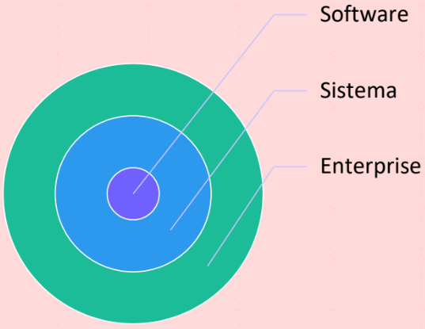
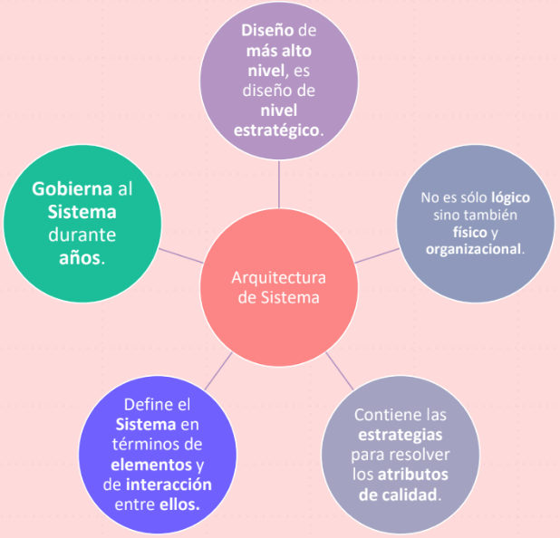
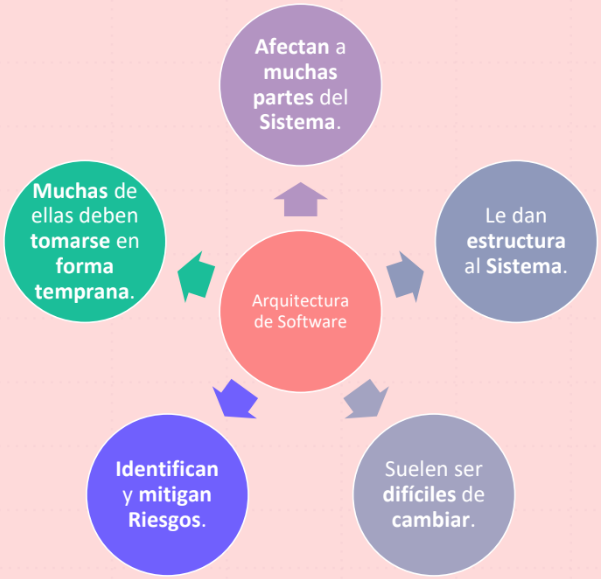
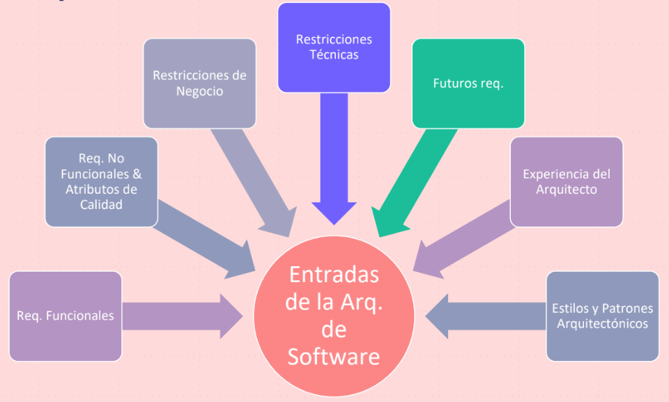
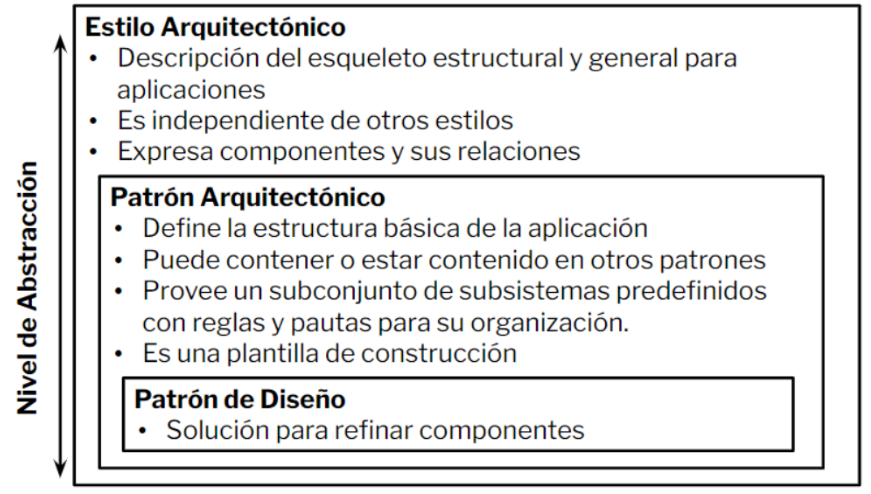
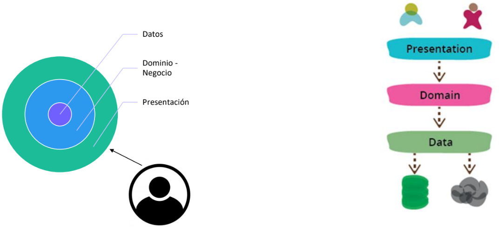
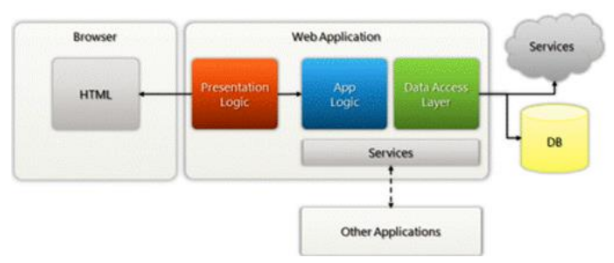
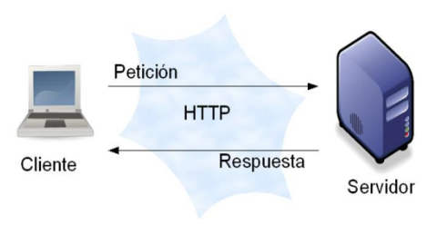
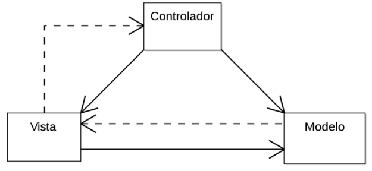
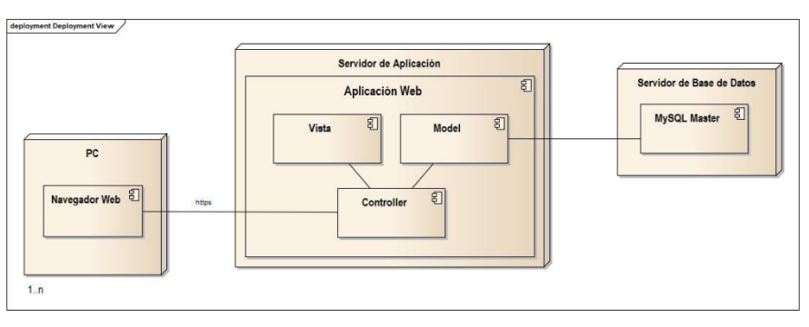

# **Diseño de Sistemas - Clase 5**
## **Introducción a la Arquitectura de Software y de Sistema**
### **Arquitectura de Software**

*Representa la **estructura o estructuras** del sistema que consiste en **componentes de software**, las propiedades **externas** vbisibles de esos componentes y las **relaciones** entre ellos.*

Un componente es una pieza de software que puede ser código fuente, código binario, un ejecutable, o una biblioteca con una interfaz definida.

**¿Qué es la interfaz de un Componente?**

Una interfaz establece las **operaciones externas** de un componente, las cuales **determinan** una *parte del comportamiento* del mismo.

**¿Cómo se relacionan con otros componentes?**

Se representan las **dependencias** *entre componentes* o *entre un componente y la interfaz de otro*, uno de ellos usa los servicios o funcionalidades del otro.

**Niveles**

* **Enterprise**
  * Define la estrategia tecnológica y de negocio de la organización para el desarrollo de sus Sistemas.
* **Sistema**
  * Arquitectura de Software e Infraestructura.
* **Software**
  * Arquitectura de Software para una aplicación o subsistema.

**Características**

**Decisiones Arquitectónicas**

**Entradas**

**Niveles de Abstracción**

---

### **Modelo en Capas**

* Layering es una de las **técnicas más comunes** para resolver un **problema** de **diseño complejo**.
* Cada capa es un **todo coherente**, con un **rol único** en el sistema.
* Las **capas superiores usan servicios de las inferiores**, pero no así de forma contraria o saltando niveles.

<u>Ventajas</u>
* Nos mantiene enfocados en el problema a resolver.
* Esconde el detalle de cómo se llevan a cabo los servicios que expone.
* Puede ser reemplazada la implementación de los servicios siendo transparente para los consumidores.
* Minimiza la defendencia entre componentes.
* Facilita pruebas.

<u>Desventajas</u>
* Los cambios pueden generar efecto cascada.
* Demasiadas capas agregan complejidad y afectan negativamente al rendimiento.

---

### **Cliente - Servidor**
2 componentes
* Un **servidor** que provee uno o más servicios a través de una interfaz.
* Un **cliente** que usa esos servicios como parte de su operación en el acceso al servidor.

**Clasificación según responsabilidades**

* **Cliente Activo, Servidor Pasivo** -> el cliente es quien posee la mayor lógica de negocio. El servidor limita su funcionalidad a la persistencia.
* **Cliente Pasivo, Servidor Pasivo** -> ambos componentes poseen baja lógica de negocio o simplemente son considerados “componentes intermedios” de algo “más grande”.
* **Cliente Pasivo, Servidor Activo (“Cliente liviano”)** -> el servidor posee la mayor lógica de negocio; mientras que el cliente se limita a presentar los datos.
* **Cliente Activo, Servidor Activo (“Cliente pesado”)** -> la lógica de negocio está distribuida en ambos componentes. El cliente posee la lógica de presentación de los datos.

*Ventajas y desventajas sobre un **Cliente Pasivo - Servidor Activo***

<u>Ventajas</u>
* Mantenibilidad: Cambios de funcionalidad Centralizados
* Seguridad: Centralización de Control de Accesos a recursos

<u>Desventajas</u>
* Eficiencia (tiempo de respuesta): El servidor puede ser un cuello de botella
* Disponibilidad: Único punto de falla

---

### **MVC** Patrón Arquitectonico

**Modelo-vista-controlador** (MVC) es un **patrón** de arquitectura de software **de interacción** que separa la arquitectura en tres componentes: el modelo, la vista y el controlador.

**MVC - Modelo**

*Vinculado con la representación de los datos con los cuales el Sistema opera. Está relacionado a la lógica y las reglas del negocio.*

* Encapsula el estado del sistema
* Gestiona todos los accesos a dichos datos (consultas, actualizaciones, etc.)
* Valida la especificación de la lógica detallada en el “negocio”
* Envía a la Vista, a través del controller, los datos solicitados para que sean visualizados

**MVC - Vista**

*Presenta los datos y su forma de interactuar en un formato adecuado para el usuario.*

* Posee lógica para poder representar los datos de la forma más “amigable” para el usuario
* Envía acciones del usuario al controlador
* Solicita actualizaciones al modelo a través del controller
* La comunicación entre la vista y el controlador se realiza mediante objetos de transferencia (DTO - Data Transfer Objects)

**MVC - Controlador**

*Responde a eventos (usualmente acciones del usuario) e invoca peticiones al modelo cuando se hace alguna solicitud sobre los datos.*

* Es el intermediario entre el modelo y la vista
* Define el comportamiento del sistema
* Traduce acciones del usuario a actualizaciones del modelo
* Es el gestor del ciclo de vida del sistema
* Responde a eventos
* Invoca peticiones al modelo

**MVC - Web**

**MVC - Validación de Datos**

*¿Dónde se validan los datos?*

* **EN CADA CAPA**. Esto se lo denomina **validación en profundidad**.
* En la vista se puede validar campos requeridos y consistencia (números y/o letras donde corresponda, entre otras cosas).
* En el controlador se debería volver a validar la consistencia de los datos y los campos requeridos. También se puede realizar una validación adicional contra un servicio externo.
* En el modelo se deberían realizar las validaciones explícitas del negocio.

**MVC - Ventajas y Desventajas**

<u>Ventajas</u>
* Buena separación de intereses (concerns)
* Reusabilidad de Vistas y Controladores
* Flexibilidad

<u>Desventajas</u>
* Mayor complejidad de los Sistemas
* No siempre útil en aplicaciones con "Poca Interactividad" o con "Vistas Simples"
* Difícil de testear como un **todo**