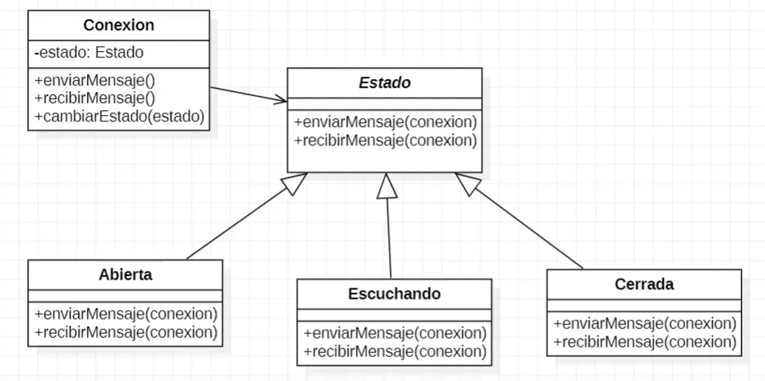
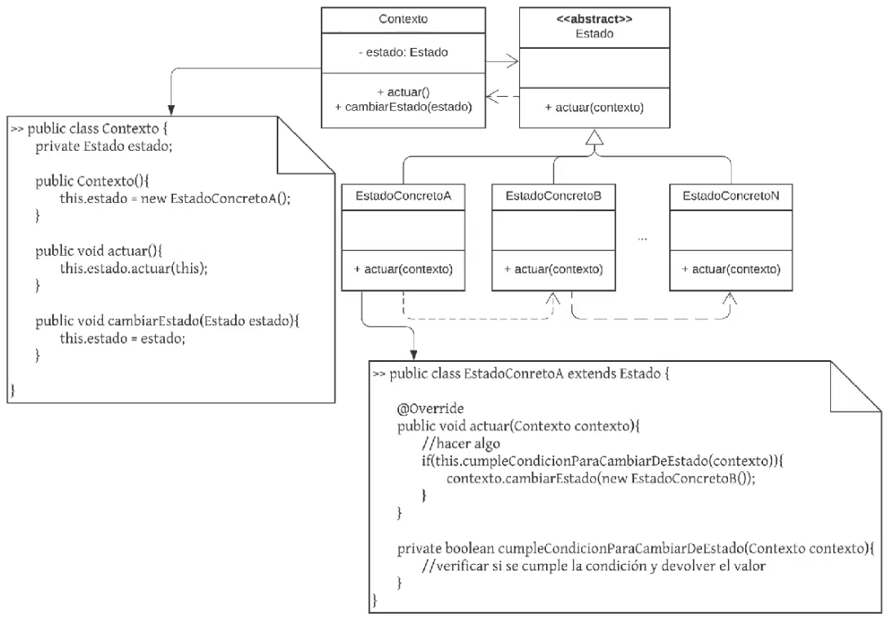
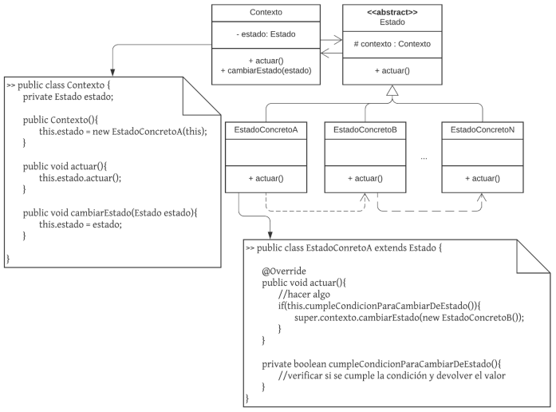
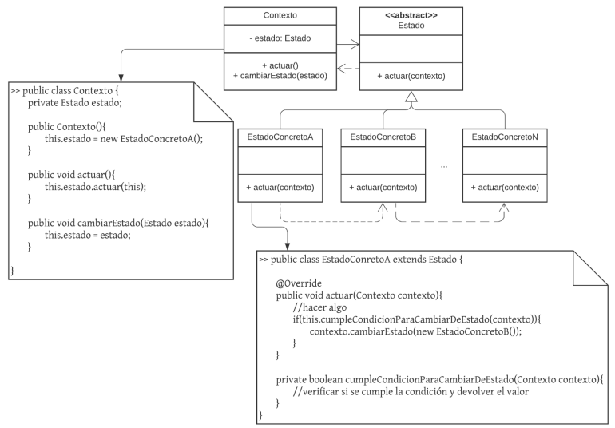

# **Patrones de Diseño**
## **State - Patrón de Comportamiento**
*¿Qué hace?*
* Genera una abstracción (una clase) por cada posible estado que pueda tener un objeto.
* Define transiciones entre los posibles estados.

*Se sugiere su utilización cuando:*
* El comportamiento de un objeto depende de su estado y este mismo puede variar en tiempo de ejecución.
* Un método está lleno de sentencias condicionales que dependen del estado del objeto. Estos estados suelen estar representados por varios atributos de distintos tipos: primitivos (boolean, int, etc.) o por enumerados (enum).

*Componentes:*
* **_Interface (o clase abstracta) State_** -> Define las firmas de los métodos que dependen del estado del objeto principal.
* **_Clases de estados concretas_** -> Clases que implementan la interface State (o que heredan de ella, si ésta fuera clase abstracta), es decir, que tienen la implementación real de los métodos. Son los estados posibles del objeto principal.
* **_Contexto_** -> Clase que tiene referencia a la interface/clase abstracta State, cuyos objetos van a delegar la responsabilidad de resolución de algunos problemas en el estado. Estos objetos utilizaran de forma polimórfica a los estados.

### **Dominio propuesto**
*Se requiere modelar la conexión de un dispositivo a la red de internet teniendo en cuenta los siguientes estados:*
* Abierta
* Escuchando
* Cerrada

### **Diagrama de Clases**

### **Implementación**

---

## **Template Method - Patrón de Comportamiento**
*¿Qué hace?*
* Define el esqueleto de un algoritmo, estableciendo los pasos que sí o sí se deben implementar.

*Se sugiere su utilización cuando:*
* varias abstracciones tienen los mismos pasos y orden para realizar una determinada acción, pero cada una de ellas lo implementa de forma diferente.
* Se requiere utilizar de forma polimórfica dos o más objetos que pueden ejecutar el mismo algoritmo, respetando sus pasos, pero con implementaciones distintas para cada uno de éstos.

*Componentes:*
* **_Clase abstracta_** -> Define el método plantilla, es decir, el esqueleto. Indica qué se va a ejecutar, en qué orden, con qué parámetros, etc.
* **_Clases concretas_** -> Definen concretamente los algoritmos que se van a ejecutar.

### **Dominio propuesto**
*Se desea crear un dispenser para bebidas. Para preparar las mismas, se debe llevar el agua a la temperatura adecuada y luego, dependiendo de la bebida, se procede de forma distinta:*
* Te: se desea calentar el agua a 100, luego servir el té y finalmente agregar azúcar.
* Cafe: se desea calentar el agua a 100, se coloca el café y se sirve con edulcorante.
* Jugo: se debe enfriar el agua, luego agregar el polvo para que se diluya en el agua y finalizar con Stevia.

### **Diagrama de Clases**

### **Implementación**

---

