# **Patrones de Diseño**
## **State - Patrón de Comportamiento**
### *¿Qué hace?*
* Genera una abstracción (una clase) por cada posible estado que pueda tener un objeto.
* Define transiciones entre los posibles estados.

### *Se sugiere su utilización cuando:*
* El comportamiento de un objeto depende de su estado y este mismo puede variar en tiempo de ejecución.
* Un método está lleno de sentencias condicionales que dependen del estado del objeto. Estos estados suelen estar representados por varios atributos de distintos tipos: primitivos (boolean, int, etc.) o por enumerados (enum).

### *Componentes:*
* **_Interface (o clase abstracta) State_** -> Define las firmas de los métodos que dependen del estado del objeto principal.
* **_Clases de estados concretas_** -> Clases que implementan la interface State (o que heredan de ella, si ésta fuera clase abstracta), es decir, que tienen la implementación real de los métodos. Son los estados posibles del objeto principal.
* **_Contexto_** -> Clase que tiene referencia a la interface/clase abstracta State, cuyos objetos van a delegar la responsabilidad de resolución de algunos problemas en el estado. Estos objetos utilizaran de forma polimórfica a los estados.

### **Dominio propuesto**
*Se requiere modelar la conexión de un dispositivo a la red de internet teniendo en cuenta los siguientes estados:*
* Abierta
* Escuchando
* Cerrada

### **Diagrama de Clases**

### **Implementación**

### **Estructura genérica**
* **_Primera posibilidad_** -> Estado como clase abstracta con relación de asociación bidireccional con el Contexto.

  * Consideraciones:
    * Existe una instancia de un estado concreto por cada instancia de la clase Contexto.
    * El Estado tiene al Contexto como atributo protegido.

* **_Segunda posibilidad_** -> Estado como clase abstracta con relación de asociación unidireccional desde Contexto hacia Estado.

  * Consideraciones:
    * No es necesario que exista una instancia de un estado concreto por cada instancia de la clase Contexto. Es decir, los estados pueden ser reutilizables.
    * El estado no tiene al Contexto como atributo.
    * El método actuar del Estado necesita recibir el Contexto por parámetro para poder enviarle mensajes.

* **_Tercera posibilidad_** -> Estado como interface.
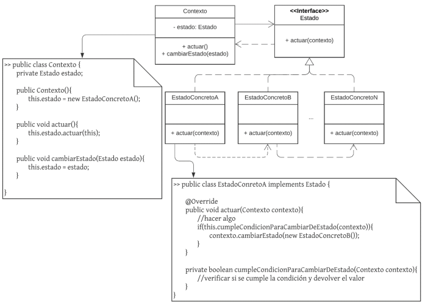
  * Consideraciones:
    * No es necesario que exista una instancia de un estado concreto por cada instancia de la clase Contexto. Es decir, los estados pueden ser reutilizables.
    * El método actuar del Estado necesita recibir el Contexto por parámetro para poder enviarle mensajes.

### **¿Qué proporciona su uso?**
* Mayor cohesión a la clase Contexto.
* Mayor mantenibilidad debido a que el comportamiento por cada estado es fácilmente localizable.
* Extensibilidad para incoporar nuevos estados (nuevos comportamientos).

### **Code smells que soluciona / evita de forma directa**
* Métodos largos
* Clase Dios
* Obsesión primitiva

---

## **Template Method - Patrón de Comportamiento**
### *¿Qué hace?*
* Define el esqueleto de un algoritmo, estableciendo los pasos que sí o sí se deben implementar.

### *Se sugiere su utilización cuando:*
* Varias abstracciones tienen los mismos pasos y orden para realizar una determinada acción, pero cada una de ellas lo implementa de forma diferente.
* Se requiere utilizar de forma polimórfica dos o más objetos que pueden ejecutar el mismo algoritmo, respetando sus pasos, pero con implementaciones distintas para cada uno de éstos.

### *Componentes:*
* **_Clase abstracta_** -> Define el método plantilla, es decir, el esqueleto. Indica qué se va a ejecutar, en qué orden, con qué parámetros, etc.
* **_Clases concretas_** -> Definen concretamente los algoritmos que se van a ejecutar.

### **Dominio propuesto**
*Se desea crear un dispenser para bebidas. Para preparar las mismas, se debe llevar el agua a la temperatura adecuada y luego, dependiendo de la bebida, se procede de forma distinta:*
* Te: se desea calentar el agua a 100, luego servir el té y finalmente agregar azúcar.
* Cafe: se desea calentar el agua a 100, se coloca el café y se sirve con edulcorante.
* Jugo: se debe enfriar el agua, luego agregar el polvo para que se diluya en el agua y finalizar con Stevia.

### **Diagrama de Clases**
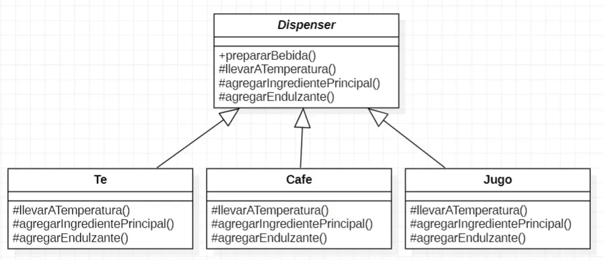

### **Implementación**
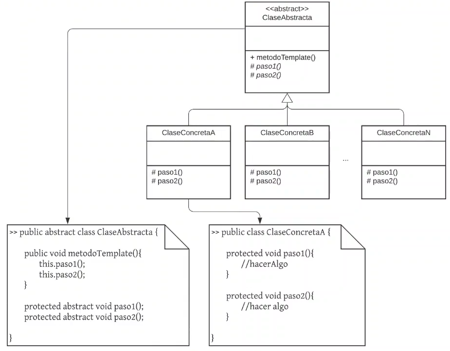

### **Estructura genérica**
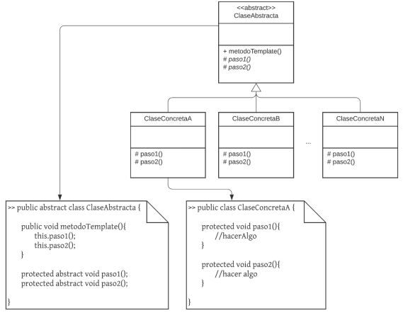
  * Consideraciones:
    * El método template puede no ser void, así como también pueden no serlo los “pasos”.
    * Pueden existir sentencias intermedias entre los “pasos” que tengan comportamiento en común para todas las clases concretas, en otras palabras, que se haga uso de métodos (concretos, no abstractos) definidos en la clase abstracta.
    * Los “pasos” no necesariamente son 2, sino que pueden ser varios.

### **¿Qué proporciona su uso?**
* Mayor mantenibilidad debido a que el comportamiento de los “pasos” es facilmente localizable.
* Alta cohesión en todas las clases involucradas (abstracta y concretas).
* Extensibilidad para agregar nuevas clases concretas que definan nuevos comportamientos para los pasos.

### **Code smells que soluciona / evita de forma directa**
* Código duplicado
* Clase Dios
* Herencia rechazada

---

## **Strategy - Patrón de Comportamiento**
### *¿Qué hace?*
* Encapsula distintas formas (o algoritmos) de resolver el mismo problema en diferentes clases.
* Permite intercambiar en momento de ejecución la forma en que un tercero 
resuelve un problema.

### *Se sugiere su utilización cuando:*
* Se requiere que un objeto realice una misma acción pero con un algoritmo distinto o de una forma distinta.
* Existen muchas formas de realizar la misma acción (pero con distintos pasos) en el mismo objeto. 
* Se requiere permitir configurar en momento de ejecución la forma en que un objeto realizará una acción.

### *Componentes:*
* **_Interface (o clase abstracta) Strategy_** -> Define la firma del método que se utilizará como estrategia de resolución de algún problema.
* **_Clases de estrategias concretas_** -> Clases que implementan la interface Strategy (o que heredan de ella, si ésta fuera clase abstracta), es decir, que tienen la implementación real del algoritmo.
* **_Contexto_** -> Clase que tiene referencia a la interface / clase abstracta Strategy, cuyos objetos van a delegar la responsabilidad de resolución de algún problema de estrategia. Estos objetos utilizarán de forma polimórfica a las estrategias concretas.

### **Dominio propuesto**
*Se requiere modelar un sistema de pagos de un e-commerce de forma tal que los clientes pueden realizar los mismos a través de:*
* Efectivo
* Visa
* MasterCard

*Además, se debe tener en cuenta que en un futuro se pueden agregar nuevos medios.*

### **Diagrama de Clases**
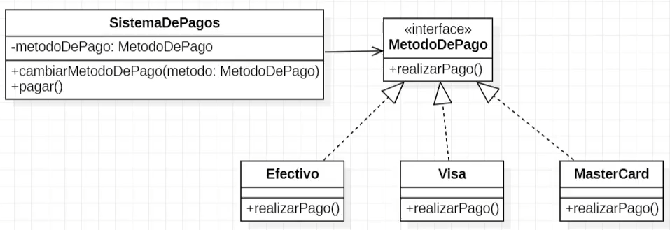

### **Implementación**
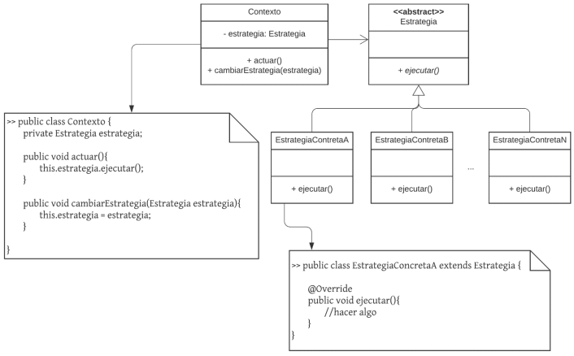

### **Estructura genérica**
* **_Primera posibilidad_** -> Estrategia como clase abstracta con relación de asociación unidireccional con el Contexto.

  * Consideraciones:
    * La clase abstracta Estrategia podría declarar el método ejecutar como abstracto, por lo que cada clase hija estaría obligada a implementar dicho método.
    * Si la clase abstracta Estrategia no declarara el método ejecutar como abstracto, podría definir un comportamiento por defecto.
    * Las estrategias concretas implementan su propio algoritmo/lógica en el método ejecutar.
    * El método ejecutar podría recibir parámetros si el problema lo amerita.
    * Las estrategias concretas podrían necesitar una configuración extra para funcionar.
    * Las estrategias concretas no se conocen.
    * No existen transiciones entre las estrategias.
    * Las instancias de cada estrategia pueden ser reutilizables.

* **_Segunda posibilidad_** -> Estrategia como interface.
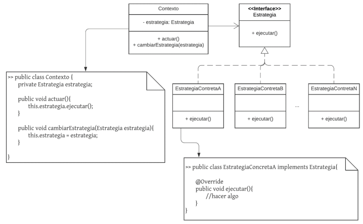
  * Consideraciones:
    * Las estrategias concretas implementan su propio algoritmo/lógica en el método ejecutar.
    * El método ejecutar podría recibir parámetros si el problema lo amerita.
    * Las estrategias concretas podrían necesitar una configuración extra para funcionar.
    * Las estrategias concretas no se conocen.
    * No existen transiciones entre las estrategias.
    * Las instancias de cada estrategia pueden ser reutilizables.

### **¿Qué proporciona su uso?**
* Mayor cohesión a la clase Contexto.
* Mayor mantenibilidad debido a que el comportamiento por cada algoritmo es fácilmente localizable.
* Extensibilidad para incoporar nuevos algoritmos/formas de realizar las acciones.

### **Code smells que soluciona / evita de forma directa**
* Métodos largos
* Código duplicado
* Clase Dios

---

## **Adapter - Patrón Estructural**
### *¿Qué hace?*
* Encapsula el uso (llamadas/envío de mensajes) de la clase que se quiere adaptar en otra clase que concuerda con la interfaz requerida.

### *Se sugiere su utilización cuando:*
* Se requiere seguir adelante con el diseño y/o implementación (código) sin conocer exactamente cómo, quién y cuándo resolverá una parte necesaria; y solamente se conoce qué responsabilidad tendrá dicha parte.
* Se requiere usar una clase que ya existe, pero su interfaz no concuerda con la que se necesita.

### *Componentes:*
* **_Interface Adapter_** -> Define la firma del método que se utilizará como "puente" de acoplamiento a nuestro dominio.
* **_Clases de Adapters concretas_** -> Clases que implementan la interface Adapter, que se encargan de acoplar los componentes externos al dominio. Guardan referencia o hacen uso de las clases Adaptadas. Llaman a los métodos "reales" que resuelven el problema.
* **_Clases Adaptadas_** -> Clases externas al dominio, o no, que posee firmas incompatibles o que todavía no conocemos (puede ser que todavía no estén creadas). Estas clases no se pueden / deben tocar.
* **_Cliente_** -> Clase que tiene referencia a la interface Adapter, cuyos objetos van a hacer uso de la funcionalidad que ésta les brinda.

### **Dominio propuesto**
*Se requiere hacer uso de una librería para enviar mensajes de WhatsApp a todos los usuarios del sistema.*

### **Diagrama de Clases**
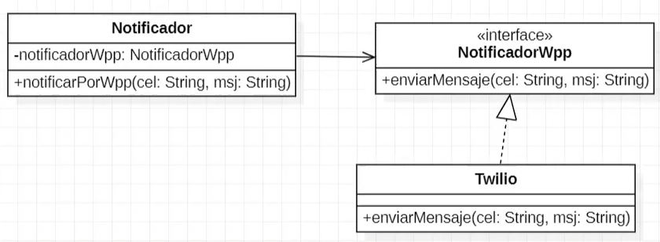

### **Implementación**
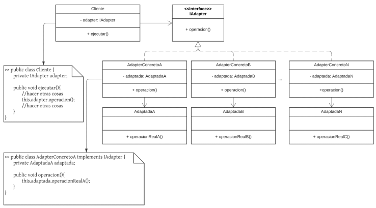

### **Estructura genérica**

  * Consideraciones:
    * Los métodos no necesariamente son void.
    * Puede no existir N adapters concretos.

### **¿Qué proporciona su uso?**
* Mayor mantenibilidad debido al nulo acoplamiento entre el cliente y la clase adaptada.
* Mayor cohesión de la clase cliente debido a la delegación de cierto comportamiento en el adapter.
* Mayor facilidad de testeo ya que se podría implementar un mock de AdapterConcreto

### **Code smells que soluciona / evita de forma directa**
* Herencia rechazada
* Clases alternativas con diferentes interfaces
* Clase de biblioteca incompleta

---

# **Composite - Patrón Estructural**
### *¿Qué hace?*
* Compone objetos en estructura de árbol.
* Permite que un cliente trate de forma polimórfica a un objeto particular y a un conjunto combinado de ellos.

### *Se sugiere su utilización cuando:*
* Se requiere que un tercero utilice de forma indistinta (polimórfica) a un objeto particular o a un conjunto compuesto de ellos.
* Se debe permitir que un objeto esté compuesto por varios objetos simples o por otros objetos compuestos.

### *Componentes:*
* **_Interface / Clase abstracta Componente_** -> Define las firmas de los métodos que son comunes entre los elementos simples y los elementos complejos / compuestos. Su propósito es que un tercero conozca su interfaz para que utilice poliórficamente los elementos simples y los compuestos.
* **_Hoja_** -> Objetos simples que cumplen con la interfaz del Componente. Contienen la implementación más "gruesa" ya que, en general, no delegan el trabajo a nadie más.
* **_Compuesto_** -> Clase que, también, cumple con la interfaz del Componente. Contiene una colección de Componentes, motivo por el cual puede contener tanto objetos simples (hojas) como otros objetos compuestos. Al recibir un mensaje, delega el trabajo en los componentes que tiene, luego junta las respuestas, las procesa y, por último, otorga una respuesta final simplificada.

### **Dominio propuesto**
*Nos solicitaron el desarrollo de una aplicación que le permita a los usuarios organizar su lista de tareas diarias, para eso se decidió separar a las tareas en:*
* Tareas simples: que involucran una sola acción como lo puede ser: "Ir al gimnasio"
* Tareas compuestas: involucran dos o más tareas que pueden ser simples o a su vez compuestas como puede ser el caso de: ""Hacer compras", que incluye "Comprar leche" y "Comprar pan"

### **Diagrama de Clases**
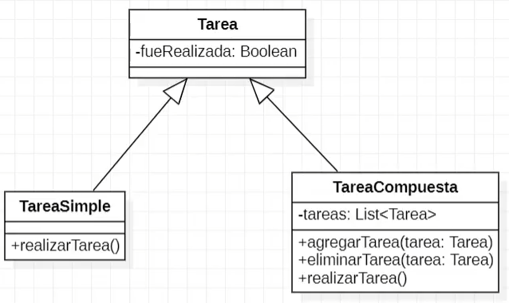

### **Implementación**
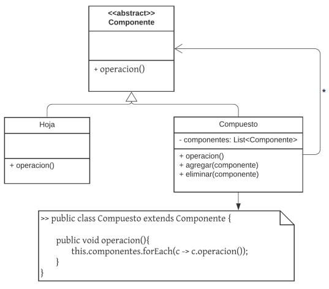

### **Estructura genérica**

  * Consideraciones:
    * El compuesto soporta contener (o estar compuesto) objetos simples (hojas) u objetos compuestos.
    * El método operación del Compuesto no necesariamente realiza un forEach: podría llamar a cualquier método de colección.
    * El compuesto puede tener cualquier tipo de colección, no necesariamente alguna implementación de List.

### **¿Qué proporciona su uso?**
* Extensibilidad para crear nuevos compuestos que agreguen nuevo comportamiento.
* Extensibilidad para crear nuevas hojas que agreguen nuevo comportamiento.
* Simplicidad para formar y tratar a una estructura de objetos compuestos.

### **Code smells que soluciona / evita de forma directa**
* Clase Dios
* Métodos largos
* Código duplicado

---

# **Decorator - Patrón Estructural**
### *¿Qué hace?*
* Agrega funcionalidades dinámicamente a un objeto sin romper su interfaz.
* Intercepta mensajes.

### *Se sugiere su utilización cuando:*
* Se requiere agregar y / o quitar funcionalidades / responsabilidades a un objeto en momento de ejecución.
* Existen condicionales que restringen / amplían las acciones que realiza un objeto frente a la recepción de un mensaje.

### *Componentes:*
* **_Clase abstracta Componente_** -> Clase abstracta (o interface) que contiene la firma del método que se quiere interceptar.
* **_Clase Componente Concreto_** -> Clase que hereda (o implementa, si fuera una interface) de la clase Componente y que define el comportamiento por defecto del método que se pretende interceptar.También conocida como “la clase a decorar”.
* **_Clase abstracta Decorator_** -> Clase abstracta que contiene referencia a la clase Componente. Permite que una clase “decorada” sea envuelta por otra. Define el método que van a interceptar los decoradores concretos.
* **_Decoradores concretos_** -> Clases que heredan de la clase Decorator, encargadas de interceptar el mensaje en cuestión, agregando o quitando funcionalidades.

### **Dominio propuesto**
*Se requiere desarrollar una maquina expendedora de café, donde cada usuario puede elegir el tipo teniendo en cuenta que por el momento hay tres tipos:*
* Con leche: el precio es el original más un 3%
* Con crema: el precio es el original más un 5%
* Con azúcar: el precio es el original más un 1%

### **Diagrama de Clases**
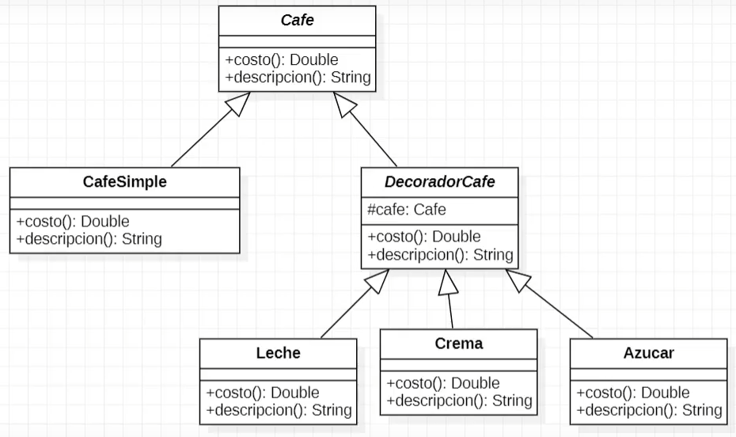

### **Implementación**
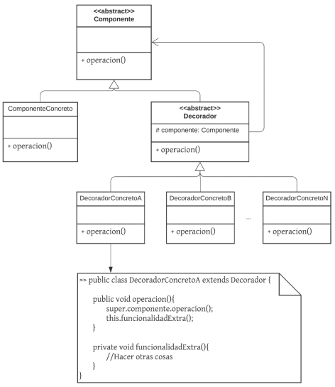

### **Estructura genérica**

  * Consideraciones:
    * Los métodos no necesariamente son void.
    * El método operación de los decoradores concretos pueden no llamar a la operación de su componente asociado (interceptar el mensaje de forma total).

### **¿Qué proporciona su uso?**
* Mayor cohesión en el componente concreto y en los decoradores concretos.
* Extensibilidad para el agregado de nuevas responsabilidades sobre componentes ya creados.

### **Code smells que soluciona / evita de forma directa**
* Métodos largos
* Sentencias switch
* Clase de biblioteca incompleta